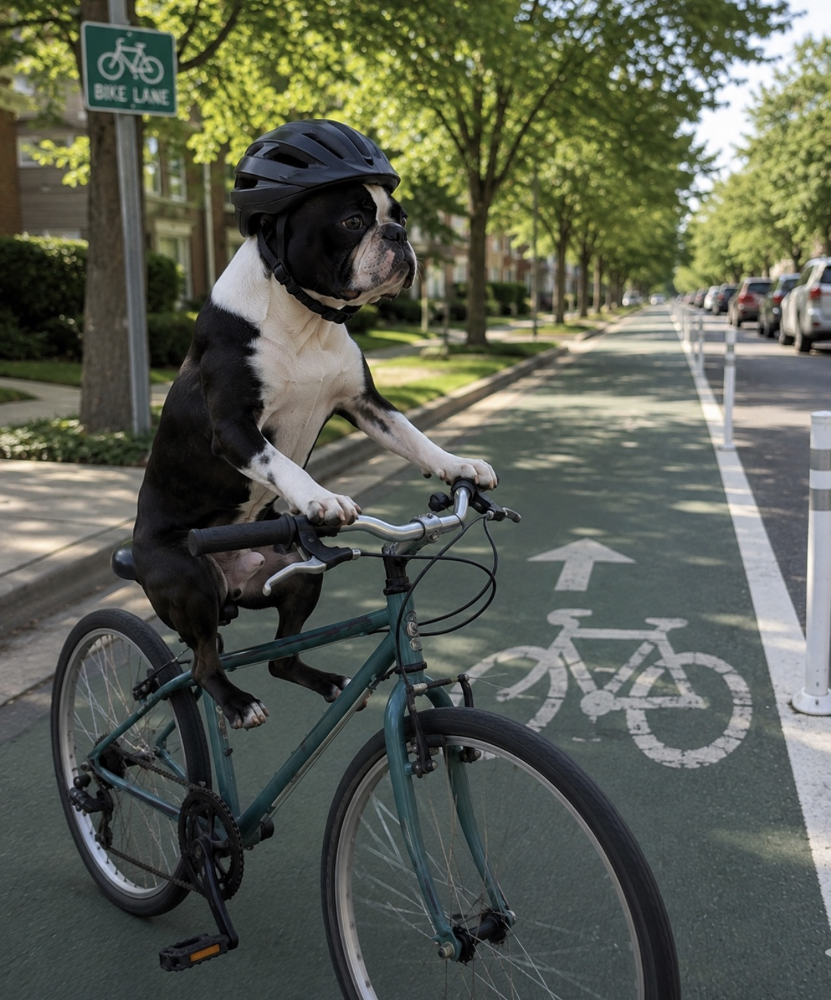
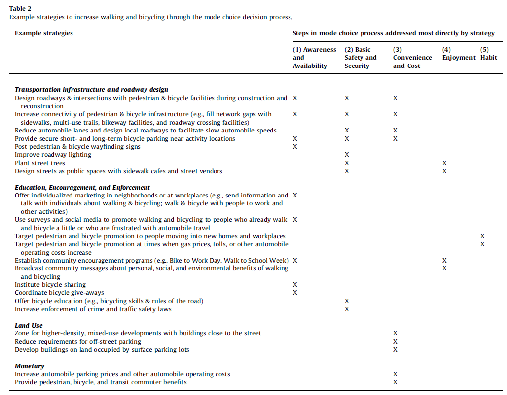
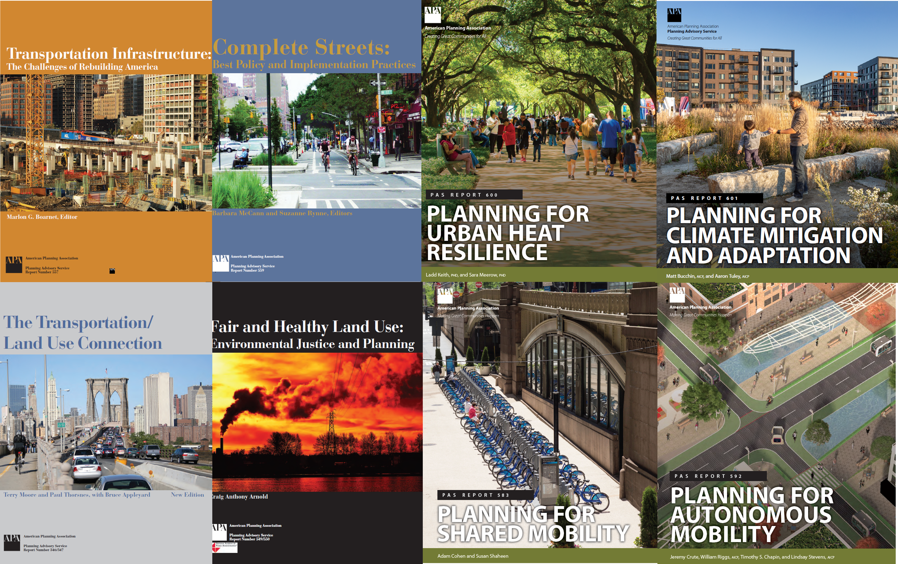

## Class orientation

- [D2L Course Page](https://d2l.depaul.edu/d2l/home/1170803){target="_blank"}
- Syllabus overview
  - Week 1 (9/15): Class orientation; Foundational concepts (Exercise #1 assigned)
  - Week 2 (9/22): Walking and the value of slow transport
  - Week 3 (9/29): Bicycling and active transportation (Exercise #1 due; Exercise #2 assigned)
  - Week 4 (10/6): Transit and the efficiencies of mass movement (Rough project proposal due)
  - Week 5 (10/13): Driving and the implications of automation (Exercise #2 due)
  - Week 6 (10/20): Reclaiming urban waterways (Exercise #3 assigned)
  - Week 7 (10/27): Just transportation (Refined project proposal)
  - Week 8 (11/3): Transportation and public health (Exercise #3 due; Exercise #4 assigned)
  - Week 9 (11/10): Economic benefits of sustainable transportation
  - Week 10 (11/17): Advocating for sustainable transportation systems (Exercise #4 due)
  - **Finals week (11/24): Group project presentations**
  - *Final projects, outstanding assignments due Friday, 11/27 by end of day*

::: notes
Welcome, everyone, to the first session of GEO 3/430, Sustainable Urban Transportation. Quick introduction before we get going: I'm Scott Smith. Alongside teaching here at DePaul, I work as an epidemiologist with the Cook County Department of Public Health, and I'm also an urban programs advisor with DePaul's Chaddick Institute for Metropolitan Development. So you'll see me bring in a lot of health data and applied planning examples throughout the quarter — that's where my own background sits.

A few logistics up front, since we're meeting online and synchronously: office hours are by appointment, so just email me and we'll find a time. Everything — readings, slides, assignments — lives on D2L, so bookmark that page now if you haven't already.

Let's walk through the quarter at a glance. [Point to the schedule.] Today is class orientation plus foundational concepts, and I'll assign Exercise number one at the end of this session. Weeks two through five each focus on one mode — walking, bicycling, transit, then driving — and that's also when your first two methods exercises will be assigned and due. From week six on we shift into more analytical lenses: equity, environment and public health, the economics of sustainable transportation, and advocacy, before your group project presentations during finals week. I'll always flag what's due at the start of each session, but it helps to have this whole map in your head now.

Any questions on logistics before we dive in? [pause] Good — let's get into it.
:::

---

## Introductions

- Name
- Degree program
- Preferred mode of travel

{.bordered-img fig-align="center" height="400"}

::: notes
Let's go around and get to know each other a bit. When it's your turn — or drop it in the chat if that's easier — tell us your name, what degree program you're in, and your preferred way of getting around, whatever mode you find yourself reaching for most. [Give students time to respond.] I'd bet we've already got walkers, drivers, transit riders, and cyclists all in this one room, and that's actually worth noticing right away: sustainable transportation isn't one mode, it's a mix, and every one of you already has a personal stake in how that mix works.

While you're thinking, let me tell you about this photo. [Gesture to image.] This is Cadillac Ranch, a public art installation just outside Amarillo, Texas, right along old Route 66. It's ten vintage Cadillacs — spanning about 1949 to 1963 — buried nose-down in a field, tilted at the same angle as the Great Pyramid of Giza. A group of artists called the Ant Farm collective built it back in 1974, commissioned by a local millionaire named Stanley Marsh 3. Visitors are actually encouraged to bring their own spray paint and add to it, which is why it looks like a constantly evolving mural rather than the original car paint — it's one of the more famous roadside stops for Route 66 travelers, and a nice visual reminder that our relationship with the automobile has always been part practical, part cultural performance.
:::

---

## What Is Sustainability?

- Individually consider your own understanding of sustainability
- Use the link below to submit three (or more) sustainability concepts
- Break out into groups of 3
- Spend 5 minutes sharing your ideas of sustainability
- Add any additional concepts/words using the same link

{.bordered-img fig-align="center" height="200"}

::: notes
Now let's do a quick activity. Take a minute on your own first — don't talk to your neighbor yet — and just think about what sustainability actually means to you. [pause] Once you've got something in mind, scan the QR code on screen, or go to PollEv.com slash urbantransport, and submit at least three words or short phrases that come to mind when you hear the word "sustainability." Don't overthink it — I want your gut reactions: environmental, economic, social, personal, whatever comes up.

Once you've submitted, get into groups of three, and spend about five minutes comparing what you each wrote. Did you land on similar words, or completely different ones? Feel free to add any new ideas your group comes up with back into the same poll.

[After a few minutes] Let's pull up the live results together. Walk through what came in with me — look for clusters around the three classic pillars of sustainability: environmental things like emissions and climate, economic things like cost and efficiency, and social or equity things like access and health. If everything skews environmental, that's my cue to introduce the idea of a triple-bottom-line, or "three-legged stool," framing of sustainability — because this course treats all three of those pillars as equally central to what we mean by "sustainable urban transportation," not just carbon emissions. Let's keep this part brief; the goal is just to get us on the same page before we move into how transportation systems actually work.
:::

---

## What Is a Transportation System?

- A system is an interconnected set of elements that is coherently organized in a way that achieves something. A system consists of three kinds of things: elements, interconnections, and a function or purpose. (Meadows, 2008)

- In its simplest, physical form, a transportation system consists of vehicles/modes, paths/networks and nodes/origins/destinations.

- Like all systems, transportation systems are also situated in time (i.e., historical) and space/place and exhibit adaptive, dynamic, goal-seeking, self-preserving, and sometimes evolutionary behavior.

<figure style="text-align: center;">
  <video controls width="600" style="border: 2px solid black; border-radius: 6px;">
    <source src="videos/southwark.MOV" type="video/quicktime">
    Your browser does not support the video tag.
  </video>
    <figcaption>
    July 19, 2024, time-lapse video, London, England. Source: C. Scott Smith
  </figcaption>
</figure>

::: notes
Let's talk for a second about what we actually mean by a "transportation system." Donella Meadows gives us a useful, general definition: a system is just an interconnected set of elements, organized in a way that achieves some function or purpose. For a transportation system specifically, those elements boil down to three things — the vehicles or modes people use, the paths or networks those vehicles move through, and the behaviors of the people actually making choices within it. And like any system, ours are historical and geographic: they were built through specific decisions, in specific places, at specific times, and they adapt — sometimes slowly, sometimes suddenly — as pressures change around them.

Now let's watch this time-lapse I shot in London, of the Southwark rail viaduct. [Play video.] I want you to notice a few layers here as it plays. First, the brick viaduct itself — that structure dates back to the 1840s, the very earliest era of London's railway expansion, when elevated masonry arches were the standard way to carry trains over dense city streets without disrupting everything below. That physical layer has barely changed in a hundred and eighty years. But look at what's running on top of it: the trains, the signaling, the electrification — all of that has been modernized again and again, steam to diesel to today's electric multiple units, now part of the London Overground network since 2007. See that gantry crane and signal structure on the right? That's newer steel bolted onto the historic brick — incremental modernization, not full replacement, which is actually the normal pattern in mature transit systems, since upgrading in place is usually far more practical than tearing everything down and starting over. Notice too how the arches underneath get reused — commercial units in those doorways at street level — while the tops are sometimes just left to nature, like that vegetation you can see, which has become an unintentional but genuinely valued bit of green infrastructure in urban rail corridors. And zoom out: you've got a skyline of brand-new glass towers rising up behind a nineteenth-century rail structure. That's a great example of how transportation corridors often become anchors that later urban development just builds itself around — the infrastructure outlasts wave after wave of the architecture surrounding it.

Keep that framing in mind — elements, interconnections, and behavior, all layered across time — because we're going to come back to it constantly this quarter.
:::

---

## In-Class Assignment #2

- Watch the archival street film of a trip down Market Street, San Francisco 1906
- What transportation modes are represented in the video?
- How would you characterize this transportation system?
- To what extent does this transportation system have elements of sustainability? Explain.
- What information would you need to know to help evaluate (and potentially improve) the performance of this transportation system?

<figure style="text-align: center;">
  <iframe width="70%" height="300" src="https://www.youtube.com/embed/8Q5Nur642BU?start=77" style="border: 2px solid black; border-radius: 6px; aspect-ratio: 16/9;" allowfullscreen>
  </iframe>
  <figcaption>A Trip Down Market Street, San Francisco, 1906.</figcaption>
</figure>

::: {.notes}
Alright, let's watch a short clip — this is "A Trip Down Market Street," filmed in San Francisco in 1906. [Play video.] As you watch, try to actually count: how many different transportation modes do you see sharing this one street at the same time? [Let it play, then pause for discussion.]

So — what did you count? [pause for responses] You've probably spotted cable cars and streetcars, horse-drawn carriages, wagons and freight carts — actually the dominant mode at this point — a few rare, disruptive early automobiles, bicycles, and pedestrians crossing wherever they like, since there isn't a crosswalk in sight. Now, how would you characterize this as a system? [pause] I'd call it informal, mixed, and negotiated in real time — genuinely no lane markings, no signals, no dedicated space for anyone. Does that count as sustainable? There's no single right answer here, but it's worth noticing it was arguably efficient, in the sense that it shared space by necessity, even though nobody at the time would have used the word "sustainability." It was also, frankly, quite dangerous by any modern safety standard.

A little bit of trivia on this footage: it was filmed by the Miles Brothers just days before the 1906 earthquake, from a camera mounted right on the front of a cable car heading down Market Street toward the Ferry Building. That's part of what makes this period so turbulent, transportation-wise — you've got four completely different propulsion types, animal, cable, electric rail, and combustion, sharing one totally unregulated street, with right-of-way worked out moment to moment. Automobiles are still a marginal curiosity here, but within a decade or two they'll displace nearly everything else you just watched — and that same tension between fixed-guideway rail and flexible-path vehicles competing for the same space is still unresolved in cities today, just think of bus and bike lanes versus general traffic. There's a poignant footnote too: the original footage was very nearly destroyed by the earthquake just days later, so what we're watching is almost an accidental last snapshot of a mobility system on the very eve of being forced to reinvent itself.

Last question for you: what information would you actually need to properly evaluate — and potentially improve — a system like this one? [pause for responses] Hold onto that thought, because that's exactly the kind of evidence-based evaluation Exercise number one is going to have you do, just with modern data instead of a hundred-year-old film reel.
:::

---

## Streets as Public Space

{.bordered-img fig-align="center" height="500"}

::: notes
Take a look at this photo. [Gesture to image.] This is Hester Street, on Manhattan's Lower East Side, in 1914. Before the 1920s, city streets simply looked like this — they were public space for play, for commerce, for just being outside, not a conduit built exclusively for moving vehicles. Look how packed this street market is: pedestrians, pushcarts, kids playing, and almost no motor vehicles at all.

I want you to hold onto this image, because it sets up the arc of everything we're about to walk through. Streets used to be shared, multi-purpose civic space. The fact that we reallocated nearly all of that space to motor vehicles over the following decades wasn't inevitable, and it wasn't natural — it was a series of very specific planning, engineering, and even legal decisions, including a deliberate campaign in the 1920s to redefine "jaywalking" as a crime. A lot of what we now call "complete streets" advocacy isn't really inventing something new — it's reclaiming space that streets already used to serve.
:::

---

## Early Urban Transit

{.bordered-img fig-align="center" height="500"}

::: notes
Here's State and Madison in Chicago, in 1904, with two cable car trains visible. [Gesture to image.] Notice how busy and multimodal this intersection already is, well before automobiles show up in force — cable cars, horse-drawn carriages, dense pedestrian crowds, all sharing one of the country's busiest commercial corners. Fun bit of trivia: State and Madison is historically considered the zero point of Chicago's entire street numbering grid, which tells you just how central this one corner was to the city's transportation network, even this early on.
:::

---

## The Automobile Era

- The 1950s through 1990s is marked by geographic dispersion of housing and employment and the provision of automobile infrastructure to serve it.

- "If you plan for cars and traffic, you get cars and traffic. If you plan for people and places, you get people and places." — Fred Kent, 2005

:::: {.columns}
::: {.column width="50%"}
{.bordered-img fig-align="center" height="300"}
:::

::: {.column width="50%"}
{.bordered-img fig-align="center" height="300"}
:::
::::

::: notes
Let's fast forward to the 1950s through the 1990s. This period is marked by the geographic dispersion of housing and jobs, and by all the automobile infrastructure built to serve that dispersal. There's a quote I like from Fred Kent that captures this really well: "If you plan for cars and traffic, you get cars and traffic. If you plan for people and places, you get people and places." Infrastructure investment was never a neutral response to demand — it actively produced the travel behavior and land-use pattern that followed.

Look at these two images. [Gesture to freeway photo.] This is a Los Angeles freeway from the early 2000s. [Gesture to aerial photo.] And this is an aerial view of Gilbert, Arizona — notice how little pedestrian or transit infrastructure is even visible in either one. This is a good moment to introduce a concept we'll come back to: induced demand. Adding highway capacity tends to generate new vehicle trips rather than durably relieving congestion, because it lowers the time cost of living farther out. Cities became, in short, wedded to automobility — and we'll pick this exact thread back up in week five, on driving and automation, and again in week nine, on the economic benefits of sustainable transportation.
:::

---

## Theory of Routine Mode Choice

:::: {.columns}
::: {.column width="45%"}
{.bordered-img}
:::

::: {.column width="55%"}
{.bordered-img}
:::
::::

::: notes
This is your assigned reading for this week — Robert Schneider's 2013 paper in Transport Policy, "Theory of Routine Mode Choice Decisions." [Gesture to diagram.] Let's walk through his five-step framework together, because we're going to use this model again and again this quarter.

Step one is awareness and availability — a mode has to be something you actually know about and have access to before you can choose it at all. You can't bike somewhere if you don't own a bike, or don't know a safe route exists.

Step two is basic safety and security — people rule out modes they perceive as unsafe, whether that's traffic risk or personal security, regardless of how convenient that mode might otherwise be.

Step three is convenience and cost — among whatever options survive that safety filter, people weigh acceptable time, effort, and money.

Step four is enjoyment — people also factor in the personal, social, or even environmental pleasure a mode gives them. Not everything reduces to time and cost.

And step five is habit — once you choose a mode regularly, that choice becomes self-reinforcing, and it loops all the way back around to step one, making that mode even more likely to come to mind next time.

Running alongside all five of these steps are socioeconomic factors — income, physical ability, life circumstances — which shape how differently people experience each step. What I like about this framework is that it hands us five distinct levers, not just one. If you want to shift routine travel behavior toward walking, biking, or transit, "make it cheaper" or "make it faster" is only one possible lever out of five.
:::

---

## In-Class Transportation Mode Choice Activity

[Individual reflection. Consider one routine trip you make regularly.]{.prompt-lead}

1. **Awareness/Availability** — Which modes do you actually consider? Are there modes you rarely think about?
2. **Safety/Security** — Does a safety concern rule out any mode?
3. **Convenience/Cost** — What's the biggest factor pushing you to your usual transportation mode?
4. **Enjoyment** — Do you enjoy walking/biking generally, even if you don't use it for *this* trip?
5. **Habit** — Is your choice automatic? When did you last reconsider it?

{.bordered-img fig-align="center" height="300"}

::: {.notes}
Now let's apply Schneider's framework to your own life. Think of one routine trip you make regularly — your commute, a grocery run, whatever comes to mind — and let's walk through these five questions for that one trip. [Give students a minute to think and jot down answers.]

First, awareness and availability: which modes do you actually consider for this trip? Are there modes you barely even think about as options?

Second, safety and security: does a safety concern rule out any mode before you even get to comparing convenience?

Third, convenience and cost: what's the single biggest factor pushing you toward whatever mode you actually use?

Fourth, enjoyment: do you generally enjoy walking or biking, even if you don't use it for this particular trip?

And fifth, habit: is this choice basically automatic at this point? When's the last time you actually reconsidered it?

One thing worth flagging as you're working through this: Schneider found that a lot of his interviewees genuinely enjoyed walking or biking for leisure, but still drove for everyday errands. Watch for that same gap in your own answers — call it the "enjoyment–behavior gap" — because it's a good example of how these five factors don't always point in the same direction for the same person.
:::

---

## Part 2: Pair / Small-Group Discussion

- Compare answers in groups of 2–3:
  - Where's the **real barrier** for you — awareness, safety, convenience/cost, enjoyment, or habit? Same across the group, or different?
  - **Socioeconomic factors** — how would your answers change with different income, physical ability, household size, or life stage?
  - **Life events** — has a past transition (moving, new job, school) ever changed your habit? What would break your *current* one?

::: notes
Now get into groups of two or three and compare what you each wrote down. [Give the class a few minutes.] I want you to talk through three things. First, where's the real barrier for you — is it awareness, safety, convenience and cost, enjoyment, or habit? And is that the same barrier across everyone in your group, or does it differ person to person? Second, think about socioeconomic factors — how would your answers change if you had a different income, a different physical ability, a bigger household, or you were at a different life stage? And third, life events — has some past transition, like a move, a new job, or starting school, ever actually changed one of your travel habits? What do you think it would take to break your current one?
:::

---

## Part 3: Class Debrief

- Quick poll: biggest barrier — awareness? safety? convenience/cost? enjoyment? habit?
- What single strategy from Table 2 (secure bike parking, individualized marketing, protected bike lanes, reduced parking, street trees) would move *you* past your barrier?

- Because people are blocked at **different steps for different reasons**, a single intervention rarely shifts community-wide mode share — a **comprehensive approach** across all five steps is usually needed.

{.bordered-img fig-align="center" height="500"}

::: notes
Let's come back together. Quick poll for the room: for your own trip, what turned out to be the biggest barrier — awareness, safety, convenience and cost, enjoyment, or habit? [Take a show of hands or a quick poll for each.]

Now look at this table of strategies. [Gesture to image.] Secure bike parking, individualized marketing, protected bike lanes, reduced parking, street trees — which single strategy here do you think would actually move you past your own barrier? [Discuss a few responses.]

Here's the takeaway I want you to leave with: because people get blocked at different steps, for different reasons, a single intervention rarely shifts mode share across an entire community. You almost always need a comprehensive approach that addresses multiple steps in this framework at once, not just whichever one is cheapest or easiest to build.
:::

---

## Planning Advisory Service (PAS) Reports

[Several evolving and emerging factors continue to influence urban transportation systems]{.prompt-lead}

{.bordered-img fig-align="center" height="500"}

::: notes
Select publications from the American Planning Association.
:::

--- 

## Applied Example: The Leading Pedestrian Interval

:::: {.columns}
::: {.column width="55%"}
{.bordered-img fig-align="center" height="300"}
:::

::: {.column width="45%"}
- A Leading Pedestrian Interval (LPI) typically gives pedestrians a 3–7 second head start when entering an intersection with a corresponding green signal in the same direction of travel.
- LPIs have been shown to reduce pedestrian-vehicle collisions as much as 60% at treated intersections.

{.bordered-img fig-align="center" height="180"}
:::
::::

::: notes
Let's close today's lecture with one small, concrete example of this framework in action: the Leading Pedestrian Interval, or LPI. [Gesture to photo.] This photo is Chicago's pedestrian scramble at State and Jackson — an especially aggressive version of prioritizing pedestrian crossing time, where all vehicle traffic actually stops at once. An LPI itself is a more modest version of the same idea: it just gives pedestrians a three-to-seven-second head start into the intersection before parallel vehicle traffic gets its green light, so people on foot are already visible and established in the crosswalk before any turning vehicle starts moving. This is purely a signal-timing change — no capital construction required — and it's been shown to reduce pedestrian-vehicle collisions by as much as sixty percent at treated intersections.

Here's a similar low-cost idea for cyclists. [Gesture to bike-signal photo.] This is a dedicated bicycle signal head, paired with a sign reminding turning vehicles to yield. Both of these examples make the same point: improving safety at the top of our transportation hierarchy is often much more about signal timing and small design details than it is about expensive capital projects.

Keep this in mind, because it's exactly the kind of specific, evidence-based intervention you'll be asked to identify yourselves: Exercise number one, assigned this week, has you analyze commute mode share and pedestrian fatality trends for a county of your choosing, and by the end of that exercise, you'll be pointing to your own hot spot and proposing your own version of exactly this kind of fix.
:::
