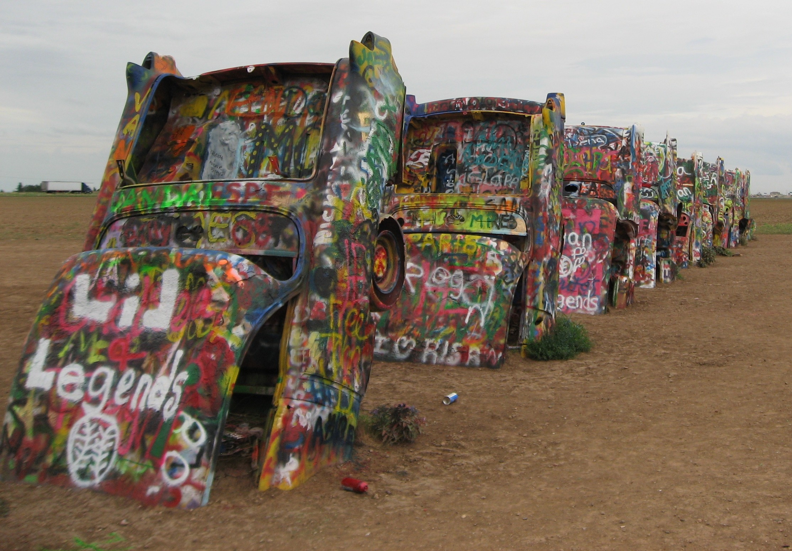
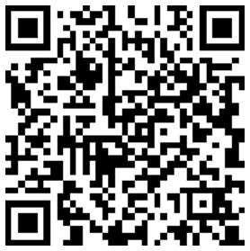
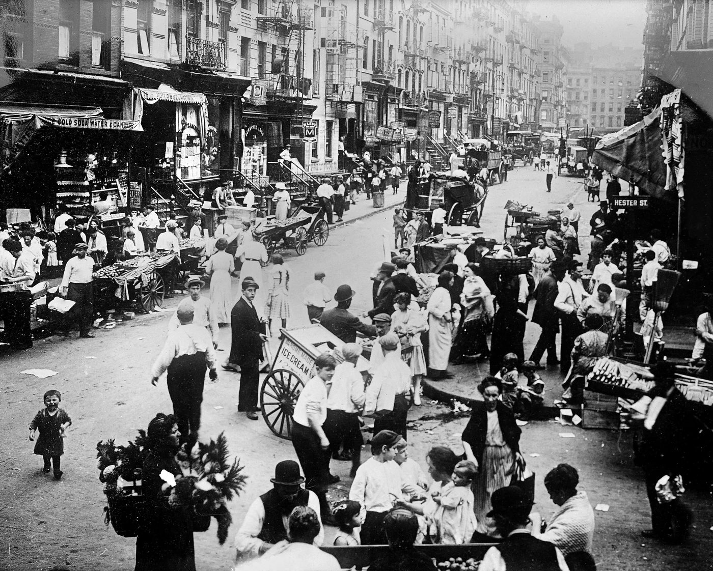
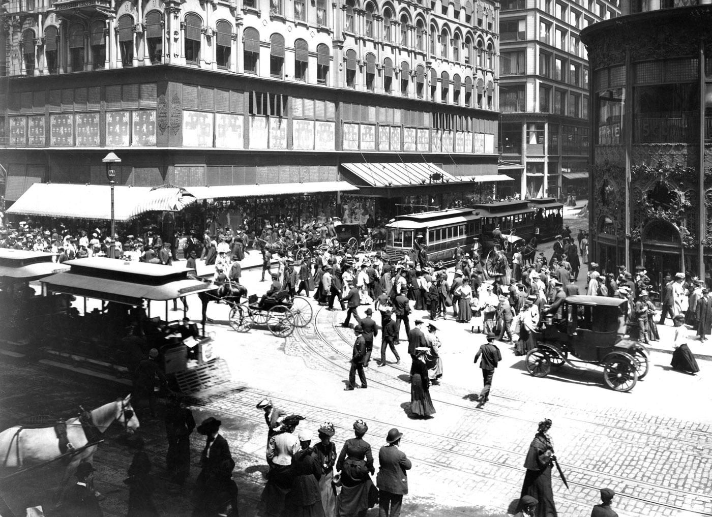
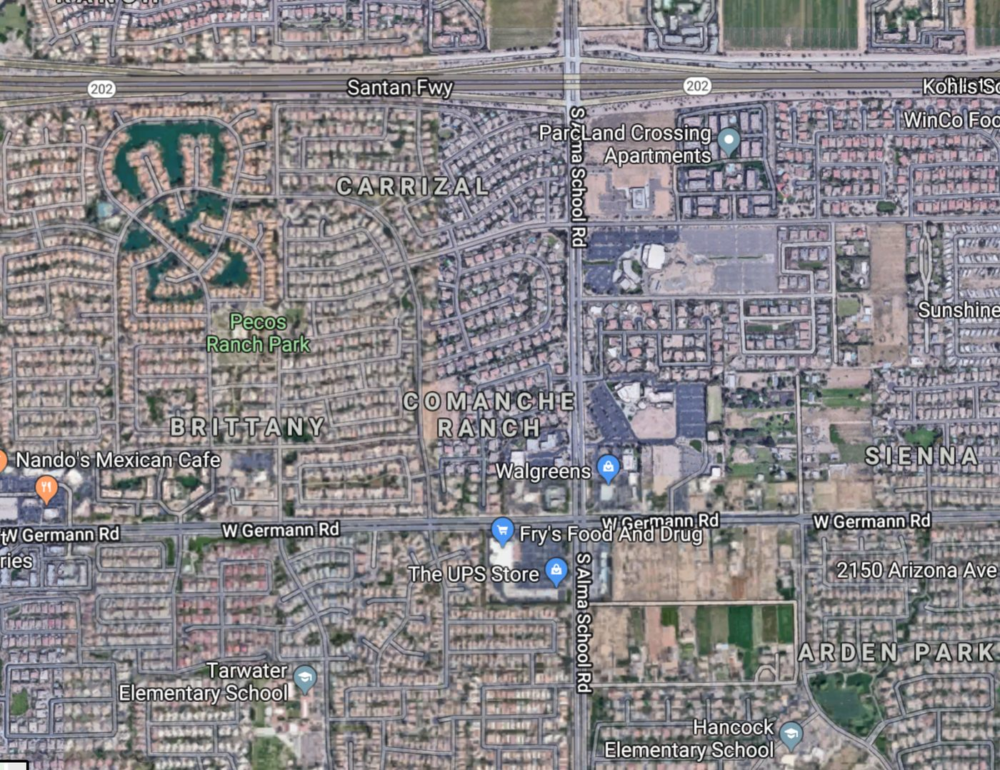
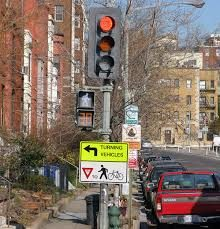

## Class orientation

- [D2L Course Page](https://d2l.depaul.edu/d2l/home/1170803){target="_blank"}
- Syllabus overview
  - Week 1 (9/15): Class orientation; Foundational concepts (Exercise #1 assigned)
  - Week 2 (9/22): Walking and the value of slow transport
  - Week 3 (9/29): Bicycling and active transportation (Exercise #1 due; Exercise #2 assigned)
  - Week 4 (10/6): Transit and the efficiencies of mass movement (Rough project proposal due)
  - Week 5 (10/13): Driving and the implications of automation (Exercise #2 due)
  - Week 6 (10/20): Reclaiming urban waterways (Exercise #3 assigned)
  - Week 7 (10/27): Just transportation (Refined project proposal)
  - Week 8 (11/3): Transportation and public health (Exercise #3 due; Exercise #4 assigned)
  - Week 9 (11/10): Economic benefits of sustainable transportation
  - Week 10 (11/17): Advocating for sustainable transportation systems (Exercise #4 due)
  - Finals week (11/24): (Group project presentations)
  - *Final projects, outstanding assignments due Friday, 11/27 by end of day*

::: notes
Welcome students to the first session of GEO 3/430, Sustainable Urban Transportation. This is class orientation plus Week 1: Foundational Concepts, per the syllabus topical agenda. Briefly introduce yourself beyond the title slide: your background as an epidemiologist with Cook County Public Health and your work with the Chaddick Institute for Metropolitan Development gives you an applied, data-driven lens on transportation and health that will show up throughout the quarter. Mention logistics briefly: this is an online, synchronous course; office hours are by appointment; all readings are posted to D2L. Preview today's session: introductions, an interactive exercise on defining sustainability, a systems-thinking framework for transportation, a short video and discussion, a walk through the historical evolution of urban streets from shared space to auto-dominance, a look at how density relates to transportation emissions, the Schneider (2013) theory of routine mode choice that anchors this week's reading, and a first look at the transportation hierarchy and pedestrian safety design — all of which sets up Exercise #1 (mode share and pedestrian fatality analysis), assigned this week.
:::

---

## Introductions

- Name
- Degree program
- Preferred mode of travel

{.bordered-img fig-align="center" height="400"}

::: notes
Icebreaker. Go around (or use chat/breakout rooms, since this is an online synchronous class) and have each student share their name, degree program, and preferred mode of travel. Listen for the range of answers — you will likely get walkers, drivers, transit riders, and cyclists in the same room, which is a useful, low-stakes way to surface that "sustainable transportation" is not one mode but a mix, and that everyone in the room already has a personal stake in and opinion about how it should work. Keep this brief, a few minutes at most, since there is a lot of ground to cover today.

This is Cadillac Ranch, the famous public art installation just outside Amarillo, Texas, along old Route 66 (I-40). It's a row of ten vintage Cadillacs (models spanning roughly 1949–1963) buried nose-down in a field at the same angle as the Great Pyramid of Giza. It was created in 1974 by a group of artists from the Ant Farm collective, commissioned by local millionaire Stanley Marsh 3. The cars are covered in layers upon layer of spray-paint graffiti, since visitors are actually encouraged to bring their own paint and add to them — which is why the surfaces look like a constantly-evolving mural rather than the original car paint. It's a popular roadside stop for Route 66 travelers.
:::

---

## What Is Sustainability?

- Individually consider your own understanding of sustainability
- Use the link below to submit three (or more) sustainability concepts
- Break out into groups of 3
- Spend 5 minutes sharing your ideas of sustainability
- Add any additional concepts/words using the same link

{.bordered-img fig-align="center" height="200"}

::: notes
This is a live, participatory activity using Poll Everywhere (PollEv.com/urbantransport — https://www.polleverywhere.com/home). Give students a minute to think individually first before they submit, so the group discussion doesn't just anchor on the first idea shared. Have them submit at least three words or short phrases that come to mind when they hear "sustainability" — don't over-constrain the prompt yet; the goal is to see the raw, varied associations people already bring (environmental, economic, social, generational, personal). After individual submission, break into groups of three for about five minutes to compare answers, then let groups add any new concepts they generated together back into the same poll. The next slide will display the live results.

Pull up the live Poll Everywhere results (word cloud or response list) on screen and walk through what came in. Look for clusters around the three classic pillars — environmental (emissions, resource use, climate), economic (cost, efficiency, jobs), and social/equity (access, health, fairness) — and note anywhere students converge or diverge. If the responses skew heavily environmental, that's a good moment to explicitly introduce the "three-legged stool" or triple-bottom-line framing of sustainability (environment, economy, equity) and note that this course treats all three as equally central to "sustainable urban transportation," not just emissions. Keep this discussion tight; the point is to establish a shared, broadened working definition before moving into systems thinking.
:::

---

## What Is a Transportation System?

- A system is an interconnected set of elements that is coherently organized in a way that achieves something. A system consists of three kinds of things: elements, interconnections, and a function or purpose. (Meadows, 2008)

- In its simplest form, a transportation system consists of vehicles/modes, paths/networks and behaviors.

- Like all systems, transportation systems are also situated in time (i.e., historical) and space/place and exhibit adaptive, dynamic, goal-seeking, self-preserving, and sometimes evolutionary behavior.

<figure style="text-align: center;">
  <video controls width="600" style="border: 2px solid black; border-radius: 6px;">
    <source src="videos/southwark.MOV" type="video/quicktime">
    Your browser does not support the video tag.
  </video>
    <figcaption>
    July 19, 2024, time-lapse video, London, England. Source: C. Scott Smith
  </figcaption>
</figure>

::: notes
Introduce Donella Meadows' basic definition of a system — elements, interconnections, and a purpose — and connect it directly to transportation: the elements are vehicles and modes, the interconnections are the paths and networks they travel on, and the whole thing is animated by human behavior and choices. Emphasize the second point especially: transportation systems are not static engineering artifacts, they are historical and geographic — they were built by specific decisions at specific times and in specific places, and they adapt, resist change, and sometimes evolve in response to new pressures (technology, policy, demand). This systems framing is the conceptual foundation for the whole course: every mode-specific week (walking, biking, transit, driving) and every analytical week (equity, health, economics) will come back to how elements, interconnections, and behavior interact. It also previews why simply swapping in a new vehicle technology, without addressing networks and behavior, rarely produces a more sustainable outcome on its own.

- Foundational infrastructure (1840s) — The brick viaduct itself dates to the earliest era of London's railway expansion, when elevated masonry arches were the standard solution for carrying trains over dense urban terrain without disrupting streets below. This is a physical layer that's remained largely unchanged for180 years.
- Operational upgrades over time — While the viaduct's brick-and-arch structure is unchanged, the trains, signaling, and electrification running on it have been modernized repeatedly (steam → diesel → electric multiple units, now part of the London Overground network since 2007).
Overlaid modern elements — The gantry crane/signal structure on the right shows newer steel infrastructure bolted onto or built alongside the historic brick, reflecting incremental modernization rather than full replacement — a common pattern in mature transit systems where upgrading in place is more practical than rebuilding.
- Adaptive reuse and neglect — The arches beneath viaducts like this one are often repurposed as commercial units (visible as the arched doorways at street level), while the tops are sometimes left to nature, as seen with the dense vegetation — an unintentional but increasingly valued "green infrastructure" element in urban rail corridors.
- Layered urban growth — The skyline of modern glass towers rising behind a 19th-century rail structure illustrates how transportation corridors often become anchors around which later urban development is built, with the transit infrastructure predating and outlasting multiple waves of surrounding architectural change.
:::

---

## In-Class Assignment #2

- Watch the archival street film of a trip down Market Street, San Francisco 1906
- What transportation modes are represented in the video?
- How would you characterize this transportation system?
- To what extent does this transportation system have elements of sustainability? Explain.
- What information would you need to know to help evaluate (and potentially improve) the performance of this transportation system?

<figure style="text-align: center;">
  <iframe width="70%" height="300" src="https://www.youtube.com/embed/8Q5Nur642BU?start=77" style="border: 2px solid black; border-radius: 6px; aspect-ratio: 16/9;" allowfullscreen>
  </iframe>
  <figcaption>A Trip Down Market Street, San Francisco, 1906.</figcaption>
</figure>

::: {.notes}
Play the embedded archival street film and give students a moment to actually count modes before discussing — most will be surprised how many different modes (pedestrians, cyclists, horse-drawn carts and streetcars, and early automobiles) shared the same street space simultaneously, often with no lane markings, signals, or dedicated space at all. Use the discussion questions in order: first the literal count of modes, then a qualitative characterization of the system (informal, mixed, negotiated, chaotic-but-functioning), then push on the sustainability question directly — there is no single right answer, but look for students noticing that the system was arguably efficient and space-sharing by necessity, even without today's vocabulary of "sustainability," while also being genuinely dangerous by modern safety standards. The last question is the pivot into the rest of the lecture: what data would you actually need (mode share, collision records, speeds, volumes) to move from an impression to an evidence-based evaluation — which is exactly what Exercise #1 will have them do.

**A Trip Down Market Street (1906, San Francisco)**

Filmed by the Miles Brothers just days before the 1906 earthquake, from a camera mounted on a cable car heading down Market Street toward the Ferry Building.

**Vehicles visible:**
- Cable cars / streetcars (fixed-rail mass transit)
- Horse-drawn carriages, wagons, freight carts (dominant mode)
- Early automobiles (rare, disruptive newcomers)
- Bicycles
- Pedestrians crossing freely, no crosswalks

**Why this period is transportation's most turbulent transition:**
1. Four propulsion types — animal, cable, electric rail, combustion — sharing one unregulated street
2. No traffic infrastructure yet: no lanes, signals, or crossings; right-of-way negotiated in real time
3. Automobiles still marginal here, but about to displace nearly every other mode within a decade or two
4. Fixed-guideway rail vs. flexible-path vehicles competing for the same space — a tension still unresolved in cities today (bus/bike lanes vs. general traffic)
5. Captures rapid, compressed change — contrast with slow-evolving infrastructure (e.g., Victorian rail viaducts layered with modern transit over centuries)
6. Footage destroyed days later by the earthquake — an accidental "last snapshot" of a mobility system on the eve of forced reinvention
:::

---

## Streets as Public Space

{.bordered-img fig-align="center" height="500"}

::: notes
Prior to the 1920s, city streets looked dramatically different than they do today. They were considered to be a public space for play and exchange, not solely a conduit for vehicle movement. This photo shows Manhattan's Hester Street, on the Lower East Side, in 1914 — a street market packed with pedestrians, pushcarts, and children playing, with almost no motor vehicles present. Use this image to set up the historical arc for the rest of the lecture: streets were once shared, multi-purpose civic space, and the reallocation of that space almost entirely to motor vehicles over the following decades was neither inevitable nor natural — it was a series of specific planning, engineering, and legal decisions (including the campaign to redefine "jaywalking" as a crime in the 1920s). That reframing is central to a lot of contemporary "complete streets" and sustainable transportation advocacy: it's less about inventing something new and more about reclaiming space that streets used to serve.
:::

---

## Early Urban Transit

{.bordered-img fig-align="center" height="500"}

::: notes
Point out how busy and multimodal this intersection already was well before automobiles arrived in force — cable cars, horse-drawn carriages, and dense pedestrian crowds all sharing one of the country's busiest commercial intersections. This is a good moment to note that Chicago's "State and Madison" is historically considered the zero-point for the city's street numbering grid, underscoring how central this corner was to the city's transportation network from very early on.
:::

---

## The Automobile Era

- The 1950s through 1990s is marked by geographic dispersion of housing and employment and the provision of automobile infrastructure to serve it.

- "If you plan for cars and traffic, you get cars and traffic. If you plan for people and places, you get people and places." — Fred Kent, 2005

:::: {.columns}
::: {.column width="50%"}
{.bordered-img fig-align="center" height="300"}
:::

::: {.column width="50%"}
{.bordered-img fig-align="center" height="300"}
:::
::::

::: notes
The postwar decades (1950s–1990s) mark a sharp break from everything shown in the previous slides: federal highway funding, cheap land at the urban edge, and single-use zoning together produced a geographic dispersion of housing and jobs that could only really function with car ownership, which in turn justified building more automobile infrastructure to serve that dispersed pattern — a self-reinforcing loop. The Fred Kent quote captures this concisely: infrastructure investment is not a neutral response to demand, it actively produces the travel behavior and land use pattern that follows. The two images pair a congested urban freeway with an aerial view of a sprawling, curvilinear suburban subdivision — visually, very little pedestrian or transit infrastructure is legible in either. Introduce the concept of induced demand explicitly here: adding highway capacity tends to generate new vehicle trips rather than durably relieving congestion, because it lowers the time-cost of longer, more dispersed trip patterns — cities became, in short, wedded to automobility. This is a good bridge into Week 5 (driving and automation) and Week 9 (economic benefits of sustainable transportation), both of which will revisit this dynamic.
:::

---

## Theory of Routine Mode Choice

:::: {.columns}
::: {.column width="45%"}
{.bordered-img}
:::

::: {.column width="55%"}
{.bordered-img}
:::
::::

::: notes
This is the assigned Week 1 reading: Schneider, Robert J. 2013, "Theory of Routine Mode Choice Decisions: An Operational Framework to Increase Sustainable Transportation," Transport Policy 25: 128–37. Walk through the five-step framework in the diagram in order, since it's the conceptual model the whole course will keep returning to. (1) Awareness and availability: a mode has to be known about and actually available before it can be chosen at all — you can't bike somewhere if you don't own a bike or don't know a safe route exists. (2) Basic safety and security: people filter out modes they perceive as unsafe from traffic or crime, regardless of the mode's actual convenience. (3) Convenience and cost: among the remaining "safe enough" options, people weigh acceptable time, effort, and money. (4) Enjoyment: people also weigh the personal, social, or environmental benefit or pleasure a mode provides — not everything reduces to cost and time. (5) Habit: once someone regularly chooses a mode, that choice becomes self-reinforcing and more likely to be considered again in the future, looping back to awareness and availability. Socioeconomic factors run alongside all five steps, since income, ability, and life circumstances shape how people experience each one differently. This framework is useful precisely because it identifies five distinct levers — not just "make it cheaper" or "make it faster" — that a planner or policy can pull to shift routine travel behavior toward walking, bicycling, and transit.
:::

---

## In-Class Transportation Mode Choice Activity

- Individual reflection. Consider one routine trip you make regularly.

1. **Awareness/Availability** — Which modes do you actually consider? Are there modes you rarely think about?
2. **Safety/Security** — Does a safety concern rule out any mode?
3. **Convenience/Cost** — What's the biggest factor pushing you to your usual transportation mode?
4. **Enjoyment** — Eo you enjoy walking/biking generally, even if you don't use it for *this* trip?
5. **Habit** — Is your choice automatic? When did you last reconsider it?

::: {.notes}
Schneider found many interviewees enjoyed walking/biking for leisure but still drove for errands — flag this "enjoyment–behavior gap" if it comes up.
:::

---

## Part 2: Pair / Small-Group Discussion

- Compare answers in groups of 2–3:
  - Where's the **real barrier** for you — awareness, safety, convenience/cost, enjoyment, or habit? Same across the group, or different?
  - **Socioeconomic factors** — how would your answers change with different income, physical ability, household size, or life stage?
  - **Life events** — has a past transition (moving, new job, school) ever changed your habit? What would break your *current* one?

---

## Part 3: Class Debrief

- Quick poll: biggest barrier — awareness? safety? convenience/cost? enjoyment? habit?
- What single strategy from Table 2 (secure bike parking, individualized marketing, protected bike lanes, reduced parking, street trees) would move *you* past your barrier?

- Because people are blocked at **different steps for different reasons**, a single intervention rarely shifts community-wide mode share — a **comprehensive approach** across all five steps is usually needed.

---

## Applied Example: The Leading Pedestrian Interval

:::: {.columns}
::: {.column width="55%"}
{.bordered-img fig-align="center" height="300"}
:::

::: {.column width="45%"}
- A Leading Pedestrian Interval (LPI) typically gives pedestrians a 3–7 second head start when entering an intersection with a corresponding green signal in the same direction of travel.
- LPIs have been shown to reduce pedestrian-vehicle collisions as much as 60% at treated intersections.

{.bordered-img fig-align="center" height="180"}
:::
::::

::: notes
Close the lecture with one small, concrete, well-evidenced example of the transportation hierarchy and the routine-mode-choice framework put into practice: the Leading Pedestrian Interval, or LPI. An LPI gives pedestrians a several-second head start — typically 3 to 7 seconds — before parallel vehicle traffic gets a green light, so pedestrians are already visible and established in the crosswalk before turning vehicles start moving. This is a low-cost signal timing change, not a capital project, and it has been shown to reduce pedestrian-vehicle collisions by as much as 60% at treated intersections. The large photo shows Chicago's pedestrian scramble at State and Jackson, an even more aggressive version of prioritizing pedestrian crossing time by stopping all vehicle traffic simultaneously; the smaller photo shows a similarly low-cost signal treatment for cyclists — a dedicated bicycle signal head paired with a sign reminding turning vehicles to yield. Both are good illustrations that improving safety for the top of the transportation hierarchy is often more about signal timing and small design details than expensive capital construction. Connect this directly to what's coming next: Exercise #1, assigned this week, asks students to analyze commute mode share and pedestrian fatality trends for a county of their choosing — the LPI is a preview of the kind of specific, evidence-based intervention they'll be asked to identify from their own hot spot analysis later in the exercise.
:::
