::: {.img-center}
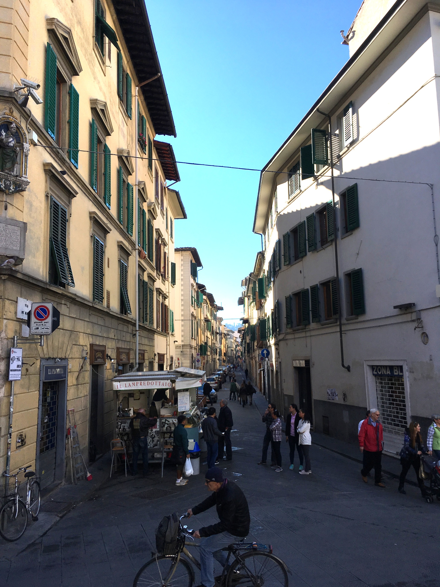{height=100%}
:::

::: notes
Welcome back, everyone. Last week we laid the conceptual groundwork for the quarter — what we mean by sustainability, what a transportation system actually is, and Schneider's five-step framework for routine mode choice. This week we slow all the way down and spend a full session on the oldest mode there is: walking.

The image behind me is a street in Florence I photographed a few years ago — a food cart, a cyclist, people stopped mid-conversation, not a single car in the frame. I want you to hold onto that image, because it's really the argument of the whole session in one photograph: for most of human history, cities were built at the speed and scale of the human body, and a great deal of what we now call "walkability" is really just what happened by default before we engineered it away.

Today we're going to move chronologically through seven broad periods of how walking's role in cities has expanded, contracted, and — in the last thirty years or so — been deliberately reclaimed. Along the way we'll pick up some of the foundational texts in this field: Amato, Jacobs, Appleyard, Bullard, Speck. By the end, I want you to be able to explain not just that streets used to be different, but specifically which decisions made them the way they are today — because those same decisions are reversible.
:::

---

## Week #2 agenda

- Week #1 recap
- Periods of Urban Pedestrian Form & Movement
- Discussion, Q&A
- Urban pedestrian case studies
- Final project brainstorming
- Exercise #1 Q&A

::: notes
Here's the shape of today's session. We'll start with a very quick recap of where we left off last week, then spend the bulk of our time moving through seven historical periods of urban pedestrian form and movement — think of this as the walking-focused companion to the "transportation system" framing we built last week. After that we'll shift into discussion mode: a set of applied urban pedestrian case studies, time to brainstorm your final group projects, and I'll leave real time at the end for questions on Exercise #1, since it's due at the end of next week alongside Exercise #2 being assigned.

One housekeeping note before we dive in: today's assigned reading was Joseph Amato's *On Foot: A History of Walking*, and I'll be weaving pieces of that in as we go rather than treating it as a separate block — keep it in mind especially once we get to the industrial era.
:::

---

## Periods of Urban Pedestrian Form & Movement

- Pre-Urban & Early Urban Walking Cities (~3000 BCE – 500 CE)
- Medieval & Early Modern Walking Cities (500 – 1700)
- Industrial Walking Cities (1700 – 1890)
- Transitional Streets: Walking Meets the Automobile (1890 – 1920)
- Auto Ascendancy & Pedestrian Marginalization (1920 – 1960)
- Crisis, Critique and Early Pedestrian Revival (1960 – 1990)
- Sustainability Era & Emerging Futures of Pedestrian Cities (1990 – Present)

::: notes
Just like we organized bicycling and transit history into distinct periods in later weeks, we can do the same thing for walking — and honestly, walking is the mode where this periodization matters most, because for the first six thousand years or so of urban history, walking wasn't a "mode choice" at all. It was simply how cities worked, full stop.

Notice the shape of this list. The first three periods — spanning roughly five thousand years — are all fundamentally pedestrian-scaled cities, just with different technologies layered on top of walking: nothing, then early wheeled transport, then early industrial transit. The real rupture happens in the fourth period, the transitional streets era, when automobiles enter a street system that was never designed for them. From there we get about forty years of auto ascendancy, then thirty years of backlash and critique, and finally the last three decades where walking gets explicitly reframed as infrastructure — something you plan for and measure, not just something that's left over.

Keep this arc in your head as we go: compatible with cities for millennia, actively engineered out in a few decades, and now being deliberately reclaimed. None of those three states was inevitable — they were each the product of specific planning and policy choices, which is exactly the kind of thing this course is designed to help you diagnose.
:::

---

## Assigned Reading: *On Foot: A History of Walking*

:::: {.columns}
::: {.column width="40%"}
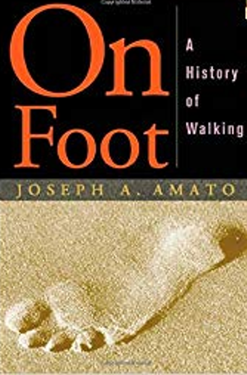{.bordered-img}
:::

::: {.column width="60%"}
- Walking as human evolution: bipedalism freed the hands and shaped human migration across the globe
- Cultural and religious significance: pilgrimage as spiritual practice, from Mecca to Santiago de Compostela
- Industrialization transformed walking from necessity into a marker of leisure — or of poverty
- Philosophical and literary traditions: Rousseau, Nietzsche, and Thoreau all treated walking as a path to reflection
:::
::::

::: notes
This week's reading was Joseph Amato's *On Foot: A History of Walking*, a 2004 cultural and historical survey that treats walking as far more than a mobility choice — he frames it as fundamental to human identity, culture, and cognition.

A few threads from the book worth pulling into today's discussion. First, Amato argues bipedalism was a defining evolutionary trait: walking upright freed the hands for tool use and let early humans migrate out of Africa and populate every other continent, which means walking quite literally shaped where and how humans live today. Second, walking carries enormous cultural and religious weight — pilgrimage traditions, from Mecca to Santiago de Compostela, treat the act of walking itself as spiritually significant, not just a means of arriving somewhere.

Where this connects directly to our course is Amato's third thread: industrialization and mechanized transport didn't just add new options alongside walking, they fundamentally changed what walking *meant*. As cars, elevators, and mechanized transport reduced the necessity of walking for daily life, it split into two very different social meanings — a leisurely, healthful, even philosophical pursuit for those who had the time and the neighborhood for it, and a marker of poverty for those who had no other option. That split matters enormously for how we think about equity in active transportation, and we'll come back to it later today when we get to Bullard's *Just Transportation*.

Discussion prompt for you: what in this book most surprised you, and what are the implications of this history for how we advocate for sustainable transportation today?
:::

---

## Transportation Technology's Impact on Urban Form

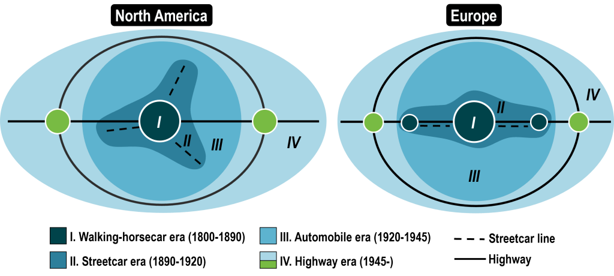{.bordered-img fig-align="center" height="420"}

::: notes
Before we walk period by period, I want to show you this diagram, because it's a useful map for the whole session. It comes from the Geography of Transport Systems textbook, and it shows how urban form expanded outward in concentric rings as each new transportation technology arrived: walking and horsecar era at the core, then a streetcar-era ring, then automobile-era sprawl, then the highway era pushing the edge out even further.

Notice two things. First, walking — labeled Roman numeral one here — is always the innermost, densest ring in both the North American and European versions: it's the layer every later technology gets built on top of, never replaced outright. Second, compare the two diagrams: the North American city has a much larger, more dominant automobile-and-highway ring than the European one, where the walking-and-streetcar core stays proportionally larger. That's not an accident of geography — it reflects decades of different policy choices about how much space and priority each mode gets. Keep this image in mind as we move through today's periods, because we're essentially going to zoom into the "I" at the center of this diagram and watch, layer by layer, how it got surrounded.
:::

---

## Period 1: Pre-Urban & Early Urban Walking Cities (~3000 BCE – 500 CE)

:::: {.columns}
::: {.column width="45%"}
### Core condition
Walking is the only viable urban transport mode

### Urban form
- Compact city footprints
- Mixed uses by necessity
- Streets as social and economic space

### Key idea
The limits of the human body defined the size and structure of cities.
:::

::: {.column width="55%"}
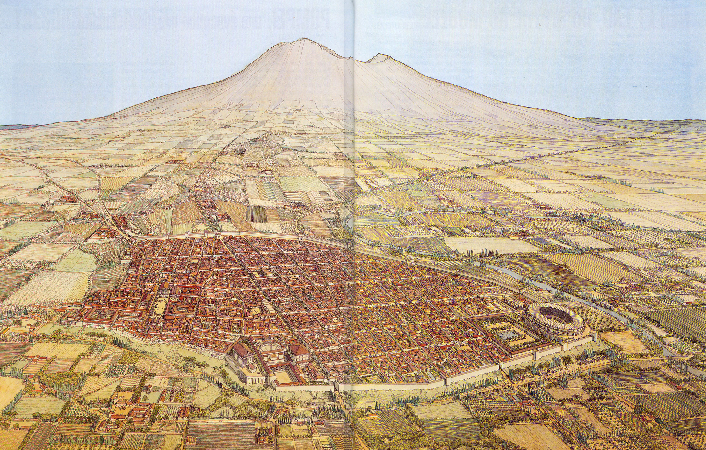{.bordered-img fig-align="center" height="420"}
:::
::::

::: notes
For the first five thousand years or so of urban history, this slide's "core condition" is really the whole story: walking wasn't one mode among several, it was the only way to get around, and that single fact determined everything about how cities were shaped. Cities had to be compact, because nobody could walk more than a few miles in a day and still get anything done. Land uses had to mix — housing next to workshops next to markets — because there was no way to separate them and still have people reach them on foot. And streets themselves had to double as social and economic space, since there was no separate "transportation corridor" carved out from everything else city life needed.

Pompeii is a wonderful case study for this, and it's a place I've actually visited. It's an ancient Roman city in Campania, at the base of Mount Vesuvius, occupied from roughly the seventh or sixth century BCE until it was buried by the eruption in 79 CE — which is exactly why it survives so well archaeologically; we're looking at a walking city frozen in time. Look at the density of that street grid radiating out from the amphitheater, and the tight block structure: every destination in that city was reachable on foot within minutes, because it had to be. There was no alternative.

The key idea I want you to leave this slide with: the limits of the human body — how far you can comfortably walk, how much you can carry — weren't a constraint planners worked around. They *were* the plan. Everything about scale, density, and mixed use in ancient cities follows directly from that one fact.
:::

---

## Period 2: Medieval & Early Modern Walking Cities (500 – 1700)

:::: {.columns}
::: {.column width="45%"}
### Core condition
Walking remains dominant mode; wheeled transport marginal

### Urban form
- Dense, organic street networks
- Strong street-front activity
- Public squares and marketplaces

### Key idea
Proximity was not a planning goal — it was a survival strategy.
:::

::: {.column width="55%"}
{.bordered-img fig-align="center" height="420"}
:::
::::

::: notes
Fast forward through the fall of Rome and into the medieval and early modern period, and walking is still completely dominant — wheeled transport exists, but it's marginal, expensive, and often impractical on streets this narrow. What changes from the ancient period isn't the mode, it's the form: instead of the more planned, gridded layout we saw in Pompeii, medieval cities grow organically, block by block, producing these dense, winding, unplanned street networks.

Florence is a great example, and this is a photo I took there myself. Florence was founded as a Roman military settlement around 59 BCE, but the city you'd actually recognize today — its street network, its block structure — was largely shaped later, particularly between the eleventh and fourteenth centuries, as the city expanded within successive rings of medieval walls. Notice how narrow this street is, how the buildings press right up to the edge, how there's a food cart doing business right in the middle of the pedestrian flow, and a cyclist just threading through — no cars anywhere in this frame even today, because the street genuinely cannot accommodate one at any real speed. Most daily destinations in historic Florence are reachable in fifteen to thirty minutes on foot, and the piazzas function as social, commercial, and political gathering points along those pedestrian routes.

The key idea here is important: proximity in medieval cities wasn't a design philosophy anyone chose — it was survival. If your bakery, your church, and your market weren't within walking distance, you were in real trouble. It took the automobile to fully sever that link between proximity and survival, which is exactly why New Urbanist and fifteen-minute-city advocates today are often, in effect, arguing for a partial return to medieval logic — just with modern sanitation.
:::

---

## Period 3: Industrial Walking Cities (1700 – 1890)

:::: {.columns}
::: {.column width="55%"}
### Core condition
Walking combined with early transit (horsecars, trams)

### Urban form
- Extremely high densities
- Mixed-use neighborhoods near employment
- Severe public health challenges

### Key idea
Early industrial cities were fundamentally pedestrian-scaled.
:::

::: {.column width="45%"}
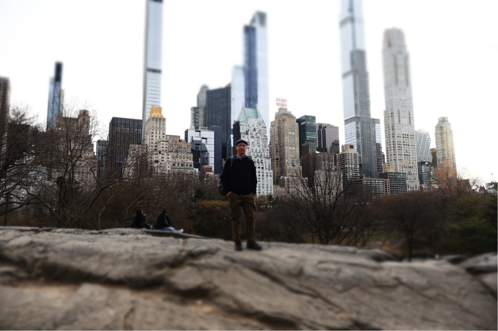{.bordered-img fig-align="center" height="220"}

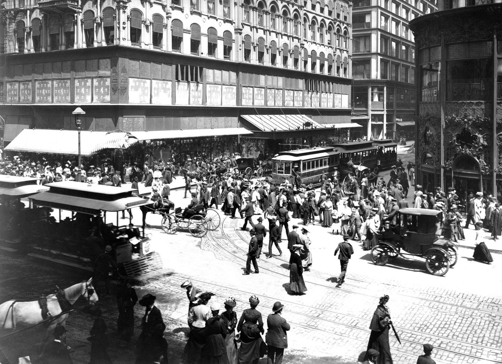{.bordered-img fig-align="center" height="220"}
:::
::::

::: notes
Industrialization from roughly 1700 to 1890 is where things get genuinely crowded. Cities like Manchester, Paris, New York, and Mumbai grow explosively during this period, but — and this is the point I want you to hold onto — they grow within a fundamentally pedestrian framework, just supplemented now by early streetcars and horsecars. Workers typically live within short walking distance of factories, ports, or workshops, because that's still the only affordable way to get to work reliably every day.

New York is a textbook case: founded as New Amsterdam in 1624, its formative growth long predates the automobile, and even after the Commissioners' Plan of 1811 laid out that famous street grid and industrialization accelerated through the nineteenth century, daily life for most residents — especially working-class and immigrant populations — stayed overwhelmingly pedestrian, just supplemented by horse-drawn vehicles and streetcars. High density, short blocks, and intense street-level activity made walking the default for commuting and social life alike. Chicago's Loop in this same era looked similar — look at this intersection at State Street, cable cars, horse carriages, and dense pedestrian crowds all sharing one of the country's busiest commercial corners, years before automobiles show up in any real numbers.

I want to flag something important here, because it connects to a theme running through the whole quarter: these industrial cities demonstrate that walking wasn't just *compatible* with industrial productivity — it was essential to it. The high densities that made industrial cities work economically were only possible because most trips were short enough to walk. So when we get to the mid-twentieth century and watch density and walkability get engineered away, understand that wasn't some inevitable byproduct of economic progress. It was a later, and very deliberate, policy choice — one that partially undid a pattern industrial cities had proven could work.
:::

---

## Period 4: Transitional Streets — Walking Meets the Automobile (1890 – 1920)

:::: {.columns}
::: {.column width="45%"}
### Core condition
Early automobiles enter shared streets

### Urban form
- No clear hierarchy of users
- High pedestrian injury and fatality rates
- Streets still socially multifunctional

### Key idea
Streets did not "naturally" belong to cars — this was a contested period.
:::

::: {.column width="55%"}
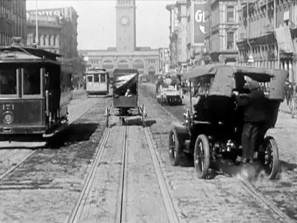{.bordered-img fig-align="center" height="260"}

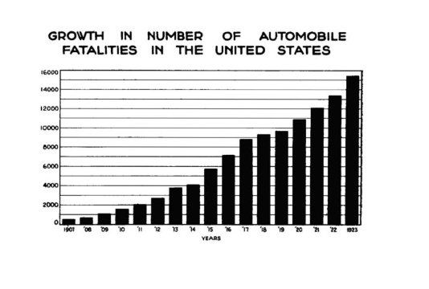{.bordered-img fig-align="center" height="160"}
:::
::::

::: notes
This is the hinge point of the whole session. Somewhere between 1890 and 1920, the automobile arrives on streets that were never designed with it in mind, and for about thirty years, nobody has agreed on who those streets actually belong to. There's no clear hierarchy of users — pedestrians, streetcars, horse-drawn wagons, bicycles, and early cars are all just negotiating right-of-way in real time — and pedestrian injury and fatality rates climb sharply as a result, which is exactly what that automobile-fatalities chart is showing you: a nearly forty-fold increase between 1907 and 1923 alone.

Some of you will remember this exact footage from week one — "A Trip Down Market Street," filmed in San Francisco just days before the 1906 earthquake. I'm showing you a still from it again deliberately, because now that we've built out this whole periodization, you can place it precisely: San Francisco at this moment is the textbook transitional city, still functioning largely as a walking-and-transit city, with dense mixed-use blocks and short walking distances, but automobiles are now a growing, disruptive presence sharing the same unregulated space as cable cars, horses, and pedestrians crossing wherever they please. The 1906 rebuilding after the earthquake and fire actually accelerated modernization — wider streets, new infrastructure — while still prioritizing streetcars and pedestrians for a few more years yet.

The key idea I want you to really sit with: streets did not "naturally" belong to cars. That outcome, which today feels like the default, was the result of a genuinely contested multi-decade struggle — and part of that struggle, which we'll pick up again in a few slides, involved a deliberate legal and cultural campaign to redefine "jaywalking" as a pedestrian's fault rather than a driver's responsibility. Nothing about this period was inevitable.
:::

---

## Period 5: Auto Ascendancy & Pedestrian Marginalization (1920 – 1960)

:::: {.columns}
::: {.column width="45%"}
### Core condition
Cars prioritized in planning and engineering

### Urban form
- Road widening and highway construction
- Sidewalk narrowing or removal
- Land-use separation and suburbanization

### Key idea
Walkability declined because it was actively engineered out.
:::

::: {.column width="55%"}
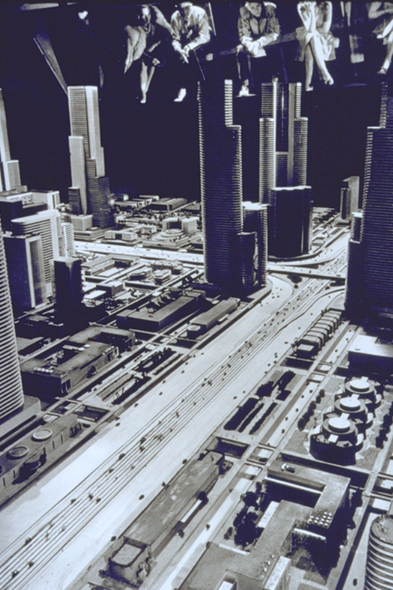{.bordered-img fig-align="center" height="220"}

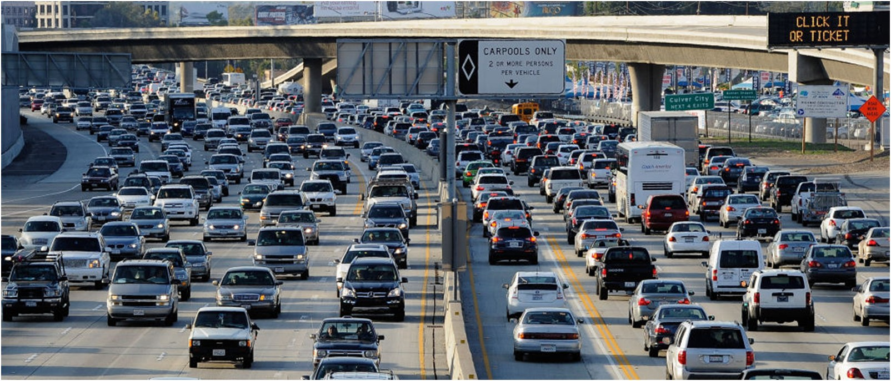{.bordered-img fig-align="center" height="200"}
:::
::::

::: notes
From 1920 to 1960, the contest we just described gets resolved decisively in the automobile's favor — and this time not by accident, but by design. Planning and traffic engineering practice reorganize themselves around vehicle speed and throughput: roads get widened, highways get built, sidewalks get narrowed or removed outright, and land uses that used to sit within walking distance of each other get deliberately separated by zoning, pushing cities toward the suburbanized, single-use pattern many of us now take for granted.

Detroit is the archetypal case. As the global center of the automotive industry, it experienced rapid population growth and spatial expansion between 1910 and 1950, with car ownership becoming widespread among working- and middle-class households earlier there than almost anywhere else in the country. That image is a detail from General Motors' Futurama exhibit at the 1939 World's Fair — a model city entirely organized around high-speed automobile movement, presented to millions of visitors as the aspirational future of American urban life. It's genuinely stunning propaganda, and it worked: postwar highway construction accelerated decentralization, physically dividing older pedestrian neighborhoods and fueling suburbanization tied to automotive-sector jobs. Los Angeles followed a related but distinct path — despite having extensive early streetcar and interurban rail networks, rapid growth after 1900 coincided with cheap land and few constraints on outward expansion, producing the low-density, horizontally dispersed pattern you can see choking this freeway today.

The key idea here matters more than almost any other in this deck: walkability did not simply fade away as some passive side effect of modernization. It was actively engineered out — narrower sidewalks, wider roads, separated land uses were each individually chosen, in engineering manuals and zoning codes, by people who believed they were building progress. That's the essential move I want you to make in your own thinking: stop treating car-dependent urban form as a natural or neutral outcome, and start treating it as a policy choice with a specific, traceable history — one that, because it was chosen, can also be unchosen.
:::

---

## Period 6: Crisis, Critique and Early Pedestrian Revival (1960 – 1990)

- Growing backlash to car-centric planning
- Pedestrian malls and traffic-calming experiments; historic core preservation
- Community-led resistance to highway construction
- **Key idea:** pedestrianism re-emerges as *critique*, not nostalgia

::: notes
By the 1960s, the costs of forty years of auto-first planning are becoming impossible to ignore — displaced neighborhoods, hollowed-out downtowns, rising traffic deaths — and a genuine backlash begins to build. Cities start experimenting with pedestrian malls and traffic calming, historic districts get organized to resist highway construction through their neighborhoods, and community-led resistance movements start winning real political fights.

I want to be precise about the framing on this slide, because it matters: pedestrianism re-emerges here as *critique*, not nostalgia. The people leading this revival in the sixties, seventies, and eighties weren't romanticizing some lost past for its own sake — they were making a pointed, evidence-based argument that mid-century planning had actively damaged American cities, and that walkable, human-scaled urban form was a corrective, not a step backward. That distinction is going to matter enormously as we look at the two foundational texts from this period on the next couple of slides — Jane Jacobs and Donald Appleyard were both making rigorous, observational arguments, not sentimental ones.
:::

---

## Jane Jacobs, *The Death and Life of Great American Cities* (1961)

:::: {.columns}
::: {.column width="35%"}
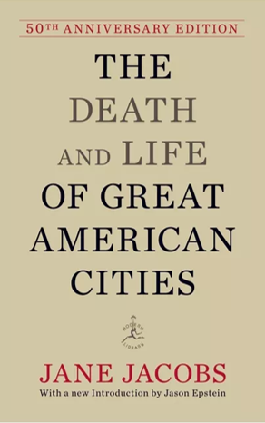{.bordered-img}
:::

::: {.column width="65%"}
- Sidewalks as social spaces: casual, repeated contact builds neighborhood trust
- "Eyes on the street": informal surveillance by residents and shopkeepers deters crime
- Mixed-use, walkable neighborhoods sustain diverse activity at all hours
- Human-scaled street design fosters creativity and spontaneous exploration
- Walkability underwrites local economic vitality
:::
::::

::: notes
Jane Jacobs published *The Death and Life of Great American Cities* in 1961, and it remains one of the single most influential critiques of mid-twentieth-century urban planning ever written. Jacobs argues directly against the large-scale, top-down planning we just spent two slides describing — planning that prioritized cars, single-use zoning, and superblock redevelopment — because she saw it as actively destroying the social fabric that made cities function.

Her core insight is that sidewalks aren't just circulation infrastructure, they're the primary social space of a neighborhood: casual, repeated contact between neighbors on a lively sidewalk builds familiarity and trust in a way that few other urban spaces can. That leads to her most famous concept, "eyes on the street" — the idea that neighborhood safety comes not primarily from police presence but from the informal, continuous surveillance of residents, shopkeepers, and pedestrians who are simply out and using the street, which only happens if the street is genuinely walkable and interesting enough to draw people outside. She also connects walkability directly to economic vitality: pedestrians passing on foot, repeatedly, at all hours, are what sustains small local businesses — something a purely car-oriented commercial strip, designed around brief parking-lot visits, generally cannot replicate.

Jacobs matters for this course because she's arguably the first major figure to frame walkability not as a nostalgic preference but as a functional, load-bearing part of how a healthy city actually works — safety, economy, and community, all resting on the same underlying condition of people being out on foot.
:::

---

## Donald Appleyard, *Livable Streets* (1981)

:::: {.columns}
::: {.column width="35%"}
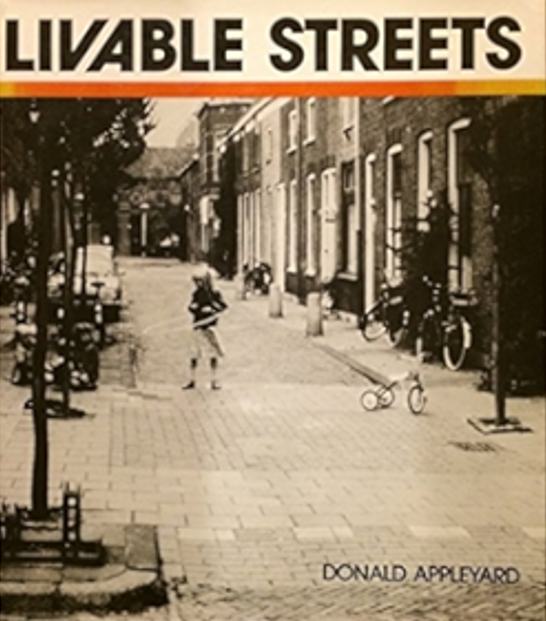{.bordered-img}
:::

::: {.column width="65%"}
- Compared three San Francisco streets, identical except for traffic volume
- Heavy-traffic streets: fewer friendships, smaller "perceived territory"
- Light-traffic streets: more gathering spots, more friendships, wider sense of home
- Traffic volume, not just design, shapes social health of a block
:::
::::

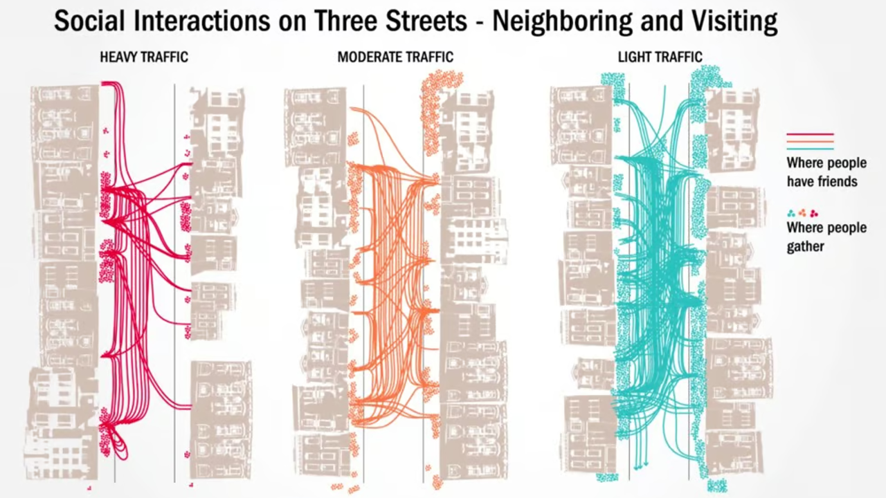{.bordered-img fig-align="center" height="280"}

::: notes
In 1981, Berkeley urban design professor Donald Appleyard published *Livable Streets*, based on fieldwork he'd actually done back in the late 1960s. His method was elegant: he picked three residential streets in San Francisco that were essentially identical in every respect except one — the volume of traffic running down them — and then systematically measured how residents actually used the street.

Look at this figure, because it's one of the most reproduced images in all of urban planning literature. Each line represents a friendship or acquaintance connecting two residents; each cluster of dots represents a spot where people are known to gather. On the heavy-traffic street on the left, look how few lines there are, and how tightly they cluster right around each home — Appleyard's residents there reported a shrunken sense of "perceived territory," essentially just their own doorstep, because the street itself felt unsafe and unpleasant. Now compare that to the light-traffic street on the right: dramatically more connections, more gathering spots, and people reporting that their sense of home extended out across the whole street, not just their own front step.

The finding that should stick with you: traffic volume alone — not architecture, not income, not any other variable Appleyard could identify — was strongly associated with how much community life a street supported. Fewer cars didn't just mean less noise; it meant measurably more friendships, more play, more spontaneous social contact. This is the empirical backbone behind everything we now call traffic calming, and it's worth remembering that this evidence has been sitting in the literature since 1981 — we've largely known this for over forty years.
:::

---

## Robert Bullard & Glenn Johnson, *Just Transportation* (1997)

:::: {.columns}
::: {.column width="35%"}
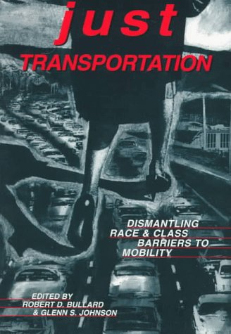{.bordered-img}
:::

::: {.column width="65%"}
- Transportation systems in the U.S. have been systematically shaped by racial and class inequity
- Highway construction routed disproportionately through Black neighborhoods
- Chronic underinvestment in transit; policy privileging car ownership
- Reframes transportation as a social determinant of opportunity, not a neutral technical system
:::
::::

::: notes
The critique period wasn't only about traffic volume and street design — it also produced a rigorous reckoning with *who* car-centric planning served and who it harmed. Robert Bullard and Glenn Johnson's 1997 collection *Just Transportation: Dismantling Race and Class Barriers to Mobility* argues that American transportation systems have been systematically shaped by racial and class inequity, not as an unfortunate side effect, but as a direct consequence of specific, traceable policy decisions: highway construction routed disproportionately through Black neighborhoods, chronic underinvestment in public transit serving lower-income communities, and policies — mortgage lending among them — that actively privileged car ownership and single-family suburban development for some populations while foreclosing it for others.

This matters directly for today's topic, because pedestrian safety outcomes track these same inequities closely. I'll flag one stark, more recent data point that extends Bullard's argument: drivers strike and kill Black and Native American pedestrians at meaningfully higher rates than white or Asian pedestrians, even after controlling for differences in how much each group walks and where. Some of that gap traces back to exactly the infrastructure history Bullard describes — the more dangerous, high-speed arterial roads that the interstate system disproportionately routed through communities of color — and some of it appears to reflect implicit bias in driver behavior itself: research out of the University of Nevada found drivers were significantly more likely to yield to a white pedestrian in a crosswalk than to a Black pedestrian in the identical crosswalk.

Bullard's central reframing is the one I want you to carry forward into your final projects: transportation is not a neutral technical system. It is a powerful social determinant of who gets access to jobs, healthcare, and safety — and evaluating "sustainability" without evaluating equity is only doing half the job.
:::

---

## Period 7: Sustainability Era & Emerging Futures (1990 – Present)

:::: {.columns}
::: {.column width="50%"}
### Core condition
Walking reframed as infrastructure

### Urban form
- Complete Streets
- Vision Zero
- Walkability metrics and indices
- Low-traffic neighborhoods
- Climate-adaptive street design

### Key idea
Walking becomes central to sustainability, equity, and public health.
:::

::: {.column width="50%"}
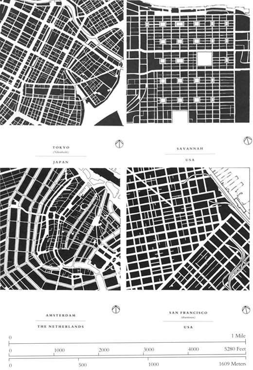{.bordered-img fig-align="center" height="420"}
:::
::::

::: notes
The final period, from 1990 to the present, is where walking gets explicitly reframed — no longer treated as a leftover mode for people without cars, but as infrastructure that cities deliberately plan for, fund, and measure. Complete Streets policies require that roadway projects accommodate pedestrians and cyclists, not just drivers, by design rather than by afterthought. Vision Zero programs set an explicit policy target of zero traffic deaths and treat every pedestrian fatality as a preventable engineering and policy failure rather than an inevitable cost of mobility. Cities now build and publish walkability indices, experiment with low-traffic neighborhoods, and increasingly design streets with climate adaptation — shade trees, permeable paving, stormwater management — built in alongside pedestrian safety.

This comparison image is worth studying closely. These four historic street grids — Tokyo's Nihonbashi district, Savannah, Amsterdam, and downtown San Francisco — are all shown at the exact same physical scale, and notice how strikingly similar their block sizes and street densities are, despite being built on different continents in different eras for different cultures. That's not a coincidence: all four were substantially shaped by pedestrian-scale movement before the automobile arrived, and all four are now held up as models of walkable urban form specifically *because* of that shared underlying grain. The sustainability era isn't inventing something new here so much as it's rediscovering, and formalizing with data and policy, a pattern that pre-automobile cities across very different cultures arrived at independently.

The key idea to close this historical arc: walking has moved from default, to marginalized, to deliberately engineered infrastructure — and that third stage is where we are now, which is exactly why your generation of planners has real influence over what happens next.
:::

---

## Recap: Theory of Routine Mode Choice

:::: {.columns}
::: {.column width="45%"}
{.bordered-img}
:::

::: {.column width="55%"}
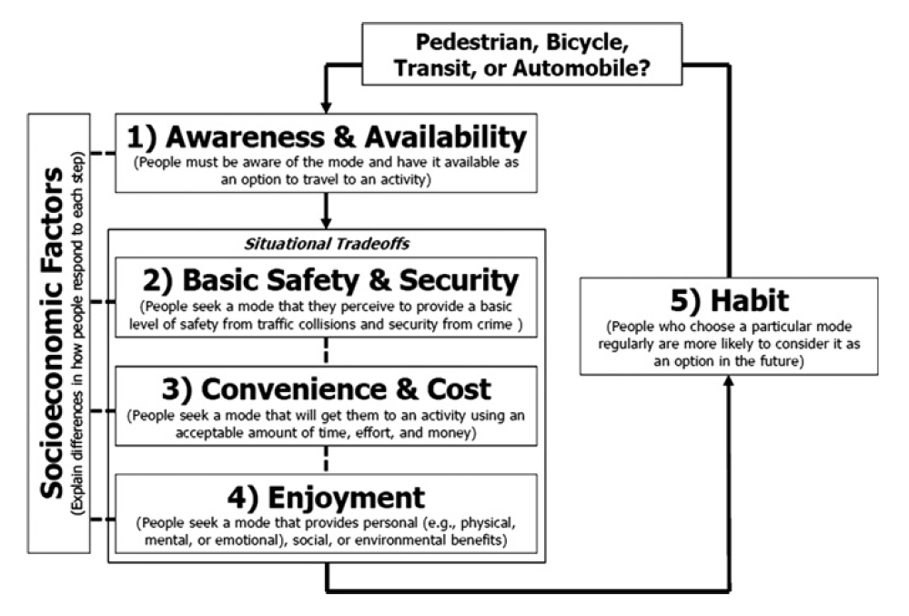{.bordered-img}
:::
::::

::: notes
Quick callback to last week, because everything we've just walked through in seven historical periods maps directly onto Schneider's five-step framework for routine mode choice. Remember the steps: awareness and availability, basic safety and security, convenience and cost, enjoyment, and habit, all running alongside socioeconomic factors that shape how differently people experience each step.

What today's history adds is the missing piece of context: those five steps don't operate in a vacuum, they operate within whatever urban form and street design a given era has produced. In a pre-automobile walking city, step one — awareness and availability — was trivial, because walking was the only option anyone had ever known. By the mid-twentieth century, after decades of auto-ascendant planning, walking had become the mode plenty of people never even consider, precisely because sidewalks were narrowed or removed and destinations were spread too far apart to reach on foot. So when we ask today why someone doesn't walk for a given trip, Schneider's framework tells us where to look for the barrier, and today's history tells us *why* that barrier exists in the built environment in the first place. Keep both frameworks running together for the rest of the quarter.
:::

---

## Commute Mode Share Since 1980

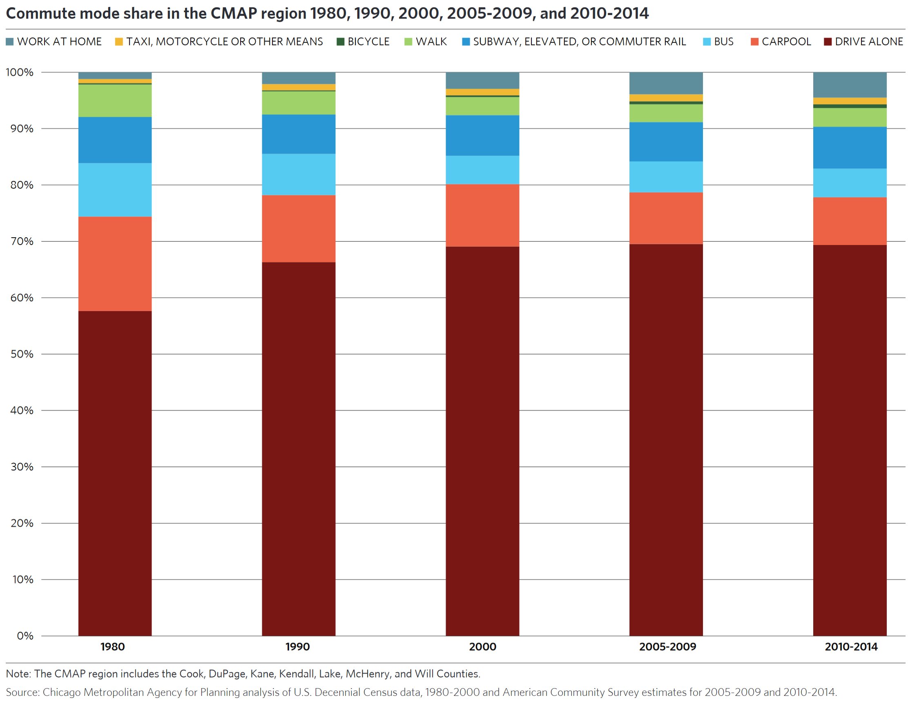{.bordered-img fig-align="center" height="480"}

::: notes
Here's the mode-share data for the Chicago region specifically. Through the 1980s and 1990s, the share of commuters driving alone steadily climbed until it represented about seventy percent of all work trips — the direct downstream result of the auto-ascendancy period we just covered. But look at what happens after 2000: the drive-alone share essentially plateaus, and the composition of the remaining thirty percent starts to diversify — walking, biking, and working from home all pick up a bit of ground.

This is a modest trend, and I don't want to oversell it, but it's a meaningful one: it lines up almost exactly with the start of the sustainability era we just discussed, when Complete Streets policies, Vision Zero campaigns, and walkability metrics started actually showing up in planning practice. Mode share is slow to move, because it's downstream of decades of accumulated infrastructure decisions, but it does move when policy priorities shift — which is exactly the argument for staying engaged with this work rather than assuming current mode share is fixed.
:::

---

## Car-Centric Systems Are Expensive

- Between 1970 and 2010, the U.S. roughly doubled the total amount of roadway
- Over that same period, the typical American household roughly doubled the share of its income spent on transportation — from 10% to 20%
- Transportation is typically a household's second-largest expense, after housing

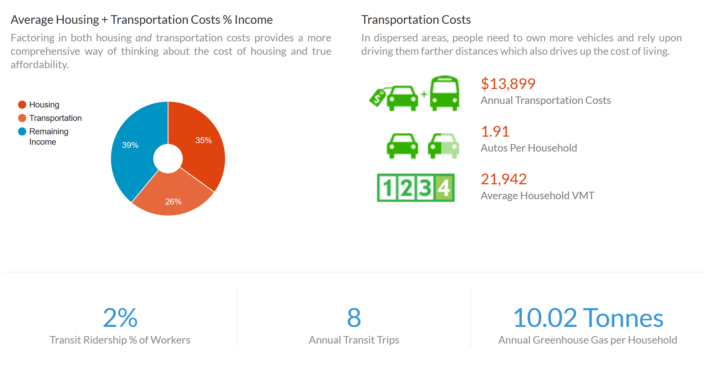{.bordered-img fig-align="center" height="320"}

::: notes
Let's turn to the costs of the car-centric system we spent periods four and five building. Between 1970 and 2010, the U.S. roughly doubled the total mileage of roadway in the country — and over that same forty-year stretch, the typical American household roughly doubled the share of its income going to transportation, from about ten percent to twenty percent. Transportation is now typically a household's second-largest expense after housing, and — this is the important analytical move — those two costs aren't actually independent of each other.

That's what the Center for Neighborhood Technology's H+T Index is built to show: when you combine housing and transportation costs into one number, you get a much more honest picture of true affordability. Notice in this figure that transportation alone eats up about a quarter of the combined budget, autos-per-household sits close to two, and average household vehicle miles traveled comes in around twenty-two thousand miles a year — annual transportation costs alone run nearly fourteen thousand dollars. And notice the punchline stat at the bottom: only about two percent of workers in this dataset use transit. Location genuinely matters here — compact, walkable neighborhoods with good access to jobs and transit are measurably more affordable once you stop looking at housing cost in isolation, which is exactly the mistake a lot of "affordable housing" policy still makes when it's sited in car-dependent locations far from jobs and transit.
:::

---

## Car-Centric Systems Are Unsafe

:::: {.columns}
::: {.column width="50%"}
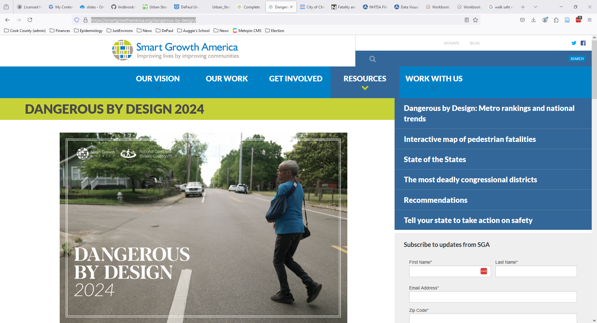{.bordered-img fig-align="center" height="320"}
:::

::: {.column width="50%"}
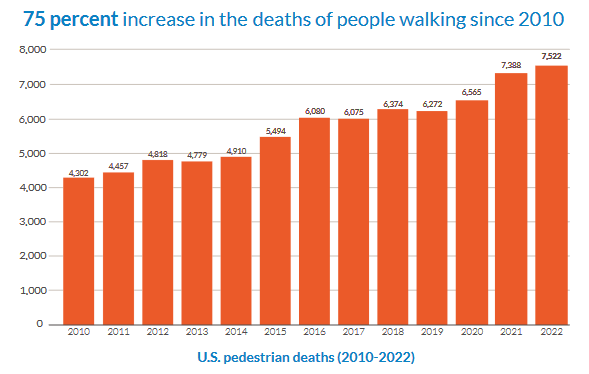{.bordered-img fig-align="center" height="220"}

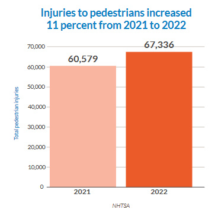{.bordered-img fig-align="center" height="180"}
:::
::::

::: notes
Smart Growth America's *Dangerous by Design* report is the definitive annual accounting of pedestrian safety in the U.S., and the trend line here should stop you in your tracks: pedestrian deaths have risen seventy-five percent since 2010, and injuries climbed another eleven percent just between 2021 and 2022 alone. This is happening *during* the sustainability era we just described — Complete Streets and Vision Zero policies have been spreading at the same time these numbers have been getting worse, which tells you plainly that policy adoption on paper and actual outcomes on the street are two very different things, and that the underlying street design in most American cities is still fundamentally built around vehicle speed, not pedestrian survival.

I want to read you a passage from the report itself, because the authors make a point I think is easy to lose in the raw statistics: "Each one of these deaths was a person who left behind a grieving family and friends. The trauma of survivors is just one of three hidden costs of this crisis that deserves far more attention. There's also the heavy direct and indirect costs — and trauma — from the hundreds of thousands of under-reported injuries during that time. And there's the countless number of walking trips never taken, as millions choose not to risk their lives or livelihoods on dangerous streets where thousands of their neighbors have lost their lives or suffered injuries." That third hidden cost — trips never taken at all — is the one that doesn't show up in any crash statistic, but it's arguably the largest cost of all, because it's suppressing exactly the kind of walking behavior every policy in the sustainability era is trying to encourage.

And remember Bullard from a few slides ago: these deaths and injuries are not evenly distributed. Older adults face the highest per-capita risk, and Black and Native American pedestrians are struck and killed at significantly higher rates than white pedestrians, even controlling for how much each group walks — a pattern this report and others tie directly back to which communities got the high-speed, multi-lane arterial roads in the first place.
:::

---

## Car-Centric Systems Carry High Environmental Costs

:::: {.columns}
::: {.column width="55%"}
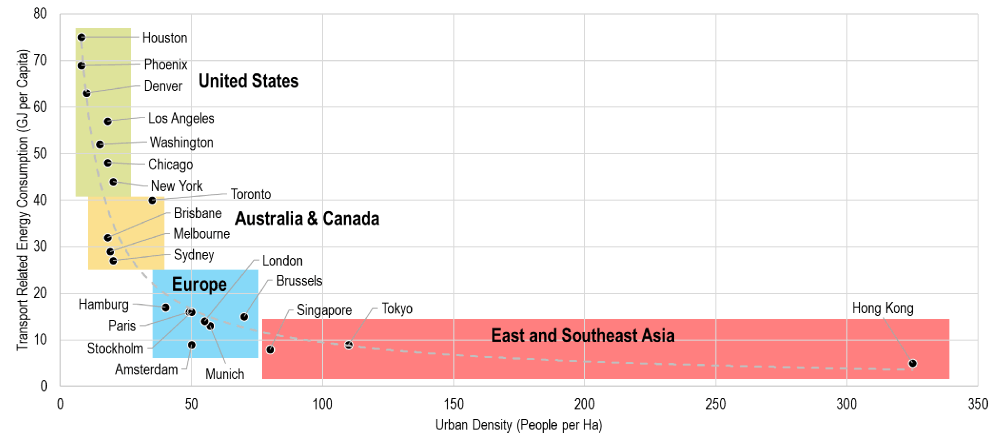{.bordered-img fig-align="center" height="360"}
:::

::: {.column width="45%"}
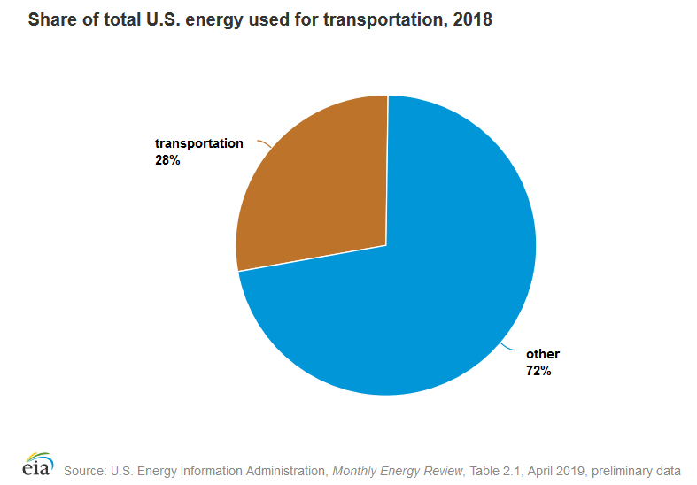{.bordered-img fig-align="center" height="300"}
:::
::::

::: notes
Last of our three "costs" slides: the environmental bill. This first chart is a classic and much-reproduced figure in transportation planning — transport-related energy consumption per capita, plotted against urban density, for cities around the world. Look at the pattern: low-density U.S. cities like Houston, Phoenix, and Denver sit way up in the seventy-gigajoule range, while dense East and Southeast Asian cities like Hong Kong sit down near five. That's roughly a fifteen-fold difference in per-capita transportation energy use, driven almost entirely by urban density and the mode choices that density makes possible — not by wealth, not by climate, not by culture alone.

On the right, nationally, transportation accounts for twenty-eight percent of all U.S. energy consumption — more than a quarter of the entire country's energy budget goes to moving people and goods around, and the density chart on the left tells you why that number is so much higher here than in comparably wealthy nations: American cities were built, in the exact periods we covered today, to require far more driving per person than dense, walkable cities require. This is the throughline connecting today's whole session — the urban form decisions made in the 1920s through the 1960s aren't just a historical curiosity, they're actively driving a substantial share of the country's energy consumption and greenhouse gas emissions today, seventy or a hundred years later. Urban form is that durable.
:::

---

## So how can we design communities that are safer, more ecologically sound, more economically efficient, and more socially equitable?

::: notes
Pause here for a second, because I want this to land as a genuine question, not a rhetorical one. We've just spent this session establishing that walkable, pedestrian-scaled cities aren't some nostalgic ideal — they're how cities worked for most of human history, they're measurably safer and cheaper and more energy-efficient, and we have forty-plus years of rigorous evidence, from Appleyard to Bullard to Dangerous by Design, telling us exactly what's gone wrong and for whom.

So the question is genuinely open: given everything we now know, what would you actually change first? Take thirty seconds and think about one specific intervention — not a philosophy, an actual physical or policy change — before we look at a few frameworks that planners are already using to answer this question.
:::

---

## Revised Transportation Hierarchy

:::: {.columns}
::: {.column width="45%"}
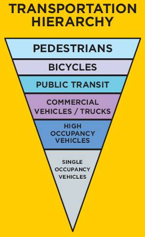{.bordered-img fig-align="center" height="420"}
:::

::: {.column width="55%"}
- Reorders how cities prioritize travel modes: people and sustainability at the center, not vehicle throughput
- Portland's order: pedestrians and cyclists first, then transit, then freight, with private automobiles last
- Implemented through signal timing, transit signal priority, and intersection redesign — not just plans on paper
:::
::::

::: notes
One of the clearest applied frameworks for answering that question comes from Peter Koonce, a traffic engineer who helped implement Portland, Oregon's "revised transportation hierarchy." The idea is simple to state and genuinely radical to implement: instead of designing traffic operations around maximizing vehicle throughput, you explicitly reorder your priorities, putting people and sustainability goals at the center. In Portland's version, pedestrians and cyclists come first, then transit vehicles, then freight and goods movement, and private automobiles are placed last.

What I want you to notice is that this isn't just a conceptual poster — it gets implemented through very specific, unglamorous operational decisions: signal timing that favors walking and biking phases, transit signal priority so buses and light rail don't sit at red lights behind single-occupant cars, and intersection geometry redesigned for safety and comfort of the most vulnerable users first. Koonce himself describes a downtown Portland intersection where light rail, a buffered bike lane reallocated from what used to be auto travel lanes, on-street parking supporting the pedestrian environment and business deliveries, and just a single vehicle travel lane all coexist — where a comparable intersection in most American cities would still have three or four lanes purely for car traffic. This hierarchy ties directly back to Koonce's own broader point: cities don't have to wait for some distant future climate target to start reallocating street space differently. It's an operational choice available right now, intersection by intersection.
:::

---

## Applied Example: Slowing Traffic Saves Lives

:::: {.columns}
::: {.column width="55%"}
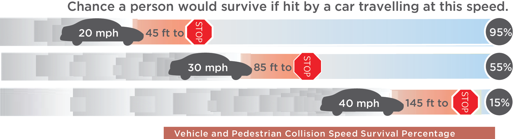{.bordered-img fig-align="center" height="280"}

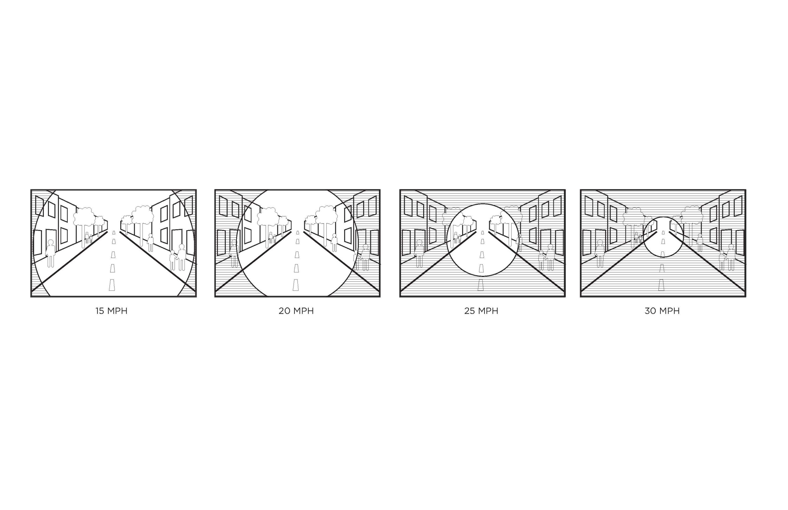{.bordered-img fig-align="center" height="160"}
:::

::: {.column width="45%"}
- A Leading Pedestrian Interval (LPI) gives pedestrians a 3–7 second head start into the intersection
- LPIs reduce pedestrian-vehicle collisions by as much as 60% at treated intersections

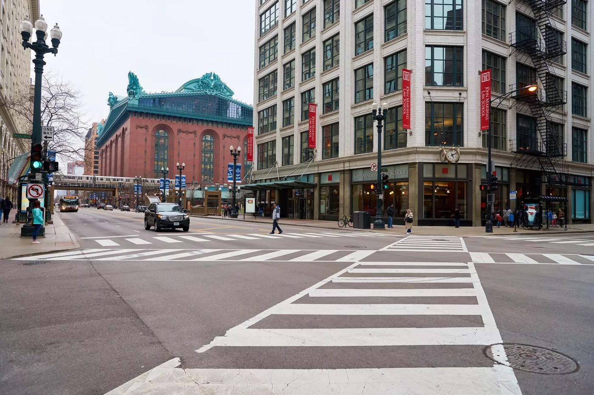{.bordered-img fig-align="center" height="180"}

{.bordered-img fig-align="center" height="160"}
:::
::::

::: notes
Let's make the safety case concrete with two related pieces of evidence, and then one specific low-cost intervention. First, speed: a pedestrian struck at 20 miles per hour survives about ninety-five percent of the time; at 30 miles per hour that drops to fifty-five percent; at 40 miles per hour it falls to just fifteen percent. That's not a gradual curve, it's a cliff — and it's the single most important number in traffic safety engineering, because it means the difference between a 25 and a 35 mile-per-hour speed limit on a residential street is, quite literally, a difference in whether pedestrian collisions are usually survivable or usually fatal. Second, notice how dramatically a driver's field of view narrows as speed increases — at 15 miles per hour a driver has wide peripheral awareness of the whole street scene; by 30 miles per hour that awareness has collapsed to a narrow tunnel straight ahead, which is exactly why higher speeds mean drivers see pedestrians later, if at all.

Given both of those facts, here's a genuinely low-cost engineering response: the Leading Pedestrian Interval, or LPI. It just gives pedestrians a three-to-seven-second head start into the crosswalk before parallel vehicle traffic gets its green light, so a person on foot is already visible and established in the intersection before any turning vehicle starts moving — no capital construction required, and it's been shown to reduce pedestrian-vehicle collisions by as much as sixty percent at treated intersections. Chicago's pedestrian scramble at State and Jackson, which some of you will remember from week one, is an even more aggressive version of the same underlying idea, stopping all vehicle traffic at once so pedestrians can cross in any direction, including diagonally. And here's a parallel low-cost treatment for cyclists: a dedicated bicycle signal head paired with a sign reminding turning vehicles to yield — same underlying philosophy, just applied to the next mode up the hierarchy we just looked at. The throughline across all of these interventions: meaningful pedestrian safety gains often come from signal timing and small design details, not from expensive capital projects.
:::

---

## The General Theory of Walkability

:::: {.columns}
::: {.column width="35%"}
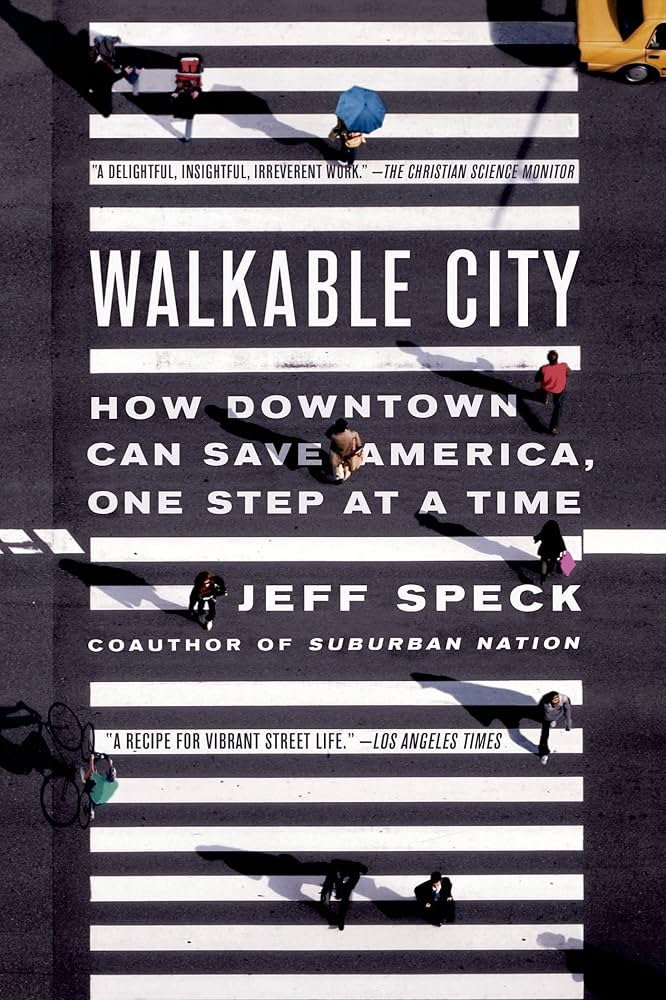{.bordered-img}

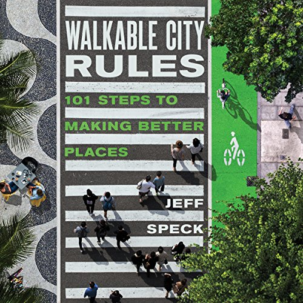{.bordered-img}
:::

::: {.column width="65%"}
A walk has to satisfy four conditions — all four, none sufficient alone:

- **Useful** — daily needs located close at hand
- **Safe** — designed to actually protect pedestrians, and to *feel* safe
- **Comfortable** — buildings and landscape form "outdoor living rooms"
- **Interesting** — unique buildings, active frontages, signs of humanity
:::
::::

::: notes
Jeff Speck's *Walkable City* gives us a compact, practical framework to close out the theory portion of today's session — what he calls the General Theory of Walkability. His claim is that for a walk to be genuinely favored over driving, it has to satisfy four conditions simultaneously, and — this is the important part — no single one of them is sufficient on its own.

Useful means the aspects of daily life you actually need are located close enough that walking legitimately serves them — you can't will your way past bad land-use separation with good sidewalks alone. Safe means the street is actually designed to protect pedestrians from being struck by a vehicle, but Speck is careful to note it also has to *feel* safe, which is a separate and honestly harder bar to clear — think about everything we just covered on speed and sightlines. Comfortable means buildings and landscape shape the street into what he calls an "outdoor living room," in contrast to the wide-open, exposed spaces that reliably fail to attract pedestrians no matter how safe they technically are. And interesting means the walk has to hold your attention — unique buildings, active storefronts, actual signs of human presence, not blank walls and parking lots.

Notice how neatly this maps back onto everything we've covered today: the medieval and industrial walking cities we looked at earlier in the session basically satisfied all four conditions by default, because there was no alternative. The auto-ascendancy period broke useful and safe first. And the sustainability era's whole project — Complete Streets, Vision Zero, walkability indices — is really just an attempt to systematically re-engineer all four conditions back into places that lost them.
:::

---

## The Evidence Base: Built Environment & Active Transportation

:::: {.columns}
::: {.column width="50%"}
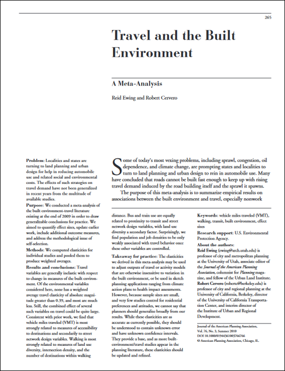{.bordered-img fig-align="center" height="380"}
:::

::: {.column width="50%"}
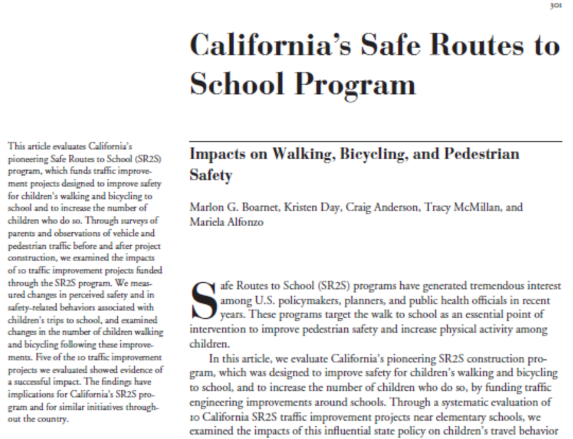{.bordered-img fig-align="center" height="380"}
:::
::::

::: notes
Beyond Amato's cultural history, this week's literature — the NCHRP report on the benefits of active transportation — draws on a much more quantitative research tradition, and these two studies anchor it. Ewing and Cervero's 2010 meta-analysis pools results across dozens of built-environment studies and computes standardized elasticities: how much does a given change in density, land-use mix, or street connectivity actually move travel behavior? Their headline finding is that walking is most strongly associated with measures of land-use diversity, intersection density, and the number of destinations within walking distance — in other words, almost exactly the "useful" and "interesting" conditions from Speck's framework, now backed by pooled statistical evidence rather than observation alone.

Boarnet and colleagues take a more applied, program-evaluation approach: they studied ten California Safe Routes to School traffic-improvement projects, measuring perceived safety and actual walking and biking behavior before and after construction. Five of the ten projects showed clear evidence of successfully increasing the number of children walking or biking to school — a genuinely encouraging result, because it shows the built-environment relationships Ewing and Cervero identify statistically can also be moved deliberately, through a specific, fundable, replicable program, not just observed passively across cities that already happen to differ.

Together these two studies are exactly the kind of evidence base Exercise #1 is asking you to build for yourselves: quantify the relationship, then propose and justify a specific intervention.
:::

---

## A Public Health Lens on Walkability

:::: {.columns}
::: {.column width="50%"}
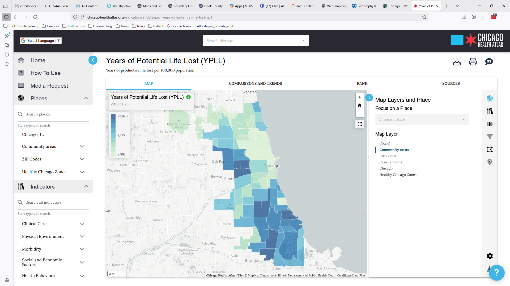{.bordered-img fig-align="center" height="230"}

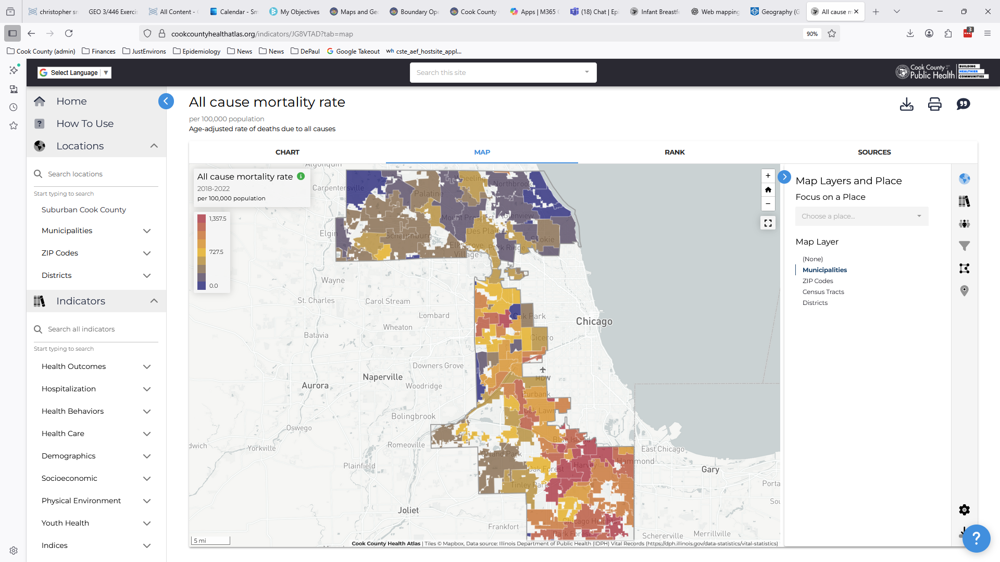{.bordered-img fig-align="center" height="230"}
:::

::: {.column width="50%"}
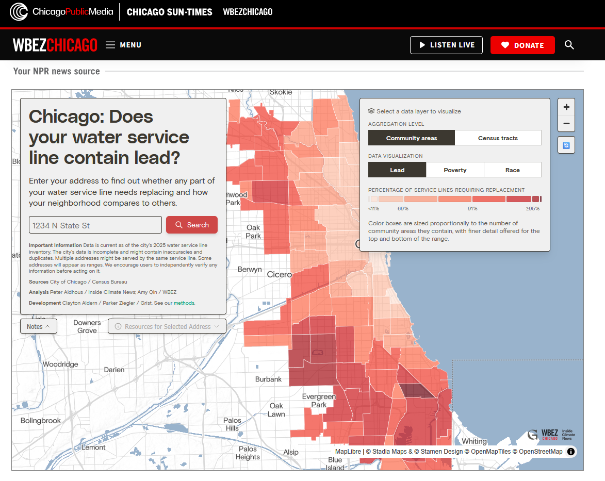{.bordered-img fig-align="center" height="230"}

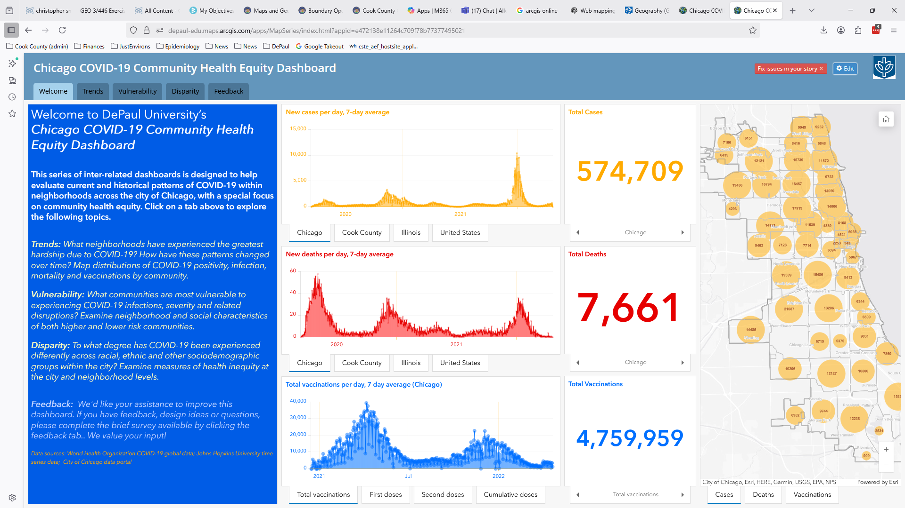{.bordered-img fig-align="center" height="230"}
:::
::::

::: notes
I mentioned in week one that alongside teaching here, I work as an epidemiologist with the Cook County Department of Public Health, so I want to close the theory portion of today's session by bringing that lens in directly, because walkability is fundamentally a public health issue, not just a mobility one.

These four maps are all tools I use or have helped build in that work. The top left is the Chicago Health Atlas showing Years of Potential Life Lost by community area — notice how closely the highest-burden areas track the same South and West Side communities that Dangerous by Design and the equity data from Bullard's chapter earlier today identify as facing the highest pedestrian fatality risk; these are not separate problems, they're the same underlying geography of disinvestment showing up across multiple health and safety indicators at once. Next to it, the Cook County Health Atlas shows all-cause mortality by municipality across the broader county, and again the pattern of concentrated risk in specific corridors should look familiar from today's discussion of which neighborhoods got the high-speed arterial roads.

The bottom two maps push the point further. Chicago's lead water-service-line map — built from the city's own 2025 inventory data — shows another environmental health burden concentrated in many of the same communities, a reminder that walkability, traffic safety, and environmental health are rarely separable problems in practice; they cluster together because they share root causes in how investment and infrastructure have historically been distributed. And the COVID-19 Community Health Equity Dashboard we built here at DePaul during the pandemic showed the same geographic pattern again for infection, mortality, and vaccination access.

The takeaway I want you to leave with: when you propose a walkability intervention for your final project, you have an opportunity — and I'd argue a responsibility — to check it against these same public health datasets. A safer crossing or a new sidewalk is a transportation fix, but sited in the right place, it is simultaneously a public health intervention.
:::

---

## Discussion: Urban Pedestrian Case Studies

[Working in small groups, pick one example we covered today.]{.prompt-lead}

1. What specific decision — planning, engineering, or policy — shaped this place's walkability, for better or worse?
2. Which of Speck's four conditions (useful, safe, comfortable, interesting) is strongest here? Which is weakest?
3. If you had one intervention and a modest budget, what would you change first?
4. How would Bullard ask you to check your answer for equity before finalizing it?

::: notes
Let's put today's frameworks to work. Break into small groups and pick one place we discussed today — it can be Pompeii, medieval Florence, industrial-era New York or Chicago, transitional San Francisco, auto-ascendant Detroit or Los Angeles, or a Complete Streets or Vision Zero example from the sustainability era. Doesn't matter which, as long as your group can agree on one.

Work through these four questions together. First, name the specific decision — not a vague trend, an actual identifiable planning, engineering, or policy choice — that shaped that place's walkability. Second, run it through Speck's four conditions and tell me which one is strongest and which is weakest there. Third, given a modest budget, what's the one intervention your group would prioritize — and try to be as concrete as the Leading Pedestrian Interval example, not just "add more sidewalks." And fourth, I want every group to explicitly apply Bullard's equity lens before you finalize your answer: who benefits from your proposed intervention, and is there any chance it could displace or burden the community you're trying to help?

[Give groups eight to ten minutes, then have two or three report back to the full class.]
:::

---

## Final Project Brainstorming

[Individually or with a partner, sketch a rough direction.]{.prompt-lead}

- What place or system draws you in — a neighborhood, a corridor, a specific intersection, a policy?
- Which lens fits best: historical (today's periods), safety (Dangerous by Design), equity (Bullard), or built-form (Speck, Jacobs, Appleyard)?
- What data would you need to evaluate it, and where might you find it?

::: notes
Now let's turn toward your own final projects, since a rough proposal is due in a few weeks. Take a few minutes, either alone or with a partner, to sketch a rough direction — I'm not looking for a finished proposal today, just a starting point.

Start with the place or system that actually draws your interest — it could be a neighborhood you know well, a specific corridor, even one dangerous intersection, or a policy question rather than a place at all. Then think about which lens from today fits best: are you drawn to the historical angle, tracing how a place's walkability changed over time the way we did with Detroit or Florence today? The safety angle, using something like the Dangerous by Design data? The equity angle, following Bullard's framework? Or the built-form angle, applying Jacobs, Appleyard, or Speck's criteria to evaluate a specific street or neighborhood? None of these is more "correct" than another — they're just different entry points, and the best projects usually end up drawing on two or three of them together.

Finally, start thinking concretely about data: what would you actually need to evaluate your question, and where would you find it? We'll talk more about data sources as we go, but Exercise #1, which many of you are already working on, is a good model for the kind of county-level commute and pedestrian-fatality data that's readily available.
:::

---

## Exercise #1 Q&A

[Open floor — bring your questions on Exercise #1.]{.prompt-lead}

- Due end of next week, alongside Exercise #2 being assigned
- Analyzing commute mode share and pedestrian fatality trends for a county of your choosing

::: notes
Let's close today with open floor time for Exercise #1, which is due at the end of next week — the same week Exercise #2 gets assigned, so this is really your last dedicated Q&A window before that deadline. As a reminder, the exercise has you analyze commute mode share and pedestrian fatality trends for a county of your choosing, and propose your own evidence-based intervention, in the same spirit as the Leading Pedestrian Interval example we walked through today.

[Take questions.] Before we wrap up, one look ahead: next week we shift from walking to bicycling — another mode we'll trace through its own distinct historical periods, from the earliest hobby-horse bicycles up through today's e-bike boom. A lot of the same forces we discussed today — auto-ascendancy, the 1970s energy-crisis revival, the sustainability era — show up again in that history too, just on a different timeline. See you then.
:::
