::: {.img-center}
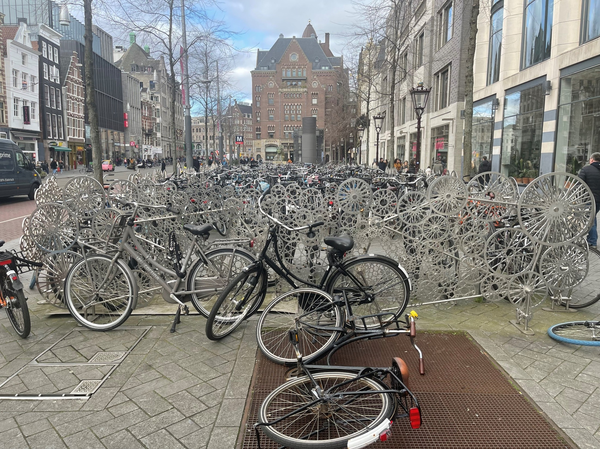{height=100%}
:::

::: notes
Today we’re focusing on bicycling, not just as a mode of transportation, but as something that’s been deeply shaped by a combination of both technological innovations and the cities themselves—their streets, their politics, and their priorities.

One thing I want to flag right away is that bicycling’s history in cities is not a steady success story to be sure. It’s a story of moments when bikes were new and thought of as novelties, moments when they were pushed aside and not thought of as legitimate transportation, and moments when cities tried to bring them back.

As we go through this lecture, we’re going to look at bicycling alongside other modes, especially automobiles, and ask why biking worked well in some periods and places—and why it struggled in others.

As with all of these presentations, the goal isn’t to memorize dates or technologies. Rather the key is to better understand how decisions about these unique forms of mobility has street space and infrastructure shape what kinds of movement feel normal, safe, or even possible.

Keep that framing in mind as we move through the periods—you’ll see that the bicycle itself changes as well as the city around it.
:::

---

## Periods of Urban Bicycling
:::: {.columns}

::: {.column width="55%"}
-   Period 1: Proto-Bicycles & Mechanical Curiosity (1816–1860s)
-   Period 2: Safety Bicycles & The First Urban Cycling Boom (1870s–1900)
-   Period 3: Cycling as a Pre-Automobile Urban Mode (1900–1930s)
-   Period 4: Automobile Ascendancy & Cycling Marginalization (1930s–1960s)
-   Period 5: Oil Crisis & Environmental Reawakening (1970s)
-   Period 6: Information Technologies & Sharing Economies (2000s–2010s)
-   Period 7: Rise of Electric Micromobility Vehicles  (2020s-Present)
:::

::: {.column width="45%"}

### Sources

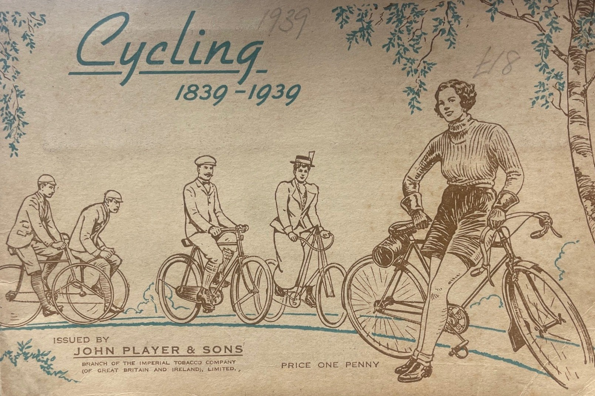

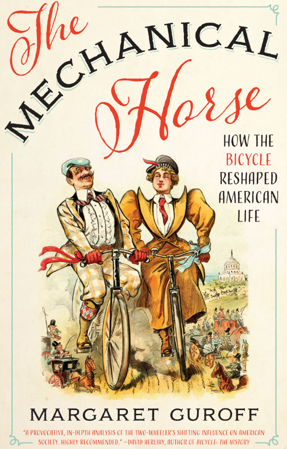

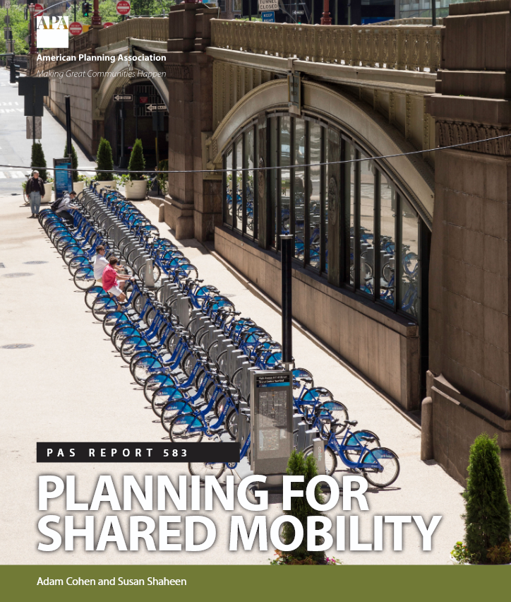

:::

::::

::: notes
We can organize the history of urban bicycling into a series of broad periods that reflect shifts in technology, urban form, and transportation priorities. Early bicycles begin as experiments, become mainstream urban transport by the late 19th century, and then gradually lose status as streets are redesigned around automobiles.

From the mid-20th century onward, bicycling re-enters planning conversations through energy crises, safety concerns, public health research, and climate policy. Across all periods, the key question is not whether bicycles work, but under what street designs and policy conditions they are allowed to work.
:::

---

## Period 1: Proto-Bicycles & Mechanical Curiosity (1816–1860s)

:::: {.columns}
::: {.column width="55%"}
### Key Developments
- Early innovations in cycling were essentially scooters (aka "hobby horse", "dandy horse", "running machine", "draisine-style" or modern "balance bikes") with no pedals
- Lever-driven cycles preceded pedal-driven velocipedes
- Foot pedals added to the front wheel as part of "boneshaker" bicycle
- These early transportation technologies were essential mechanical experiments that bridged walking and cycling and represented the first practical attempts of human-powered wheeled personal transport

### Urban Transportation Relevance
- Early cycles often made of wood (not mass produced) that offered limited everyday use
- Largely used in parks, promenades, and wide boulevards (e.g., Hyde Park, Regent's Park) for recreational travel among the elite (mostly upper-class men) who could afford them
- They offered demonstrations of modernity and a break from animal-powered transport

### Sustainability Significance
- Established the potential of zero-emission, human-powered mobility
- Laid groundwork for later urban and rural adoption
:::

::: {.column width="45%"}

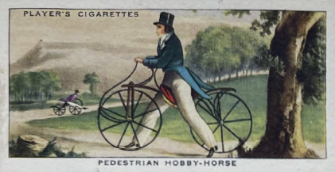

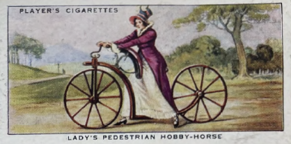

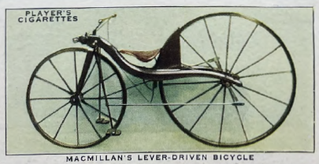

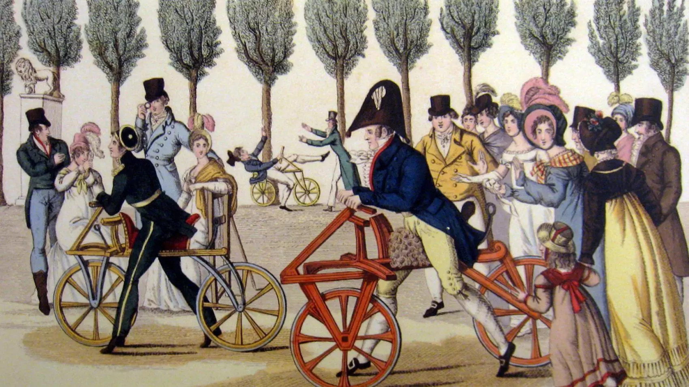

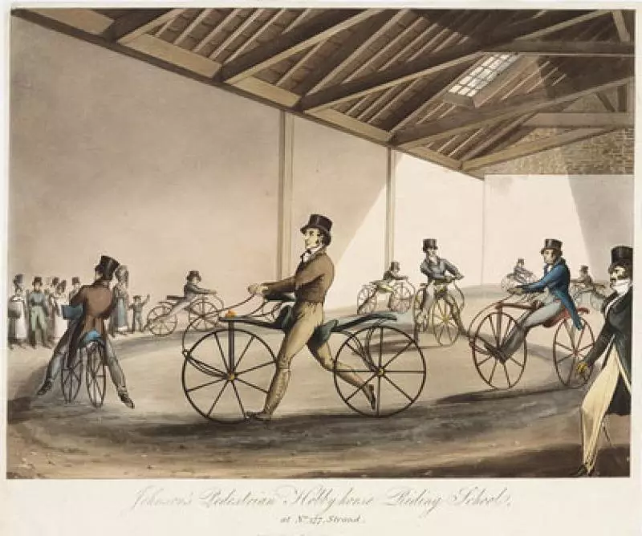

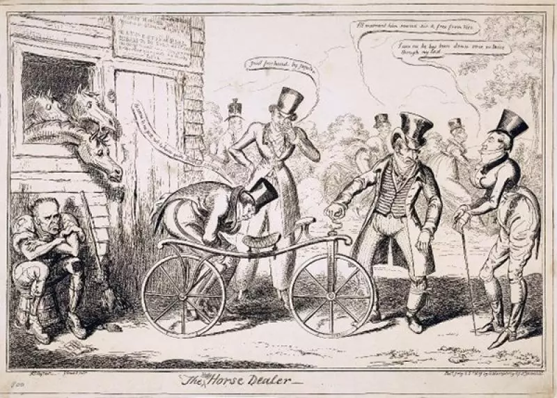

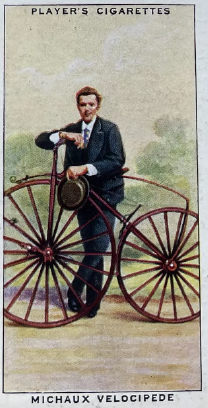
:::
::::

::: notes
In this first period, bicycles are better understood as mechanical experiments than true transportation. Devices like hobby horses and draisines had no pedals and relied on foot propulsion, functioning much like modern balance bikes. Engineers experimented with levers and front-wheel pedals, gradually learning how balance, steering, and speed might work on two wheels.

From an urban perspective, these early cycles had limited everyday use. They were expensive, often wooden, and used mainly by elites in parks and promenades rather than busy streets. Even so, they established a critical idea: that zero-emission, human-powered wheeled mobility was possible, laying the conceptual groundwork for later urban cycling.
:::

---

## Period 2: Safety Bicycles & The First Urban Cycling Boom (1870s–1900)

:::: {.columns}
::: {.column width="55%"}
### Key Developments
- Introduction of chain drive systems, pneumatic tires, and mass-production techniques transformed the bicycle into a reliable, comfortable, and widely accessible technology.
- These innovations dramatically reduced costs, allowing bicycles to become affordable to broad segments of the urban population and enabling rapid diffusion across cities.

### Urban Transportation Relevance
- With improved reliability and comfort, bicycling emerged as a practical mode of daily urban travel rather than a recreational novelty.
- Organized cyclists played an influential role in advocating for smoother road surfaces and early standards for street design and maintenance.

### Sustainability Significance
- Bicycling represented the first large-scale urban transportation mode capable of supporting daily mobility while producing virtually no direct carbon emissions.
- The bicycle expanded personal mobility and access to urban opportunities while requiring minimal materials, energy, and space compared to animal- or motor-powered transport.

:::

::: {.column width="45%"}

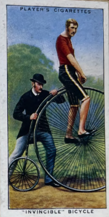

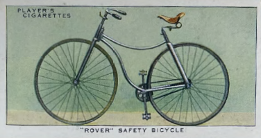

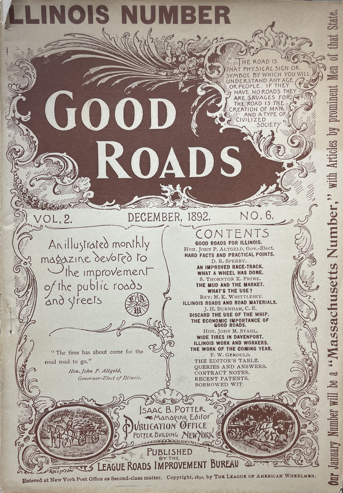

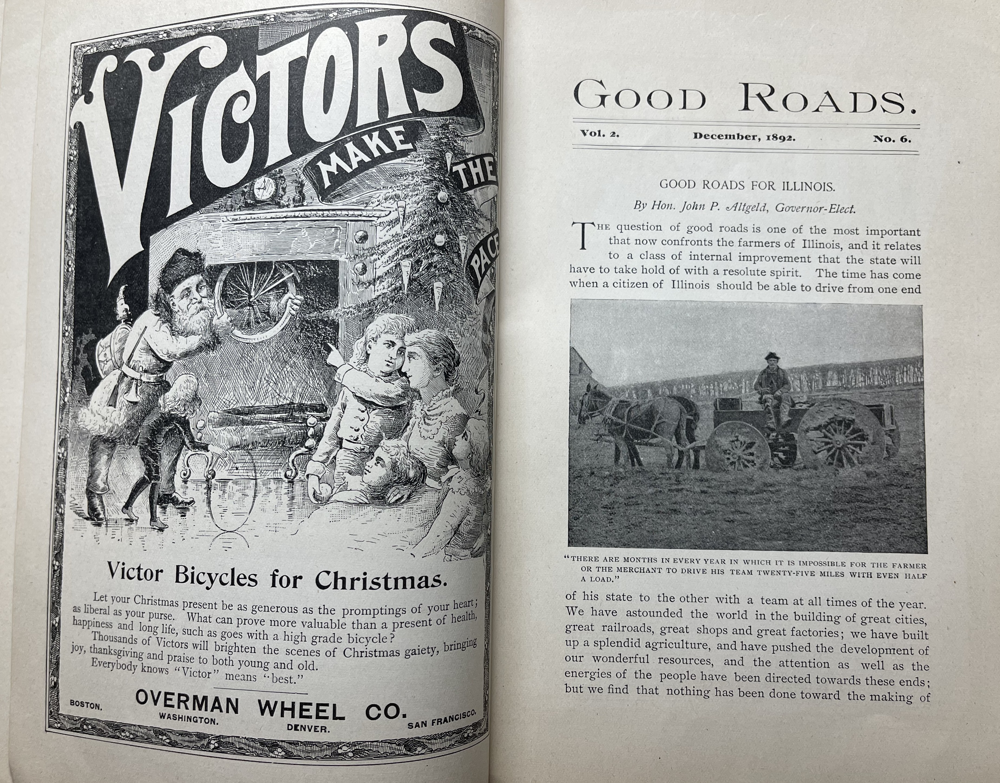

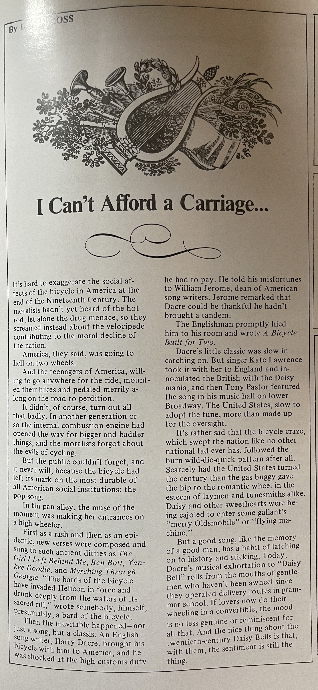

:::
::::

::: notes
This period marks the bicycle’s transition from novelty to practical urban transportation. Innovations like chain drives, pneumatic tires, and mass production made bicycles safer, cheaper, and comfortable enough for everyday use, while the shift to the safety bicycle opened cycling to a much broader population.

One especially important transition during this period was the shift from the *ordinary* or *high-wheeler* bicycle to the *safety bicycle* around 1887. Earlier bicycles were fast but unstable, hard to mount, and frankly dangerous for most people. The safety bicycle—lower to the ground, with equal-sized wheels and a chain-driven rear wheel—dramatically reduced the risk of falls while making riding easier and more intuitive. That change alone opens bicycling up to a much broader population, including women, older riders, and people who weren’t athletic thrill-seekers. 

As bicycles spread through cities, they became tools for daily travel and catalysts for early infrastructure advocacy, particularly around road quality. From a sustainability standpoint, this was the first time a transportation mode could support widespread urban mobility with minimal energy, space, or environmental impact.
:::

---

## Period 3: Cycling as a Pre-Automobile Urban Mode (1900–1930s)

:::: {.columns}
::: {.column width="55%"}
### Key Developments
- By the early 20th century, bicycling had become a routine part of everyday life across much of Europe and North America, used by workers, students, and families for regular urban travel.  
- Bicycles operated alongside walking and streetcar systems, forming an integrated urban mobility environment in which multiple modes shared street space without rigid separation.

### Urban Transportation Relevance
- Cities during this period remained largely human-scaled, with short trip distances, dense development, and active ground-floor uses that made cycling an efficient and natural choice for daily travel.  
- Bicycles functioned both as standalone commute modes and as feeders to streetcar and rail systems, extending the reach of transit and enabling flexible door-to-door mobility.

### Sustainability Significance
- This period demonstrates a balanced multimodal transportation system that existed prior to automobile dominance, where mobility needs were met without high energy consumption or emissions.  
- Cycling reinforced compact urban development patterns and local accessibility, supporting cities that relied more on proximity and human movement than on speed or vehicle capacity.

:::

::: {.column width="45%"}

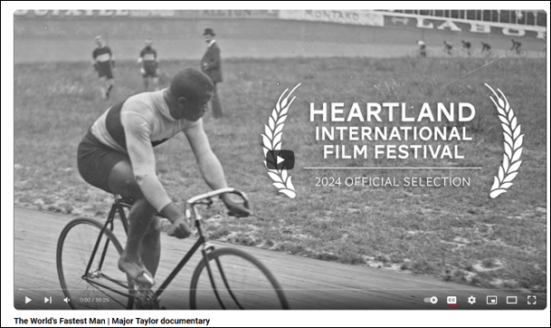

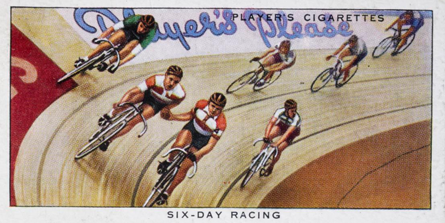

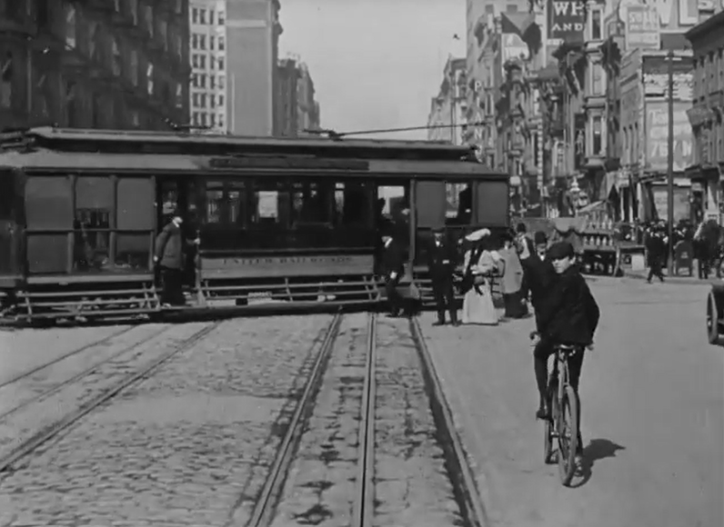

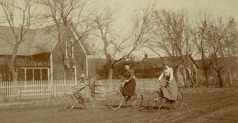

:::
::::

::: notes
By the early 20th century, bicycling had settled into everyday urban life as a practical mode for workers, students, and families. Cities were compact and human-scaled, allowing bicycles to coexist naturally with pedestrians and streetcars in a balanced multimodal system.

This period is significant because it demonstrates that high levels of cycling once existed without modern bike infrastructure. Cycling reinforced local accessibility and compact development, offering a historical example of urban mobility that met daily needs without high energy use or emissions.

In this same period, bicycle racing also played an important cultural role in normalizing cycling as a serious and modern activity. Track racing and six-day races drew large urban crowds, and figures like Major Taylor became international celebrities. Taylor’s success at the turn of the 20th century—culminating in a world championship—demonstrated both the athletic potential of the bicycle and its deep integration into urban life. At the same time, his career highlights the racial barriers embedded in American cities, reminding us that access to mobility, sport, and public space was never evenly distributed, even during cycling’s peak years.

:::

## Period 4: Automobile Ascendancy and Cycling Marginalization (1930s–1960s)

:::: {.columns}
::: {.column width="55%"}

### Key Developments
- Rapid motorization reshaped daily travel as automobiles became more affordable and widely available, coinciding with suburbanization and the decentralization of housing, jobs, and services.  
- Road design and traffic engineering increasingly prioritized vehicle speed, capacity, and throughput, leading to wider streets, higher design speeds, and the removal of street features that supported slower, human-scale movement.

### Urban Transportation Relevance
- Cycling was progressively reframed as unsafe, inefficient, or obsolete in the context of faster and more complex traffic environments, and increasingly associated with children, recreation, or poverty rather than everyday mobility.  
- Dedicated cycling infrastructure that had existed informally or implicitly in earlier periods disappeared, and cyclists lost political influence as transportation planning became dominated by automotive and highway interests.

### Sustainability Significance
- This period represents a major missed opportunity, as cities displaced one of the most energy-efficient and space-efficient transportation modes in favor of energy-intensive automobility.  
- The shift toward car-oriented urban systems laid the groundwork for long-term challenges, including traffic congestion, rising greenhouse gas emissions, air pollution, physical inactivity, and widening public health and equity disparities.

:::

::: {.column width="45%"}

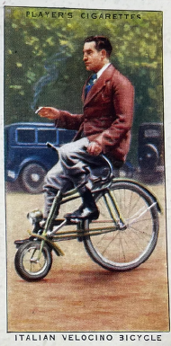

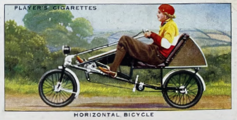

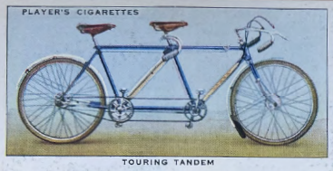

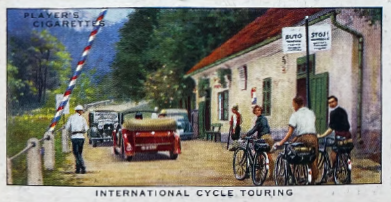

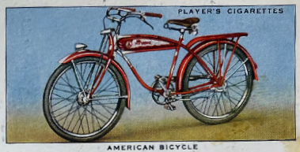

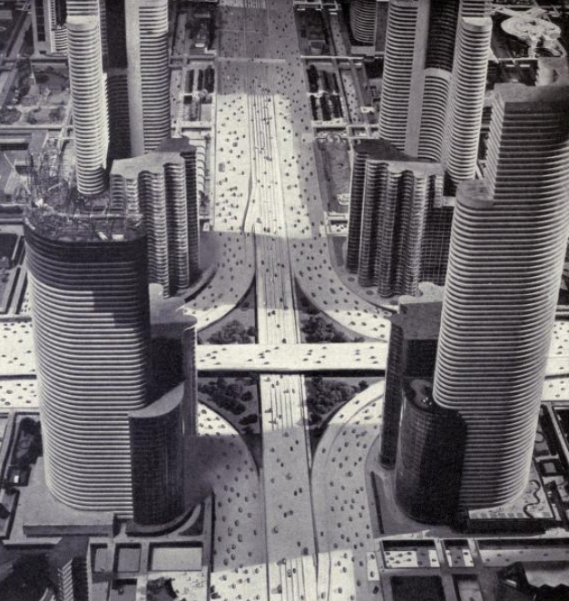

:::
::::

::: notes
Between the 1930s and 1960s, rapid motorization and suburbanization fundamentally reshaped urban transportation. Streets were redesigned to prioritize vehicle speed and throughput, displacing slower, human-scale modes like walking and cycling.

This focus on the automobile led to wider streets and higher design speeds, which necessitated the removal of street features that supported slower, human-scale movement. Consequently, the dedicated cycling infrastructure of the previous generation was dismantled; for example, hundreds of miles of separate side-paths were paved over as roads were widened to accommodate cars. By the mid-twentieth century, the bicycle had lost its political influence, and on-street cycling became increasingly dangerous because roads were built or rebuilt with only cars in mind, lacking even basic safety features like curb cuts.

As a result, cycling lost political influence and was reframed as unsafe or obsolete, even as automobiles generated congestion, pollution, and public health challenges. This period represents a major missed sustainability opportunity, locking cities into car-dependent systems whose impacts persist today.
:::

---

## Period 5: Oil Crises and Environmental Reawakening (1970s)

:::: {.columns}
::: {.column width="55%"}

### Key Developments
- The 1973 oil crisis exposed the economic and geopolitical vulnerability of automobile-dependent transportation systems, prompting governments and the public to reconsider energy-intensive travel patterns.  
- In response, grassroots cycling and pedestrian activism emerged—particularly in Northern European cities—where citizens organized protests and campaigns demanding safer streets, reduced traffic speeds, and greater investment in non-motorized transport.

### Urban Transportation Relevance
- Cities such as Amsterdam and Copenhagen began to reverse decades of automobile-oriented planning by reinvesting in cycling infrastructure, including protected bike lanes, traffic calming measures, and network continuity.  
- During this period, cycling was reframed as a practical and reliable mode of daily transportation rather than a recreational activity, especially for short urban trips and commuting.

### Sustainability Significance
- For the first time, cycling was explicitly linked to broader concerns about energy security, environmental degradation, and urban livability, rather than framed solely around efficiency or convenience.  
- This era marked an early articulation of cycling as a climate-responsive urban policy tool, laying the conceptual and political groundwork for later sustainability and climate-action–oriented transportation planning.

:::

::: {.column width="45%"}

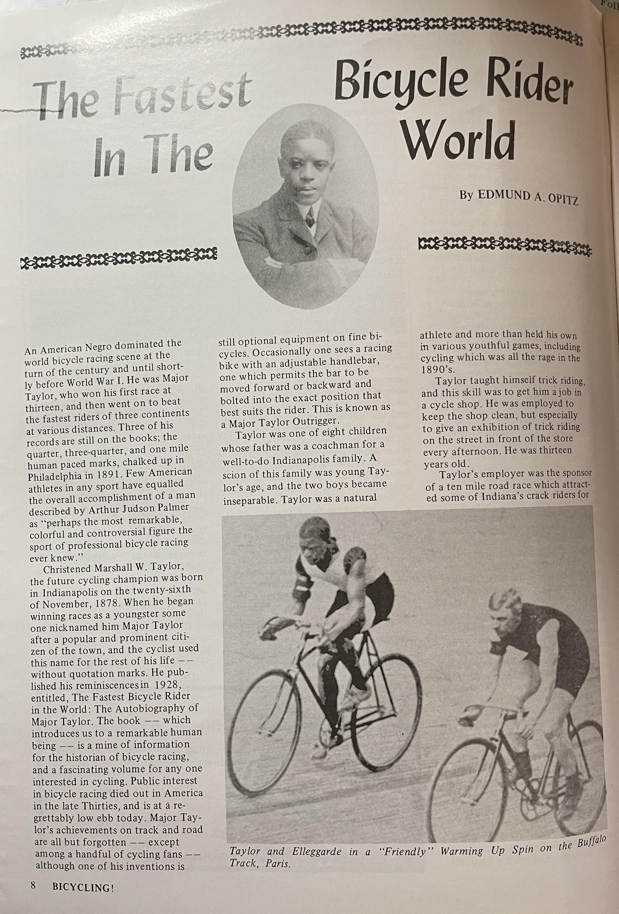

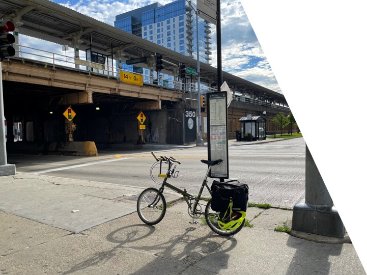

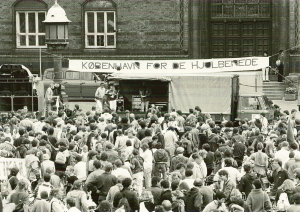

:::
::::

::: notes

In October 1973, a major geopolitical shift occurred when Arab oil-producing countries cut off petroleum exports to the United States, exposing the profound economic and geopolitical vulnerability of automobile-dependent transportation. As gas prices quadrupled and drivers faced massive lines at the pumps, the "mechanical horse" suddenly regained its status as a highly practical alternative to the car. This energy crisis served as a catalyst for governments and the public to reconsider energy-intensive travel patterns in favor of "good ol’ American leg power". Amidst the rise of the environmental movement and the first Earth Day in 1970, the non-polluting bicycle became a "symbolic savior of the planet".

Grassroots activism—especially in Northern Europe—pushed cities to reconsider traffic speeds, street safety, and the role of cycling. During this period, cycling was reframed as a serious, everyday mode tied to energy security and environmental protection. These early efforts laid the conceptual foundation for later climate-oriented transportation policy.

The resulting "Great American Bicycle Boom" effectively reframed the bicycle as a reliable mode of daily transportation for adults rather than just "kid stuff". By 1971, 86 percent of bicycle sales were to adults—a total reversal from just years prior—and between 1972 and 1974, bicycles actually outsold cars in the United States. For the first time since the early 20th century, the bicycle was recognized as the swiftest way to navigate congested urban centers, with commuters finding they could consistently outpace city buses and cars on short trips.

:::

--- 

## Period 6: Institutionalization of Cycling Policy (1980s–1990s)

:::: {.columns}
::: {.column width="55%"}

### Key Developments
- During the 1980s and 1990s, many cities began to move beyond ad hoc or recreational cycling facilities and instead developed formal, connected bike lane networks that were planned at the citywide or regional scale.  
- Cycling was increasingly integrated into transportation planning and traffic engineering practices, with design standards, guidelines, and professional expertise emerging to address cyclist safety, facility design, and network performance.

### Urban Transportation Relevance
- In this period, cycling became a deliberate and recognized component of urban mobility systems rather than an afterthought, with planners and engineers accounting for cyclists in roadway design, signal timing, and street reconstruction projects.  
- Empirical evidence began to accumulate showing that safety improves when cycling infrastructure is continuous, legible, and physically separated from high-speed motor traffic, reinforcing the importance of network-based approaches.

### Sustainability Significance
- This era demonstrates that cycling levels are shaped primarily by policy choices and infrastructure design rather than cultural preference alone, challenging the notion that high cycling rates are unique to specific countries or populations.  
- By supporting mode shift away from private automobiles, institutionalized cycling policy reinforced cycling’s role in reducing greenhouse gas emissions, improving air quality, and enhancing overall urban livability.

:::

::: {.column width="45%"}

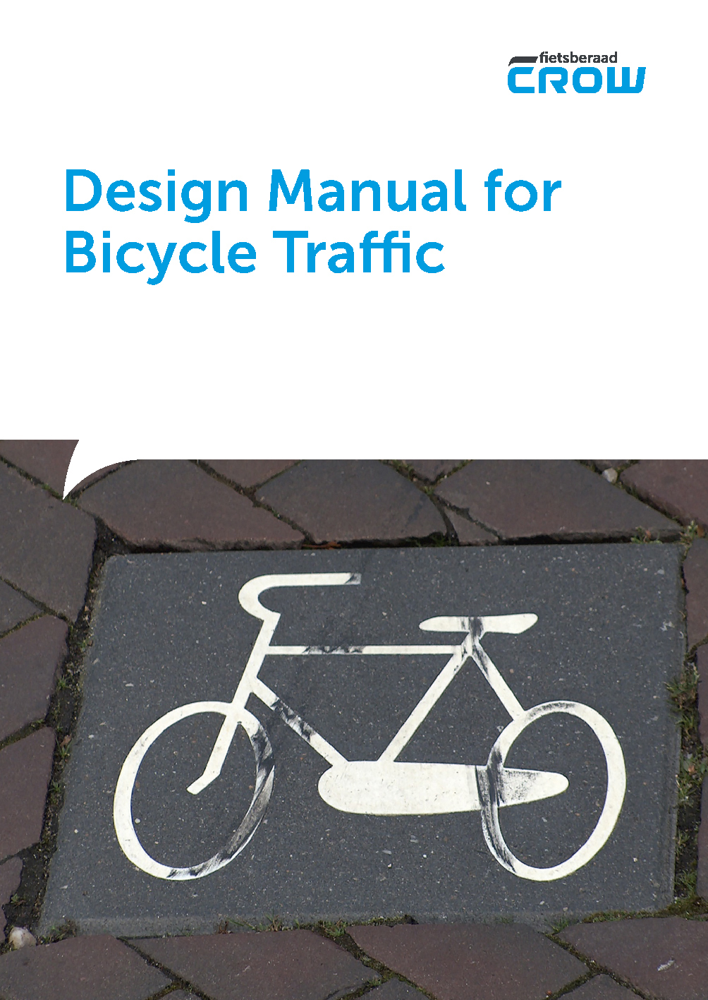

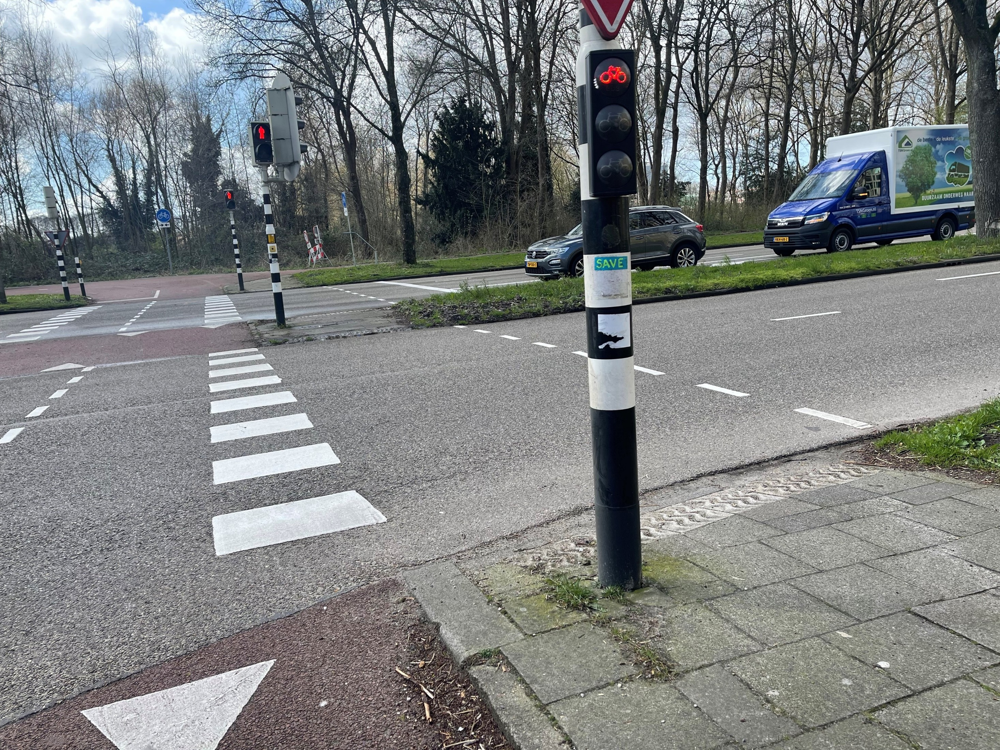

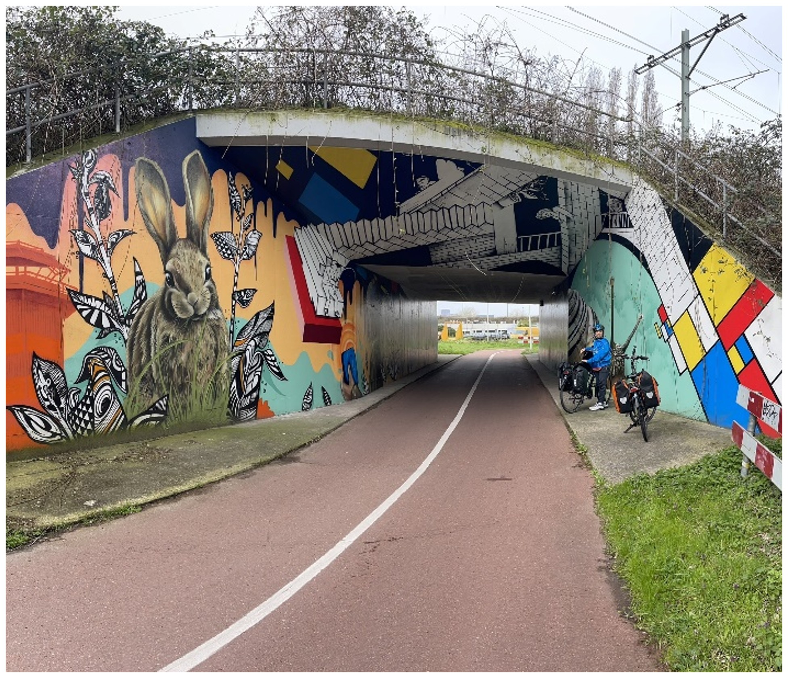

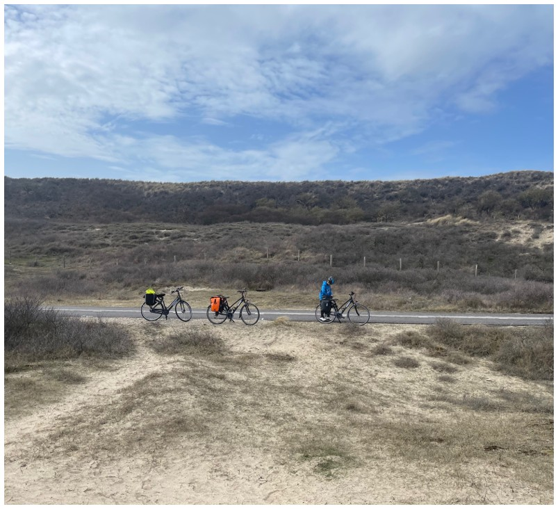

:::
::::

::: notes

By the 1980s and 1990s, the bicycle had decisively shed its "just-for-kids" image, a transformation that began during the great boom of the 1970s. While earlier decades treated cycling facilities as ad hoc or purely recreational, this period marked a shift toward formal, connected bike lane networks planned at citywide or regional scales. An early milestone of this institutionalization was seen in cities like Manhattan, which introduced its first on-street bicycle lanes in 1978, signaling a move toward integrating cyclists into the existing urban grid. This transition reflected a growing recognition that cycling could serve as a deliberate and recognized component of urban mobility rather than a mere afterthought.

This era also saw cycling become increasingly integrated into the professional practices of transportation planning and traffic engineering. In previous decades, on-street cycling in the United States was notoriously dangerous because roads were built or rebuilt with only cars in mind. However, during the 1980s and 90s, planners and engineers began accounting for cyclists in roadway design and signal timing. A significant technical advancement for urban cycling accessibility occurred with the passage of the Americans with Disabilities Act in 1990, which led to the widespread installation of curb cuts. While intended for accessibility, these features removed a major physical barrier for cyclists who had previously struggled with the "obstacle course" of high curbs and car-centric street design.

The sustainability significance of this period lies in the accumulation of empirical evidence showing that safety and ridership levels are primarily shaped by policy choices and infrastructure design. The sources note that before this institutionalization, cyclists were often vulnerable to both high-speed traffic and urban crime, particularly in densely built environments. By moving toward networks that were continuous, legible, and physically separated from motor traffic, cities proved that high cycling rates were not merely a result of "cultural preference" but a response to safe and efficient infrastructure. By supporting a mode shift away from private automobiles, these institutionalized policies reinforced the bicycle's role in reducing greenhouse gas emissions and enhancing overall urban livability.

:::

---

:::: {.columns}
::: {.column width="50%"}
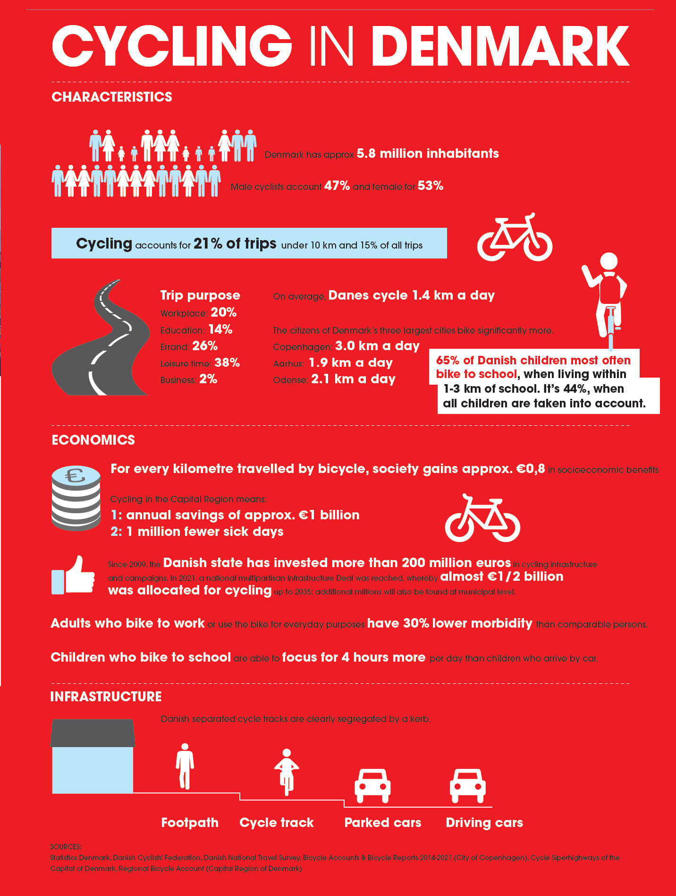{height=50%}
:::

::: {.column width="50%"}
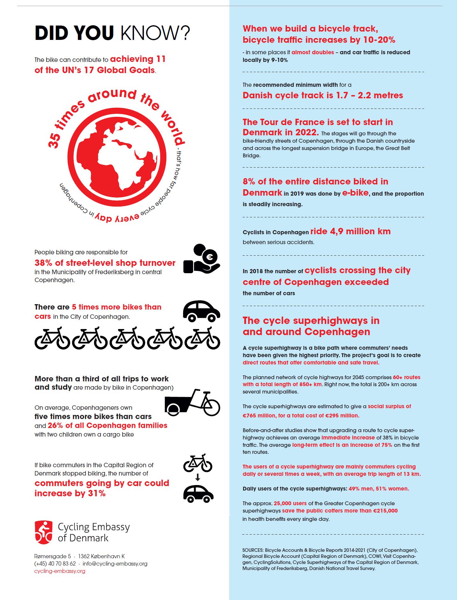{height=50%}
:::

::::
::: notes
How many Danes own a bike? How often and how far do they bike? And why? What are the socio-economic benefits of cycling? These are some of the FAQ’s that we often get at the Cycling Embassy of Denmark. Find the short answers below or go to our publications page to go more in depth with e.g. the bicycle accounts of the City of Copenhagen og the Cycle Superhighways.
:::

---

## Period 7: Information Technologies, Equity and Sharing Economies (2000s–2010s)

:::: {.columns}
::: {.column width="55%"}

### Key Developments
- During the 2000s and 2010s, cycling became increasingly embedded in climate change mitigation strategies as cities and regions sought to reduce greenhouse gas emissions from transportation, the largest and fastest-growing source of emissions in many countries.  
- At the same time, a growing body of public health research linked active transportation to reduced rates of chronic disease, improved mental health, and lower health care costs, providing an empirical foundation for cycling investments beyond transportation efficiency alone.  
- Bike sharing systems expanded rapidly across Europe, North America, and the Global South, enabled by digital technologies, GPS tracking, and new business models that made short-term bicycle access easy and scalable.

### Urban Transportation Relevance
- Cycling was explicitly positioned as a policy response to multiple urban challenges at once, including traffic congestion, air pollution, climate emissions, and rising rates of physical inactivity and chronic disease.  
- Bike share systems lowered barriers to cycling by reducing the need for personal bike ownership, extending the reach of transit systems, and enabling first- and last-mile connections in dense urban environments.

### Sustainability Significance
- This period produced a strong and widely accepted evidence base demonstrating cycling’s triple-bottom-line benefits, including environmental gains through emissions reduction, health benefits through increased physical activity, and economic benefits through lower infrastructure and health care costs.  
- Equity and access became increasingly central to cycling policy debates, with greater attention to the spatial distribution of infrastructure, affordability, and the inclusion of historically underserved communities in planning and investment decisions.

:::

::: {.column width="45%"}

 guided participants through Chicago to showcase emerging bicycle infrastructure innovations, including protected bike lanes, Divvy bikesharing stations, intersection safety treatments, and transit-integrated facilities, demonstrating how recent design and policy changes were reshaping everyday urban mobility and street safety across the city.](images/2017_depaul_bicycle_tour.png)

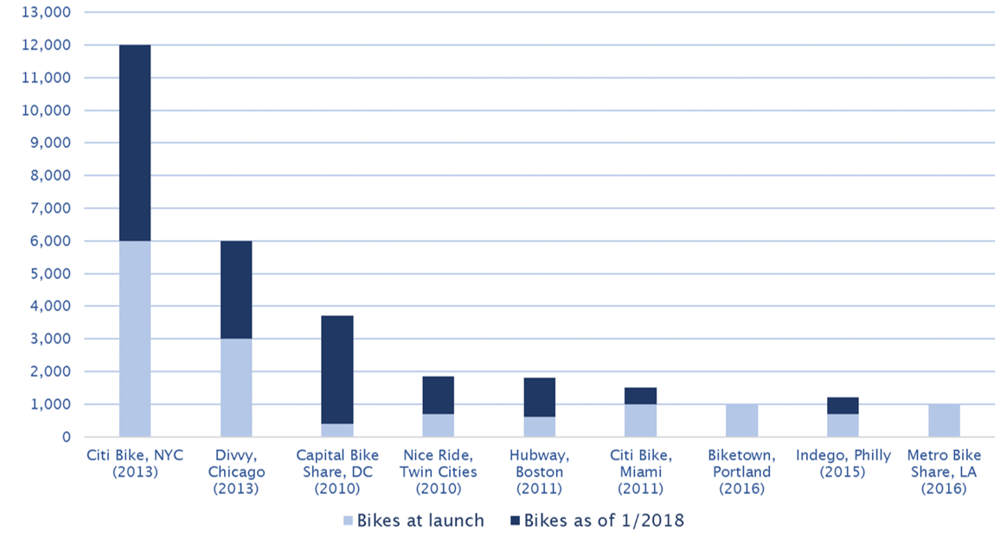

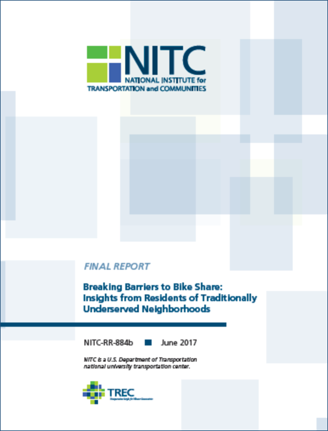

:::

::::

::: notes
During the 2000s and 2010s, cycling became embedded in climate, health, and equity frameworks. Research linked active transportation to emissions reduction, chronic disease prevention, and economic benefits, strengthening the case for cycling investment.

At the same time, bike-sharing systems expanded globally, lowering barriers to access and integrating cycling with transit. Equity and inclusion became central concerns, shifting cycling policy toward broader access rather than niche participation.
:::

---

## Period 8: Emergence and Integration of Electric Bikes (2020s-Present)

:::: {.columns}
::: {.column width="55%"}

### Key Developments
- Rapid growth of electric-assist bicycles (e-bikes), driven by improvements in battery technology, declining costs, and expanded model types ranging from commuter and cargo bikes to adaptive and accessibility-focused designs.  
- Accelerated adoption during and after the COVID-19 pandemic, as cities reallocated street space, expanded bike networks, and individuals sought flexible, socially distanced travel options.  
- Policy recognition of e-bikes as a distinct mobility category, with new regulations, incentives, and pilot programs addressing speed classes, safety, and integration with existing cycling infrastructure.

### Urban Transportation Relevance
- E-bikes significantly extend the feasible distance, speed, and demographic reach of cycling, making biking practical for longer trips, hilly terrain, older adults, and people with physical limitations.  
- They blur the traditional boundary between bicycles and motorized modes, increasingly substituting for short car trips and supporting first- and last-mile connections to transit.  
- Cities begin adapting infrastructure, curb management, and parking policies to accommodate higher cycling volumes, cargo bikes, and mixed-speed bicycle traffic.

### Sustainability Significance
- E-bikes offer substantial emissions reductions by replacing car trips with a mode that consumes a fraction of the energy of even electric automobiles.  
- By expanding who can realistically cycle and for what purposes, e-bikes strengthen the scalability of active transportation as a climate mitigation strategy rather than a niche solution.  
- Their integration raises new equity and sustainability questions—around affordability, access, safety, and regulation—highlighting the need for policy frameworks that ensure e-bikes contribute to inclusive, low-carbon urban mobility systems.

:::

::: {.column width="45%"}

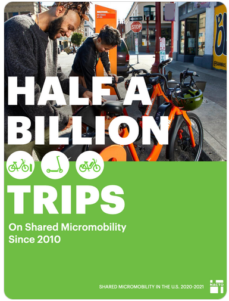

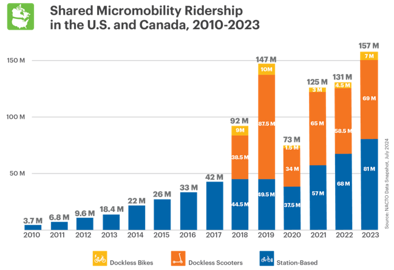

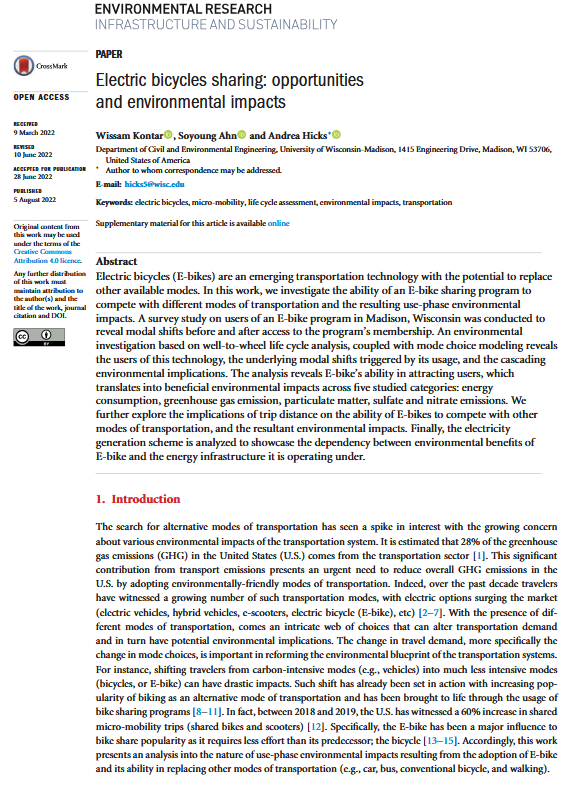

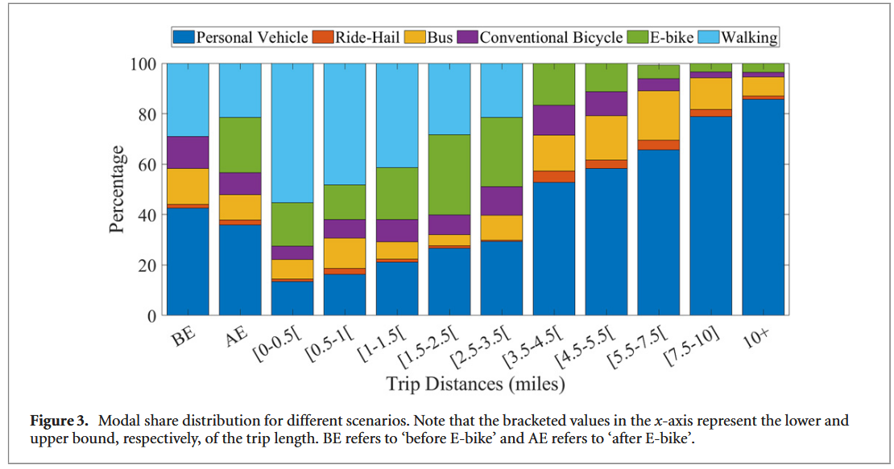

:::
::::

::: notes

In this most recent period, electric bikes really change what cycling can be in cities. E-bikes lower the physical barriers that limited traditional cycling—distance, hills, age, fitness, even time—so biking starts to compete directly with short car trips rather than just walking or transit. Their growth accelerated during the pandemic, when people needed flexible, low-contact ways to get around and cities rapidly expanded bike infrastructure. 

What’s important here is that e-bikes blur the line between bicycles and motorized modes: they’re still human-scale and energy-efficient, but they extend the range and usefulness of cycling in a way we haven’t seen before. From a planning perspective, this forces cities to rethink infrastructure, speed management, parking, and even freight, as cargo e-bikes begin replacing delivery vans for some trips. From a sustainability standpoint, e-bikes are powerful because they can substitute for car travel at a fraction of the energy and emissions, but they also raise new questions about equity, safety, and regulation that cities are still figuring out. In many ways, this period isn’t just about a new technology—it’s about whether cities can integrate e-bikes in a way that scales active transportation without recreating the problems of automobility.

:::

