::: {.img-center}
{height=100%}
:::

::: notes
This week examines public transit as a system of coordinated mass movement, emphasizing how fixed-route, shared vehicles deliver mobility at scale while optimizing energy use, street space, and network reliability. The focus is not on any single mode, but on how networks—bus, rail, and bus rapid transit—function together to move large numbers of people efficiently through dense urban environments.
:::

---

## Periods of Public Transit

:::: {.columns}

::: {.column width="55%"}

- Period 1: Horse-Drawn & Early Fixed-Route Transit (1830s–1880s)
- Period 2: Electric Streetcars & Urban Expansion (1890s–1920s)
- Period 3: Motorization, Decline & Public Takeover (1930s–1970s)
- Period 4: Modern Transit Revival & Network Integration (1980s–2000s)
- Period 5: Integration of Mass Transit with Other Shared Mobilities (2000s–Present)
:::

::: {.column width="45%"}

### Sources

:::

::::

::: notes
Public transit history can be organized into five broad periods reflecting shifts in technology, governance, and urban form. Together, these periods illustrate how transit has alternately expanded and contracted in response to economic forces, policy choices, and competition with private automobiles.
:::

---

## Period 1: Horse-Drawn & Early Fixed-Route Transit (1830s–1880s)

:::: {.columns}
::: {.column width="55%"}

### Key Developments

- Horse-drawn omnibuses and street railways introduced fixed routes and regular schedules, marking the first large-scale shift from individual to shared urban mobility.
- The use of steel rails reduced rolling resistance, allowing vehicles to carry more passengers with greater reliability than horse-drawn carriages.
- Early fare systems and standardized routes formalized public transit as a coordinated urban service rather than an informal travel option.

### Urban Transportation Relevance

- These systems extended practical travel distances beyond walking, enabling early forms of commuting within expanding industrial cities.
- Development began to concentrate along transit corridors, establishing early patterns of accessibility-based urban growth.
- Fixed-route services introduced the idea of predictable, collective mobility as a core urban function.

### Sustainability Significance

- Shared horse-drawn transit improved efficiency relative to individualized carriage travel by moving more people with fewer vehicles.
- The consolidation of trips reduced street congestion and disorder compared to unregulated private transport.
- These systems were ultimately constrained by animal labor, waste management, and limited scalability, highlighting the need for technological transition.

:::

::: {.column width="45%"}
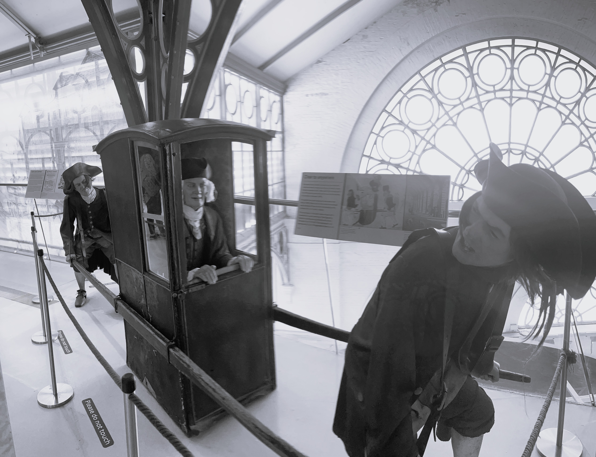

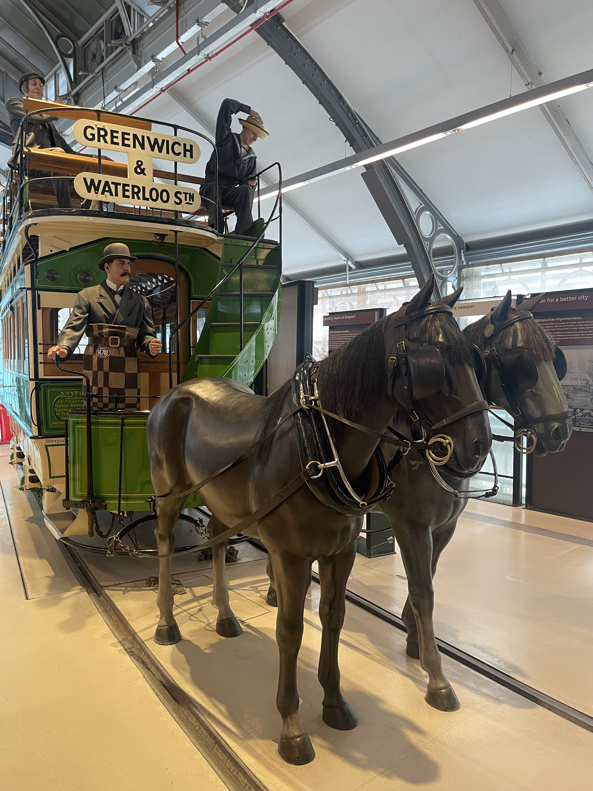

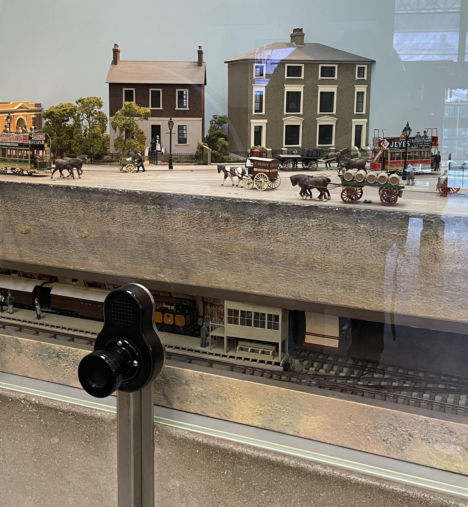
:::

::::

::: notes
Before the 1880s, walking was the primary mode of travel for most urban residents because owning a horse and buggy was prohibitively expensive. The introduction of horsecars served primarily middle-income households, marking a significant shift from individual travel to shared urban mobility. These early systems operated on tracks located in the center of city streets and were governed by franchise agreements that formalized routes and fare collection. By utilizing fixed rails and schedules, these vehicles provided the first predictable transit services that allowed multiple people with different destinations to travel together.

Early horse-drawn transit systems transformed urban travel habits by extending practical distances beyond the traditional walking range. These fixed services established the idea of collective mobility as a core urban function, as people could plan their trips around a predictable pattern without coordinating with one another. While many workers still lived within walking distance of their jobs during this era, these systems facilitated the early patterns of accessibility-based growth that would later define industrial cities. Consequently, development began to concentrate along these transit corridors, laying the groundwork for the future expansion of metropolitan areas.

Shared horse-drawn transit improved urban efficiency compared to individualized carriage travel by moving more people with fewer vehicles. The consolidation of trips into fixed routes helped manage street congestion, though early urban centers remained dominated by a mix of pedestrians and horse carts. However, these systems were ultimately limited by the inherent constraints of animal labor, including significant waste management issues and the physical limitations of horse speed. These challenges, combined with the difficulty of scaling horse-drawn service to meet rising demand, eventually highlighted the need for the technological transition to electric power that began in the mid-1880s.
:::

---

## Period 2: Electric Streetcars & Urban Expansion (1890s–1920s)

:::: {.columns}
::: {.column width="55%"}

### Key Developments
- The electrification of street railways replaced horse-drawn systems, dramatically increasing speed, capacity, and operational reliability.
- Private transit companies rapidly built extensive streetcar networks, often financed through integrated real estate and land development ventures.
- Technological standardization, including electric traction and fixed rails, enabled frequent, high-volume service across metropolitan areas.

### Urban Transportation Relevance
- Electric streetcars made routine commuting possible over longer distances, fundamentally expanding the spatial footprint of cities.
- Urban growth became organized around radial streetcar corridors, giving rise to compact but expanding “streetcar suburbs.”
- Mass transit emerged as the dominant mode of daily urban travel for working- and middle-class populations during this period.

### Sustainability Significance
- Streetcar systems moved large numbers of passengers with relatively low per-capita energy use compared to later automobile travel.
- Electrified transit supported dense, walkable urban development that minimized travel distances and infrastructure costs.
- This period demonstrated the scalability of electric mass transit as an efficient alternative to individualized motorized mobility.
:::

::: {.column width="45%"}
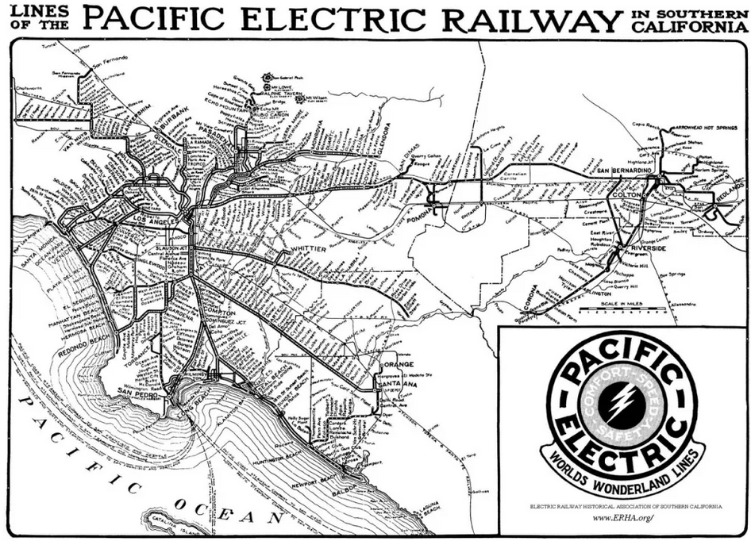

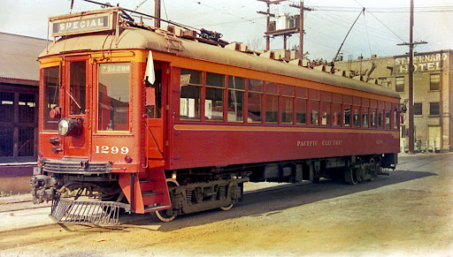

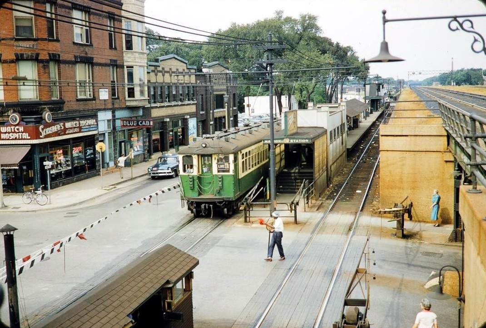
:::
::::

::: notes
The electrification of street railways in the late 1880s represented a massive technological leap over horse-drawn systems, offering much higher speeds, larger vehicle capacities, and improved operational reliability. These extensive networks were often built by private companies affiliated with electric utilities or real estate syndicates that used transit lines to unlock the value of suburban land. This boom was supported by technological standardization, including specialized power station equipment and overhead electric wires, which enabled frequent and high-volume service across hundreds of cities.

Electric streetcars fundamentally reshaped the spatial footprint of cities by making routine commuting possible over much longer distances than walking. Urban growth became organized around radial streetcar corridors, resulting in the development of compact but rapidly expanding streetcar suburbs. During this peak era, mass transit emerged as the dominant mode of daily travel for working- and middle-class populations, with per capita ridership nearly doubling between 1890 and 1902.

Streetcar systems were remarkably efficient for moving large urban populations, utilizing relatively low per-capita energy compared to the individualized automobile travel that would later follow. These electrified systems also supported a dense, walkable built form because the reliance on transit required high-quality pedestrian environments near stops, which minimized infrastructure costs and travel distances. Ultimately, this period demonstrated that electric mass transit was a highly scalable mobility tool capable of serving as a predictable and shared alternative to individualized motorized transport.
:::

---

## Period 3: Motorization, Decline & Public Takeover (1930s–1970s)

:::: {.columns}
::: {.column width="55%"}

### Key Developments
- Rapid growth in private automobile ownership reshaped travel behavior and reduced demand for fixed-route public transit.
- Many privately operated transit systems became financially unsustainable due to declining ridership, fixed fare structures, and rising operating costs.
- Governments increasingly intervened by acquiring failing transit companies and consolidating them under public ownership to preserve basic service.

### Urban Transportation Relevance
- Transit ridership declined as metropolitan areas dispersed and land use patterns shifted toward low-density, automobile-oriented development.
- Public transit increasingly served transit-dependent populations rather than functioning as a universal urban mobility system.
- Highway construction and street redesigns prioritized automobile throughput, further marginalizing transit operations in urban rights-of-way.

### Sustainability Significance
- Widespread motorization substantially increased energy consumption and transportation-related emissions.
- The decline of high-capacity transit reinforced longer travel distances and inefficient land use patterns.
- Public takeover of transit systems preserved essential infrastructure that later enabled reinvestment and system recovery.
:::

::: {.column width="45%"}
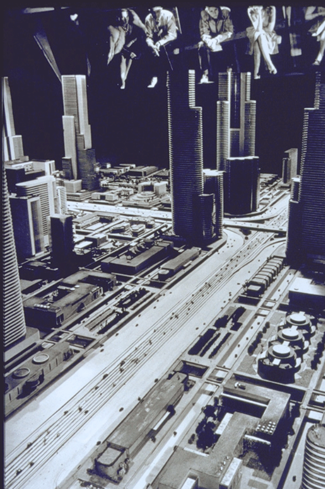

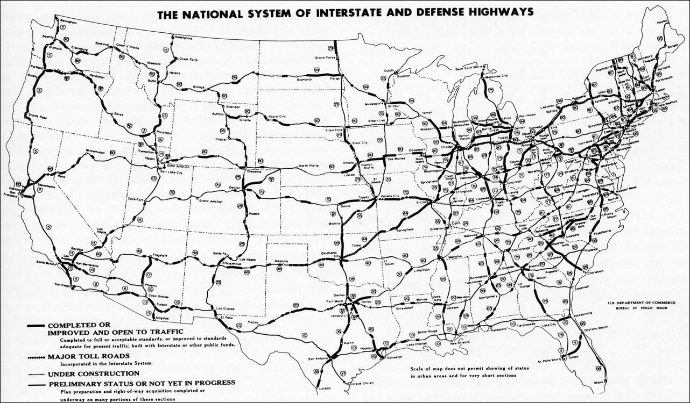

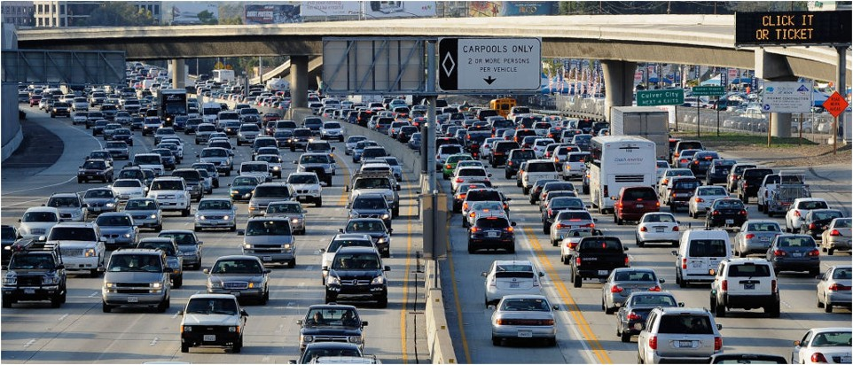

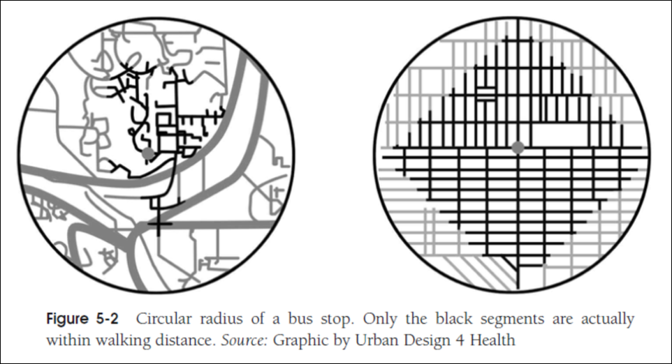

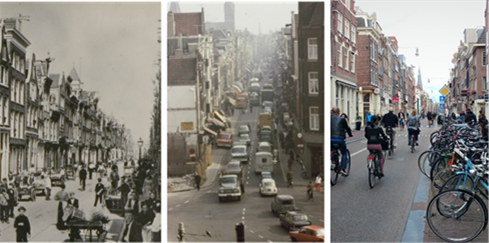
:::
::::

::: notes
The mid-20th century was defined by a ruinous financial vice for private transit companies, created by rigid fixed-fare structures and rising operating costs driven by wartime inflation and labor unionization. The Great Depression accelerated the collapse of these already distressed systems, forcing many operators to replace streetcars with less expensive buses or face outright abandonment. Rapid growth in private automobile ownership followed World War II, fundamentally reshaping travel behavior and significantly reducing the demand for shared fixed-route mobility. Consequently, governments began to intervene on a large scale by the 1960s, acquiring failing private companies and consolidating them under public ownership to ensure the continued provision of basic urban services.
As metropolitan areas dispersed, the relevance of public transit shifted from a universal urban utility to a specialized service often limited to transit-dependent populations. The rise of mass motorization and the federal prioritization of highway construction facilitated low-density, automobile-oriented development that was structurally inhospitable to traditional transit. Street redesigns and the creation of the interstate highway system prioritized automobile throughput, further marginalizing transit operations within urban rights-of-way. This era saw the hollowing out of industrial centers as middle-class residents and employers migrated to suburbs, leaving transit systems to serve a shrinking share of total metropolitan trips.

From a sustainability perspective, widespread motorization resulted in a substantial increase in per-capita energy consumption and transportation-related greenhouse gas emissions. The decline of high-capacity streetcar networks and the subsequent shift toward private vehicles reinforced inefficient land use patterns and necessitated much longer travel distances. While this period was marked by the erosion of transit's market share, the eventual public takeover of failing systems was significant because it preserved essential infrastructure and rights-of-way. This preservation of core corridors and systems provided the foundational armature that would later enable the modern reinvestment and network integration seen in contemporary transit revivals.

How did federal highway policy lead to urban transit's decline?
Could public ownership have saved transit ridership in the 1960s?
How does Portland's Smart Growth model compare to older systems?
:::

---

## Period 4: Modern Transit Revival & Network Integration (1980s–2000s)

:::: {.columns}
::: {.column width="55%"}

### Key Developments
- Public agencies renewed investment in rail transit, light rail systems, and high-frequency bus services after decades of disinvestment.
- Bus Rapid Transit emerged as a cost-effective strategy for delivering higher-capacity service using dedicated lanes and priority treatments.
- Transit planning increasingly emphasized network design, service frequency, and reliability rather than isolated capital projects.

### Urban Transportation Relevance
- Transit was reframed as a competitive alternative to driving in dense urban corridors and regional centers.
- Integration between transit investments and land use planning supported downtown revitalization and compact urban development.
- Regional transit authorities expanded coordination across municipal boundaries, improving system legibility and connectivity.

### Sustainability Significance
- Higher-capacity transit systems reduced per-passenger energy use relative to automobile travel in congested corridors.
- Transit-oriented development patterns supported walkable neighborhoods and reduced automobile dependence.
- Network-based planning improved operational efficiency and laid the groundwork for long-term mode shift.
:::

::: {.column width="45%"}
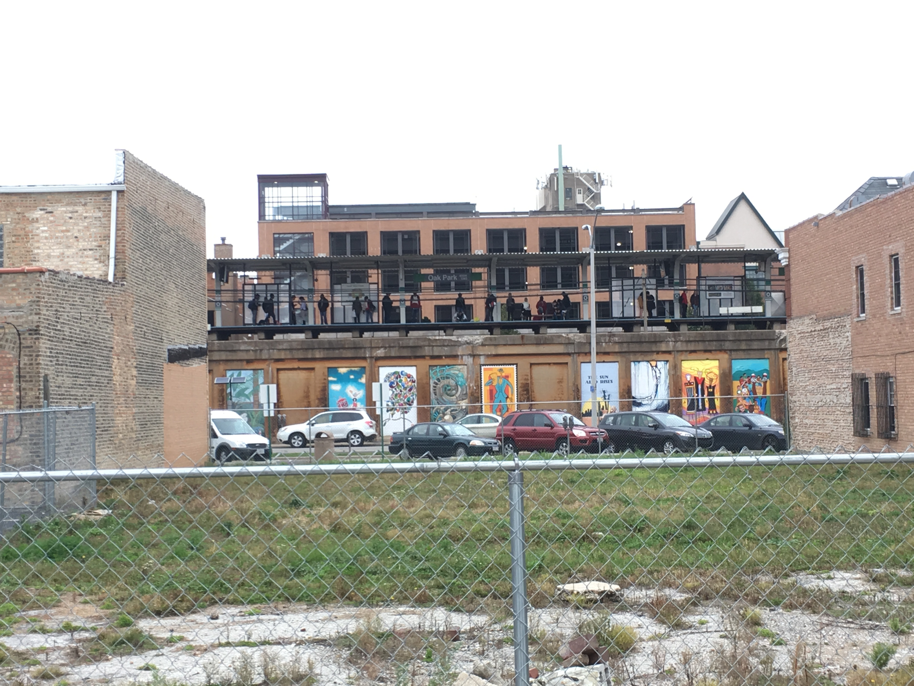

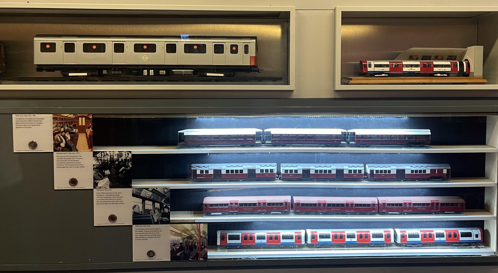
:::
::::

::: notes
Public agencies have entered an era of renewed investment, targeting rail systems, light rail, and high-frequency bus networks to reverse decades of previous disinvestment. Bus Rapid Transit has emerged during this period as a particularly cost-effective strategy, using dedicated lanes and signal priority to provide high-capacity service at a fraction of the capital cost required for heavy rail. Modern transit planning now moves beyond isolated capital projects to emphasize network design, where service frequency and reliability are prioritized to create a frequent transit network that offers passengers a sense of freedom and spontaneous mobility.

Transit is being reframed as a competitive alternative to driving, particularly in dense urban corridors and regional centers where it can offer more reliable travel times than congested road networks. Integrating transit investments with strategic land-use planning has become central to downtown revitalization and compact development efforts, as evidenced by successful models in Arlington County, Singapore, and Copenhagen. To improve system legibility and connectivity for the user, regional transit authorities have expanded their coordination across municipal boundaries, ensuring that the transit network aligns with regional commuter and labor sheds.

From a sustainability perspective, higher-capacity transit systems are being utilized to significantly reduce per-passenger energy use compared to private automobile travel in congested corridors. Contemporary transit-oriented development patterns support the creation of walkable neighborhoods, which effectively reduces automobile dependence and the associated environmental footprint of urban growth. Finally, the current shift toward network-based planning improves overall operational efficiency and establishes the foundational urban form necessary for a long-term shift in travel behavior toward more ecological modes.
:::

---

## Period 5: Integration of Mass Transit with Other Shared Mobilities (2010s–Present)

:::: {.columns}
::: {.column width="55%"}

### Key Developments
- Public transit systems have increasingly integrated with walking, bicycling, micromobility, and shared mobility services to form coordinated urban transportation networks.
- Digital technologies now support real-time information, trip planning, and fare integration across multiple modes.
- Transit agencies have accelerated the electrification of bus and rail fleets in response to climate and air quality goals.

### Urban Transportation Relevance
- Mass transit functions as the backbone of multimodal mobility systems, with shared and active modes addressing first- and last-mile connections.
- Integrated networks improve accessibility and user experience by reducing transfer friction and travel uncertainty.
- Planning increasingly emphasizes reliability, legibility, and equity to serve diverse urban populations.

### Sustainability Significance
- Multimodal integration enables large-scale mode shift away from private automobiles, reducing congestion and emissions.
- Electrified transit and shared mobility reduce per-capita energy use and exposure to air pollution.
- Contemporary transit systems align transportation policy with climate action, public health, and broader sustainability objectives.
:::

::: {.column width="45%"}
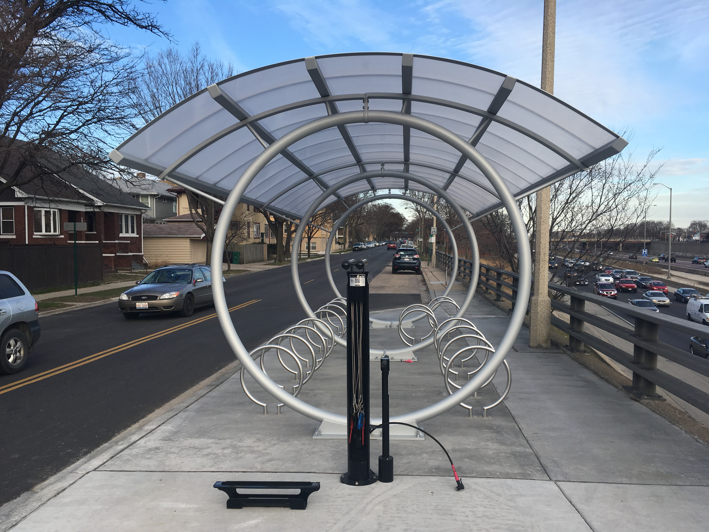

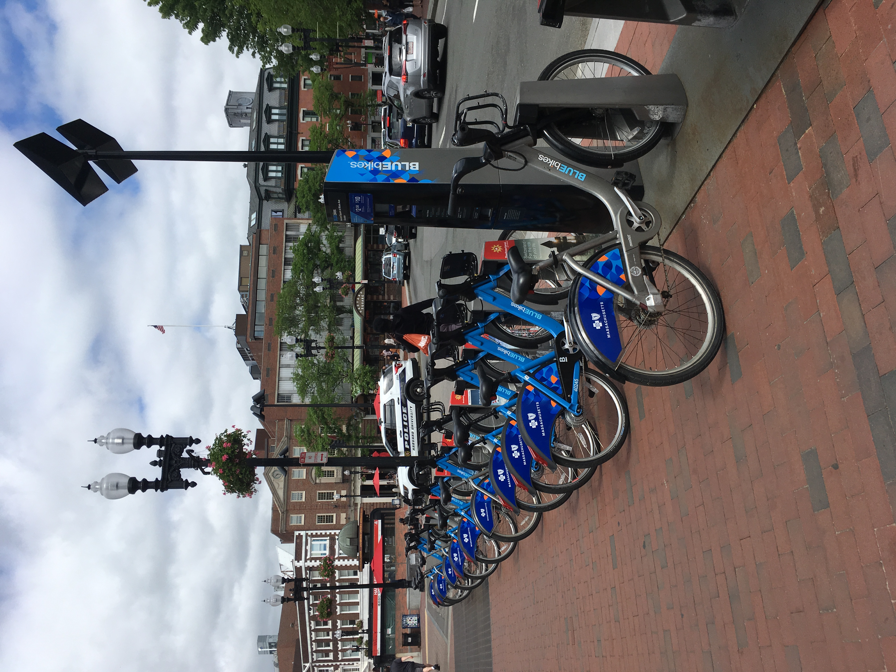

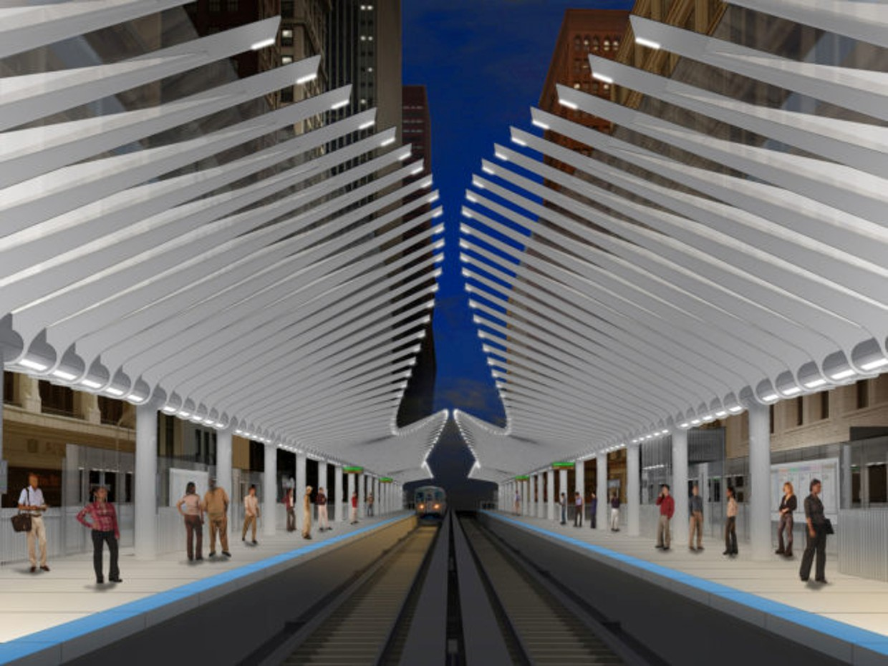

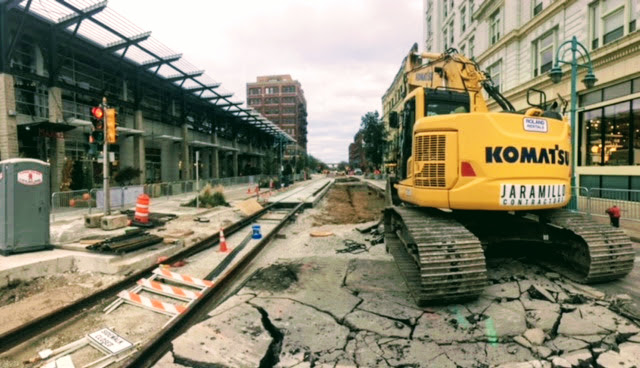

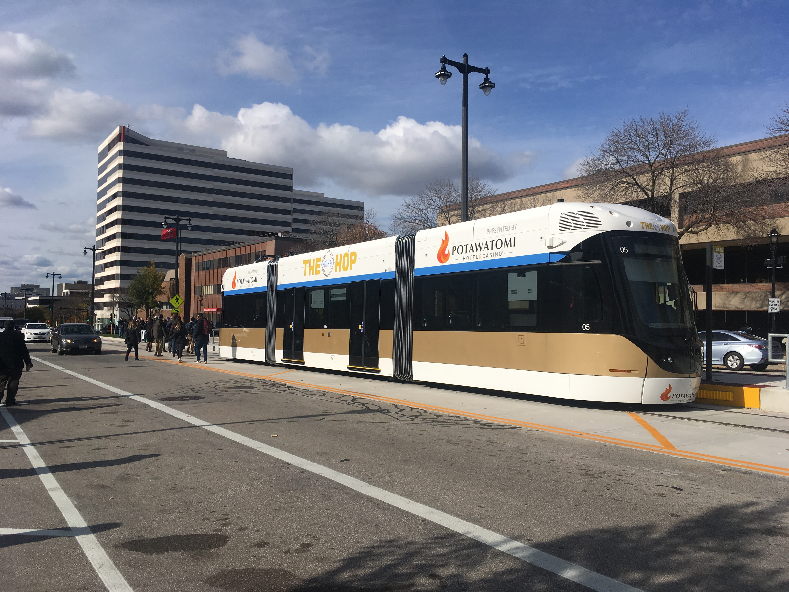

:::
::::

::: notes
Modern public transit is increasingly positioned as the backbone of an integrated multimodal system where walking, cycling, and shared mobility serve as critical feeders. Because nearly every transit trip begins and ends as a pedestrian, high-quality walking environments and green connectors like dedicated bike paths are essential to reducing transfer friction and addressing first- and last-mile connectivity. These integrated networks are designed to provide passengers with a sense of personal mobility that extends beyond their walking range, fostering a high-capacity system where different modes work together to provide spontaneous freedom of movement.

The user experience is being fundamentally transformed by digital technologies that support real-time information, trip planning, and seamless fare integration. Real-time data on vehicle locations reduces the uncertainty associated with waiting and connecting, making transit phases like walking or transferring feel less onerous and more predictable. Planning now emphasizes legibility—the simplicity of network design and clarity of presentation—as a critical value, allowing diverse populations to navigate complex urban regions spontaneously without relying on confusing paper timetables.

Contemporary transit strategies align transportation policy with broader sustainability and equity objectives, such as climate action and public health. Agencies are accelerating the search for new motive powers, such as fleet electrification and hydrogen fuel cells, to reduce per-capita energy use and localized air pollution. Furthermore, a focus on inclusive development through social housing and affordable accessibility near transit hubs ensures that these integrated systems serve a wide demographic, making cities more economically competitive and socially resilient.
:::

