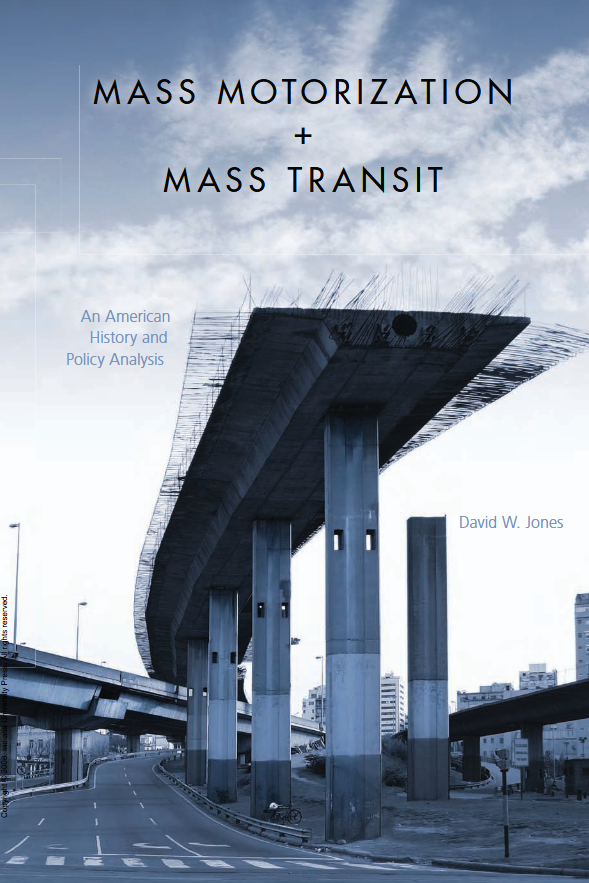
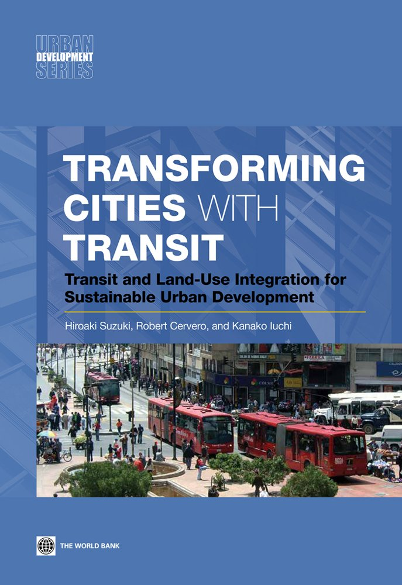
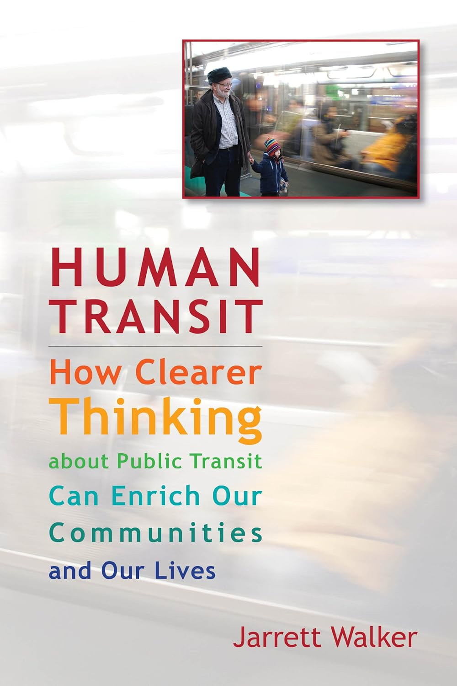

::: {.img-center}
{height=100%}
:::

::: notes
This week examines public transit as a system of coordinated mass movement, emphasizing how fixed-route, shared vehicles deliver mobility at scale while optimizing energy use, street space, and network reliability. The focus is not on any single mode, but on how networks—bus, rail, and bus rapid transit—function together to move large numbers of people efficiently through dense urban environments.
:::

---

## Periods of Public Transit

:::: {.columns}

::: {.column width="55%"}

- Period 1: Horse-Drawn & Early Fixed-Route Transit (1830s–1880s)
- Period 2: Electric Streetcars & Urban Expansion (1890s–1920s)
- Period 3: Motorization, Decline & Public Takeover (1930s–1970s)
- Period 4: Modern Transit Revival & Network Integration (1980s–2000s)
- Period 5: Integration of Mass Transit with Other Shared Mobilities (2000s–Present)
:::

::: {.column width="45%"}

### Sources

:::

::::

::: notes
Public transit history can be organized into five broad periods reflecting shifts in technology, governance, and urban form. Together, these periods illustrate how transit has alternately expanded and contracted in response to economic forces, policy choices, and competition with private automobiles.
:::

---

## Period 1: Horse-Drawn & Early Fixed-Route Transit (1830s–1880s)

:::: {.columns}
::: {.column width="55%"}

### Key Developments

- Horse-drawn omnibuses and street railways introduced fixed routes and regular schedules, marking the first large-scale shift from individual to shared urban mobility.
- The use of steel rails reduced rolling resistance, allowing vehicles to carry more passengers with greater reliability than horse-drawn carriages.
- Early fare systems and standardized routes formalized public transit as a coordinated urban service rather than an informal travel option.

### Urban Transportation Relevance

- These systems extended practical travel distances beyond walking, enabling early forms of commuting within expanding industrial cities.
- Development began to concentrate along transit corridors, establishing early patterns of accessibility-based urban growth.
- Fixed-route services introduced the idea of predictable, collective mobility as a core urban function.

### Sustainability Significance

- Shared horse-drawn transit improved efficiency relative to individualized carriage travel by moving more people with fewer vehicles.
- The consolidation of trips reduced street congestion and disorder compared to unregulated private transport.
- These systems were ultimately constrained by animal labor, waste management, and limited scalability, highlighting the need for technological transition.

:::

::: {.column width="45%"}

:::

::::

::: notes
Early transit systems addressed the limitations of walking cities by introducing shared, scheduled movement along corridors. While constrained by animal power, they marked the first scalable alternative to individualized urban travel.
:::

---

## Period 2: Electric Streetcars & Urban Expansion (1890s–1920s)

:::: {.columns}
::: {.column width="55%"}

### Key Developments

- Horse-drawn omnibuses and street railways introduced fixed routes and regular schedules, marking the first large-scale shift from individual to shared urban mobility.
- The use of steel rails reduced rolling resistance, allowing vehicles to carry more passengers with greater reliability than horse-drawn carriages.
- Early fare systems and standardized routes formalized public transit as a coordinated urban service rather than an informal travel option.

### Urban Transportation Relevance

- These systems extended practical travel distances beyond walking, enabling early forms of commuting within expanding industrial cities.
- Development began to concentrate along transit corridors, establishing early patterns of accessibility-based urban growth.
- Fixed-route services introduced the idea of predictable, collective mobility as a core urban function.

### Sustainability Significance

- Shared horse-drawn transit improved efficiency relative to individualized carriage travel by moving more people with fewer vehicles.
- The consolidation of trips reduced street congestion and disorder compared to unregulated private transport.
- These systems were ultimately constrained by animal labor, waste management, and limited scalability, highlighting the need for technological transition.
:::

::: {.column width="45%"}

:::
::::

::: notes
The electric streetcar era represents the first mature phase of mass urban transit, fundamentally reshaping city size, density, and daily mobility patterns.
:::

---

## Period 3: Motorization, Decline & Public Takeover (1930s–1970s)

:::: {.columns}
::: {.column width="55%"}

### Key Developments

- Horse-drawn omnibuses and street railways introduced fixed routes and regular schedules, marking the first large-scale shift from individual to shared urban mobility.
- The use of steel rails reduced rolling resistance, allowing vehicles to carry more passengers with greater reliability than horse-drawn carriages.
- Early fare systems and standardized routes formalized public transit as a coordinated urban service rather than an informal travel option.

### Urban Transportation Relevance

- These systems extended practical travel distances beyond walking, enabling early forms of commuting within expanding industrial cities.
- Development began to concentrate along transit corridors, establishing early patterns of accessibility-based urban growth.
- Fixed-route services introduced the idea of predictable, collective mobility as a core urban function.

### Sustainability Significance

- Shared horse-drawn transit improved efficiency relative to individualized carriage travel by moving more people with fewer vehicles.
- The consolidation of trips reduced street congestion and disorder compared to unregulated private transport.
- These systems were ultimately constrained by animal labor, waste management, and limited scalability, highlighting the need for technological transition.
:::

::: {.column width="45%"}

:::
::::

::: notes
This period reflects a decisive policy shift toward automobility, with transit surviving largely through public intervention rather than market competitiveness.
:::

---

## Period 4: Modern Transit Revival & Network Integration (1980s–2000s)

:::: {.columns}
::: {.column width="55%"}

### Key Developments

- Horse-drawn omnibuses and street railways introduced fixed routes and regular schedules, marking the first large-scale shift from individual to shared urban mobility.
- The use of steel rails reduced rolling resistance, allowing vehicles to carry more passengers with greater reliability than horse-drawn carriages.
- Early fare systems and standardized routes formalized public transit as a coordinated urban service rather than an informal travel option.

### Urban Transportation Relevance

- These systems extended practical travel distances beyond walking, enabling early forms of commuting within expanding industrial cities.
- Development began to concentrate along transit corridors, establishing early patterns of accessibility-based urban growth.
- Fixed-route services introduced the idea of predictable, collective mobility as a core urban function.

### Sustainability Significance

- Shared horse-drawn transit improved efficiency relative to individualized carriage travel by moving more people with fewer vehicles.
- The consolidation of trips reduced street congestion and disorder compared to unregulated private transport.
- These systems were ultimately constrained by animal labor, waste management, and limited scalability, highlighting the need for technological transition.
:::

::: {.column width="45%"}

:::
::::

::: notes
Late twentieth-century transit planning emphasized rebuilding systems capable of supporting dense urban activity and regional mobility.
:::

---

## Period 5: Integration of Mass Transit with Other Shared Mobilities (2000s–Present)

:::: {.columns}
::: {.column width="55%"}

### Key Developments

- Horse-drawn omnibuses and street railways introduced fixed routes and regular schedules, marking the first large-scale shift from individual to shared urban mobility.
- The use of steel rails reduced rolling resistance, allowing vehicles to carry more passengers with greater reliability than horse-drawn carriages.
- Early fare systems and standardized routes formalized public transit as a coordinated urban service rather than an informal travel option.

### Urban Transportation Relevance

- These systems extended practical travel distances beyond walking, enabling early forms of commuting within expanding industrial cities.
- Development began to concentrate along transit corridors, establishing early patterns of accessibility-based urban growth.
- Fixed-route services introduced the idea of predictable, collective mobility as a core urban function.

### Sustainability Significance

- Shared horse-drawn transit improved efficiency relative to individualized carriage travel by moving more people with fewer vehicles.
- The consolidation of trips reduced street congestion and disorder compared to unregulated private transport.
- These systems were ultimately constrained by animal labor, waste management, and limited scalability, highlighting the need for technological transition.
:::

::: {.column width="45%"}

:::
::::

::: notes
In the contemporary period, public transit is increasingly understood as part of an integrated mobility ecosystem, central to achieving sustainability, equity, and climate objectives.
:::

