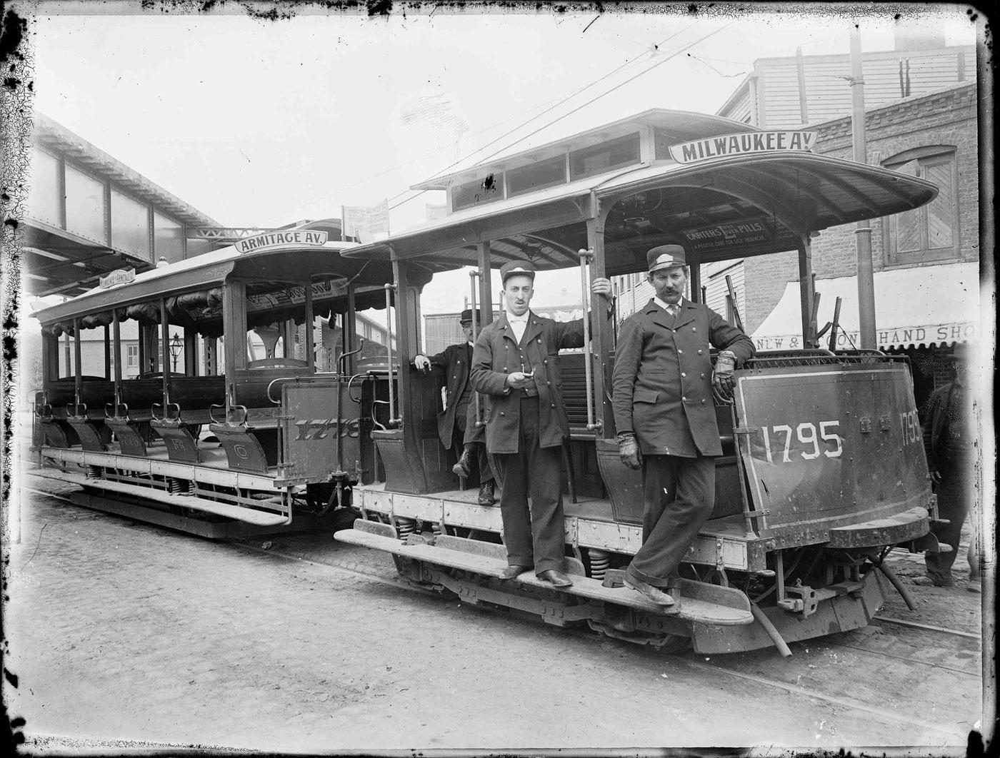
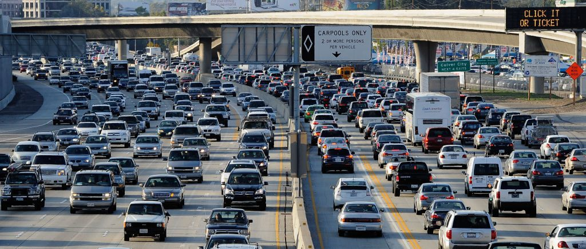
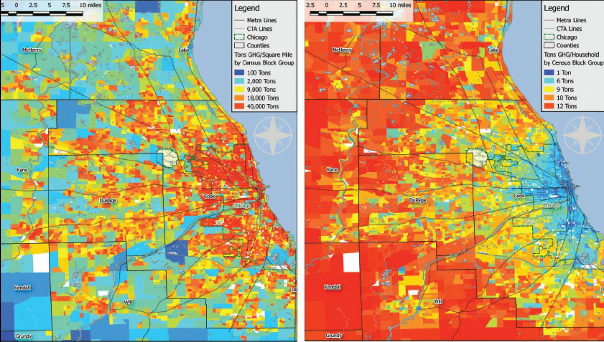
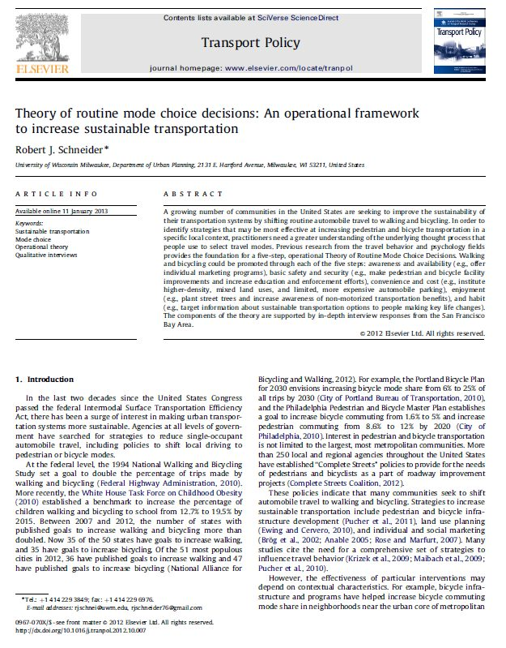
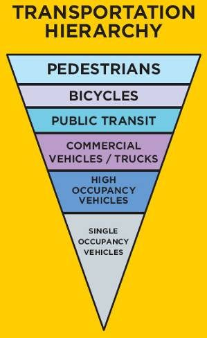

## Introductions

- Name
- Degree program
- Preferred mode of travel

::: {.notes}
Welcome students to the first session of GEO 330 / SUD 430, Sustainable Urban Transportation. This is class orientation plus Week 1: Foundational Concepts, per the syllabus topical agenda. Briefly introduce yourself beyond the title slide: your background as an epidemiologist with Cook County Public Health and your work with the Chaddick Institute for Metropolitan Development gives you an applied, data-driven lens on transportation and health that will show up throughout the quarter. Mention logistics briefly: this is an online, synchronous course; office hours are by appointment; all readings are posted to D2L. Preview today's session: introductions, an interactive exercise on defining sustainability, a systems-thinking framework for transportation, a short video and discussion, a walk through the historical evolution of urban streets from shared space to auto-dominance, a look at how density relates to transportation emissions, the Schneider (2013) theory of routine mode choice that anchors this week's reading, and a first look at the transportation hierarchy and pedestrian safety design — all of which sets up Exercise #1 (mode share and pedestrian fatality analysis), assigned this week.

Then run the icebreaker itself: go around (or use chat/breakout rooms, since this is an online synchronous class) and have each student share their name, degree program, and preferred mode of travel. Listen for the range of answers — you will likely get walkers, drivers, transit riders, and cyclists in the same room, which is a useful, low-stakes way to surface that "sustainable transportation" is not one mode but a mix, and that everyone in the room already has a personal stake in and opinion about how it should work. Keep this brief, a few minutes at most, since there is a lot of ground to cover today.
:::

## What Is Sustainability? {.smaller}

- Individually consider your own understanding of sustainability
- Use the link below to submit three (or more) sustainability concepts
- Break out into groups of 3
- Spend 5 minutes sharing your ideas of sustainability
- Add any additional concepts/words using the same link

**Poll:** `PollEv.com/urbantransport`

::: {.notes}
This is a live, participatory activity using Poll Everywhere (PollEv.com/urbantransport — https://www.polleverywhere.com/home). Give students a minute to think individually first before they submit, so the group discussion doesn't just anchor on the first idea shared. Have them submit at least three words or short phrases that come to mind when they hear "sustainability" — don't over-constrain the prompt yet; the goal is to see the raw, varied associations people already bring (environmental, economic, social, generational, personal). After individual submission, break into groups of three for about five minutes to compare answers, then let groups add any new concepts they generated together back into the same poll. The next slide will display the live results.
:::

## What Is Sustainability? {.smaller}

*(Display the live Poll Everywhere word cloud / response feed here.)*

**Poll:** `PollEv.com/urbantransport`

::: {.notes}
Pull up the live Poll Everywhere results (word cloud or response list) on screen and walk through what came in. Look for clusters around the three classic pillars — environmental (emissions, resource use, climate), economic (cost, efficiency, jobs), and social/equity (access, health, fairness) — and note anywhere students converge or diverge. If the responses skew heavily environmental, that's a good moment to explicitly introduce the "three-legged stool" or triple-bottom-line framing of sustainability (environment, economy, equity) and note that this course treats all three as equally central to "sustainable urban transportation," not just emissions. Keep this discussion tight; the point is to establish a shared, broadened working definition before moving into systems thinking.
:::

## What Is a Transportation System?

A system is an interconnected set of elements that is coherently organized in a way that achieves something. A system consists of three kinds of things: elements, interconnections, and a function or purpose. (Meadows, 2008)

In its simplest form, a transportation system consists of vehicles/modes, paths/networks and behaviors.

Like all systems, transportation systems are also situated in time (i.e., historical) and space/place and exhibit adaptive, dynamic, goal-seeking, self-preserving, and sometimes evolutionary behavior.

::: {.notes}
Introduce Donella Meadows' basic definition of a system — elements, interconnections, and a purpose — and connect it directly to transportation: the elements are vehicles and modes, the interconnections are the paths and networks they travel on, and the whole thing is animated by human behavior and choices. Emphasize the second point especially: transportation systems are not static engineering artifacts, they are historical and geographic — they were built by specific decisions at specific times and in specific places, and they adapt, resist change, and sometimes evolve in response to new pressures (technology, policy, demand). This systems framing is the conceptual foundation for the whole course: every mode-specific week (walking, biking, transit, driving) and every analytical week (equity, health, economics) will come back to how elements, interconnections, and behavior interact. It also previews why simply swapping in a new vehicle technology, without addressing networks and behavior, rarely produces a more sustainable outcome on its own.
:::

## In-Class Assignment #1



- How many modes are represented in the video?
- How would you characterize this transportation system?
- Does this transportation system have elements of sustainability? Why and/or why not?
- What other information would you need to know to evaluate and improve the sustainability of this and other transportation systems?

::: {.notes}
Play the embedded archival street film and give students a moment to actually count modes before discussing — most will be surprised how many different modes (pedestrians, cyclists, horse-drawn carts and streetcars, and early automobiles) shared the same street space simultaneously, often with no lane markings, signals, or dedicated space at all. Use the discussion questions in order: first the literal count of modes, then a qualitative characterization of the system (informal, mixed, negotiated, chaotic-but-functioning), then push on the sustainability question directly — there is no single right answer, but look for students noticing that the system was arguably efficient and space-sharing by necessity, even without today's vocabulary of "sustainability," while also being genuinely dangerous by modern safety standards. The last question is the pivot into the rest of the lecture: what data would you actually need (mode share, collision records, speeds, volumes) to move from an impression to an evidence-based evaluation — which is exactly what Exercise #1 will have them do.
:::

## Streets as Public Space {background-image="images/hester-street-1914.jpg" background-size="contain" background-color="black"}

::: {.notes}
Prior to the 1920s, city streets looked dramatically different than they do today. They were considered to be a public space for play and exchange, not solely a conduit for vehicle movement. This photo shows Manhattan's Hester Street, on the Lower East Side, in 1914 (source: Getty Images) — a street market packed with pedestrians, pushcarts, and children playing, with almost no motor vehicles present. Use this image to set up the historical arc for the rest of the lecture: streets were once shared, multi-purpose civic space, and the reallocation of that space almost entirely to motor vehicles over the following decades was neither inevitable nor natural — it was a series of specific planning, engineering, and legal decisions (including the campaign to redefine "jaywalking" as a crime in the 1920s). That reframing is central to a lot of contemporary "complete streets" and sustainable transportation advocacy: it's less about inventing something new and more about reclaiming space that streets used to serve.
:::

## Early Urban Transit {background-image="images/state-madison-1904.jpg" background-size="contain" background-color="black"}

::: {.notes}
This photo shows various forms of transit in 1904 at State and Madison Streets, Chicago, with two cable car trains visible (source: Chicago's Forgotten Cable Cars). Point out how busy and multimodal this intersection already was well before automobiles arrived in force — cable cars, horse-drawn carriages, and dense pedestrian crowds all sharing one of the country's busiest commercial intersections. This is a good moment to note that Chicago's "State and Madison" is historically considered the zero-point for the city's street numbering grid, underscoring how central this corner was to the city's transportation network from very early on.
:::

## Cable Cars in Chicago {.smaller}

Cable cars were installed in Chicago to replace horsecars, which were vehicles pulled by horses along railways in the street.

Chicago had the largest cable car system in the country in terms of ridership and actual cars. (Chicago History Museum)

The technology enabled the expansion of the city and helped tie outlying areas to the downtown as well as laying the groundwork for later transit systems.

{fig-align="center" height="380"}

::: {.notes}
Cable cars replaced horsecars — horse-drawn vehicles running on street rails — because they were faster, could pull more cars, and didn't require the enormous logistical burden (and public health problem) of stabling and feeding thousands of horses in a dense city. Chicago had the largest cable car system in the country by both ridership and number of cars, according to the Chicago History Museum. The key point for a sustainable transportation course: this was infrastructure that actively shaped urban growth, not just responded to it — cable (and later electric streetcar) lines enabled the city to expand outward while still tying new neighborhoods back to the downtown core, and they laid the physical and institutional groundwork for the transit systems Chicago still operates today. This is a nice concrete example of path dependency: decisions made in the 1880s–1900s about where transit lines went still shape neighborhood form and transit access more than a century later.
:::

## The Automobile Era {.smaller}

The 1950s through 1990s is marked by geographic dispersion of housing and employment and the provision of automobile infrastructure to serve it.

> "If you plan for cars and traffic, you get cars and traffic. If you plan for people and places, you get people and places." — Fred Kent, 2005

::: {layout-ncol="2"}

:::

::: {.notes}
The postwar decades (1950s–1990s) mark a sharp break from everything shown in the previous slides: federal highway funding, cheap land at the urban edge, and single-use zoning together produced a geographic dispersion of housing and jobs that could only really function with car ownership, which in turn justified building more automobile infrastructure to serve that dispersed pattern — a self-reinforcing loop. The Fred Kent quote captures this concisely: infrastructure investment is not a neutral response to demand, it actively produces the travel behavior and land use pattern that follows. The two images pair a congested urban freeway with an aerial view of a sprawling, curvilinear suburban subdivision — visually, very little pedestrian or transit infrastructure is legible in either. Use your speaker notes cue here ("wedded to automobility — induced demand") to introduce the concept of induced demand explicitly: adding highway capacity tends to generate new vehicle trips rather than durably relieving congestion, because it lowers the time-cost of longer, more dispersed trip patterns. This is a good bridge into Week 5 (driving and automation) and Week 9 (economic benefits of sustainable transportation), both of which will revisit this dynamic.
:::

## Density and Transportation Emissions

{fig-align="center"}

::: {.notes}
This pair of maps shows transportation-related greenhouse gas emissions by census block group across the greater Chicago region, using two different denominators side by side: tons of GHG per square mile on the left, and tons of GHG per household on the right. This is the "density paradox" made visible: the dense urban core lights up red on the left map (highest total emissions per unit of land, simply because so much activity is concentrated there), but on the right map that same urban core is often cooler (blue/green) while the outer, low-density suburban and exurban ring is red — because households in dense, transit- and walk-accessible neighborhoods generate far less transportation-related emissions per household than households in car-dependent, dispersed areas. Ask students to sit with this for a moment: which map should a planner or policymaker care about more, and why? The answer depends on the question being asked — a regional air-quality regulator might care about per-square-mile totals, while someone evaluating an individual household's carbon footprint, or a fair way to allocate mitigation investment, should care about the per-household view. This sets up the equity and analytical-methods themes that carry through the rest of the quarter.
:::

## Theory of Routine Mode Choice

::: {layout="[45,55]"}

:::

::: {.notes}
This is the assigned Week 1 reading: Schneider, Robert J. 2013, "Theory of Routine Mode Choice Decisions: An Operational Framework to Increase Sustainable Transportation," Transport Policy 25: 128–37. Walk through the five-step framework in the diagram in order, since it's the conceptual model the whole course will keep returning to. (1) Awareness and availability: a mode has to be known about and actually available before it can be chosen at all — you can't bike somewhere if you don't own a bike or don't know a safe route exists. (2) Basic safety and security: people filter out modes they perceive as unsafe from traffic or crime, regardless of the mode's actual convenience. (3) Convenience and cost: among the remaining "safe enough" options, people weigh acceptable time, effort, and money. (4) Enjoyment: people also weigh the personal, social, or environmental benefit or pleasure a mode provides — not everything reduces to cost and time. (5) Habit: once someone regularly chooses a mode, that choice becomes self-reinforcing and more likely to be considered again in the future, looping back to awareness and availability. Socioeconomic factors run alongside all five steps, since income, ability, and life circumstances shape how people experience each one differently. This framework is useful precisely because it identifies five distinct levers — not just "make it cheaper" or "make it faster" — that a planner or policy can pull to shift routine travel behavior toward walking, bicycling, and transit.
:::

## Designing for Sustainable Transportation

So how can we design communities that offer safer, more ecologically sound, more economically efficient and more socially equitable transportation opportunities?

::: {.notes}
Use this as a discussion pivot rather than a slide to read verbatim. Give students a moment to react to the question directly — safer, more ecologically sound, more economically efficient, more socially equitable — and note that these four criteria roughly map onto the semester's structure: safety and mode-specific design (Weeks 2–6), justice and equity (Week 7), environment and public health (Week 8), and economics (Week 9). The next two slides offer two concrete, practical starting points for that design question: a prioritization framework (the transportation hierarchy) and one specific, well-evidenced safety intervention (the leading pedestrian interval).
:::

## The Transportation Hierarchy

{fig-align="center" height="500"}

::: {.notes}
The transportation hierarchy is a simple but powerful planning heuristic: when street space, funding, or signal timing are in conflict, prioritize modes in this order — pedestrians first, then bicycles, then public transit, then commercial vehicles and trucks (which are moving goods the economy needs), then high-occupancy vehicles, and single-occupancy vehicles last. Note what this inverts: most twentieth-century American street design implicitly prioritized in the opposite order, with single-occupancy vehicles first. Ask students where their own city's or neighborhood's streets actually fall on this hierarchy in practice (signal timing, snow-clearing order, budget allocation) versus where the hierarchy says they should fall. This framework will come back explicitly in Exercise #1 and in later weeks on walking, bicycling, and transit.
:::

## Applied Example: The Leading Pedestrian Interval {.smaller}

::: {layout="[55,45]"}

A Leading Pedestrian Interval (LPI) typically gives pedestrians a 3–7 second head start when entering an intersection with a corresponding green signal in the same direction of travel.

LPIs have been shown to reduce pedestrian-vehicle collisions as much as 60% at treated intersections.

{height="180"}
:::

::: {.notes}
Close the lecture with one small, concrete, well-evidenced example of the transportation hierarchy and the routine-mode-choice framework put into practice: the Leading Pedestrian Interval, or LPI. An LPI gives pedestrians a several-second head start — typically 3 to 7 seconds — before parallel vehicle traffic gets a green light, so pedestrians are already visible and established in the crosswalk before turning vehicles start moving. This is a low-cost signal timing change, not a capital project, and it has been shown to reduce pedestrian-vehicle collisions by as much as 60% at treated intersections. The large photo shows Chicago's pedestrian scramble at State and Jackson, an even more aggressive version of prioritizing pedestrian crossing time by stopping all vehicle traffic simultaneously; the smaller photo shows a similarly low-cost signal treatment for cyclists — a dedicated bicycle signal head paired with a sign reminding turning vehicles to yield. Both are good illustrations that improving safety for the top of the transportation hierarchy is often more about signal timing and small design details than expensive capital construction. Connect this directly to what's coming next: Exercise #1, assigned this week, asks students to analyze commute mode share and pedestrian fatality trends for a county of their choosing — the LPI is a preview of the kind of specific, evidence-based intervention they'll be asked to identify from their own hot spot analysis later in the exercise.
:::
